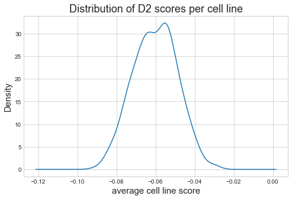
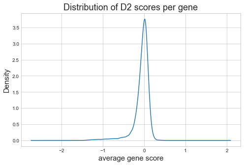
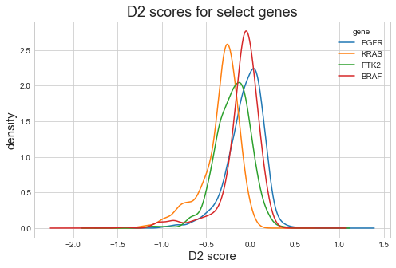
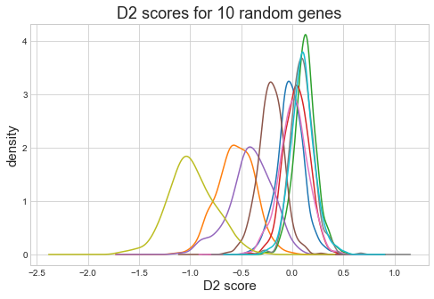

# Data preparation


```python
import numpy as np
import pandas as pd
from matplotlib import pyplot as plt
from pathlib import Path
import janitor

plt.style.use('seaborn-whitegrid')
plt.rcParams['figure.figsize'] = (8.0, 5.0)
plt.rcParams['axes.titlesize'] = 18
plt.rcParams['axes.labelsize'] = 15

data_dir = Path('../data')
```

## shRNA mapping


```python
shrna_mapping_df = pd.read_csv(data_dir / 'shRNAmapping.csv').clean_names()
shrna_mapping_df.head()
```


<div>
<style scoped>
    .dataframe tbody tr th:only-of-type {
        vertical-align: middle;
    }

    .dataframe tbody tr th {
        vertical-align: top;
    }

    .dataframe thead th {
        text-align: right;
    }
</style>
<table border="1" class="dataframe">
  <thead>
    <tr style="text-align: right;">
      <th></th>
      <th>barcode_sequence</th>
      <th>gene_symbol</th>
      <th>gene_id</th>
    </tr>
  </thead>
  <tbody>
    <tr>
      <th>0</th>
      <td>AAAAATGGCATCAACCACCAT</td>
      <td>RPS6KA1</td>
      <td>6195</td>
    </tr>
    <tr>
      <th>1</th>
      <td>AAAACCGTGGACTTCAAGAAG</td>
      <td>NO_CURRENT_1</td>
      <td>NO_CURRENT_1</td>
    </tr>
    <tr>
      <th>2</th>
      <td>AAAAGGATAACCCAGGTGTTT</td>
      <td>TSC1</td>
      <td>7248</td>
    </tr>
    <tr>
      <th>3</th>
      <td>AAAAGTGAGGACAATCCGCAA</td>
      <td>RAPGEFL1</td>
      <td>51195</td>
    </tr>
    <tr>
      <th>4</th>
      <td>AAAATCAGTCATGGTGATTTA</td>
      <td>CECR2</td>
      <td>27443</td>
    </tr>
  </tbody>
</table>
</div>


## Knock-down data


```python
def load_achilles_lfc_data(fpath):
    df = pd.read_csv(data_dir / fpath) \
        .clean_names() \
        .rename({'unnamed_0': 'barcode_sequence'}, axis=1) \
        .melt(id_vars=['barcode_sequence'], var_name='cell_line', value_name='lfc')
    return df
```


```python
achilles_55k_batch1_lfc = load_achilles_lfc_data('achilles55kbatch1repcollapsedlfc.csv')
achilles_55k_batch1_lfc.head()
```


<div>
<style scoped>
    .dataframe tbody tr th:only-of-type {
        vertical-align: middle;
    }

    .dataframe tbody tr th {
        vertical-align: top;
    }

    .dataframe thead th {
        text-align: right;
    }
</style>
<table border="1" class="dataframe">
  <thead>
    <tr style="text-align: right;">
      <th></th>
      <th>barcode_sequence</th>
      <th>cell_line</th>
      <th>lfc</th>
    </tr>
  </thead>
  <tbody>
    <tr>
      <th>0</th>
      <td>ATATCCACCACTTTAACCTTA</td>
      <td>ln215_central_nervous_system</td>
      <td>-1.896471</td>
    </tr>
    <tr>
      <th>1</th>
      <td>GACAACAGACAAATCACCATT</td>
      <td>ln215_central_nervous_system</td>
      <td>-0.364165</td>
    </tr>
    <tr>
      <th>2</th>
      <td>GCCAGTGATTATGAGCTTGAA</td>
      <td>ln215_central_nervous_system</td>
      <td>-2.744832</td>
    </tr>
    <tr>
      <th>3</th>
      <td>GCTAAGTACAGGGCCAAGTTT</td>
      <td>ln215_central_nervous_system</td>
      <td>1.621193</td>
    </tr>
    <tr>
      <th>4</th>
      <td>AGAGCTGTTTGACCGGATAGT</td>
      <td>ln215_central_nervous_system</td>
      <td>-2.154795</td>
    </tr>
  </tbody>
</table>
</div>


```python
achilles_55k_batch2_lfc = load_achilles_lfc_data('achilles55kbatch2repcollapsedlfc.csv')
achilles_55k_batch2_lfc.head()
```


<div>
<style scoped>
    .dataframe tbody tr th:only-of-type {
        vertical-align: middle;
    }

    .dataframe tbody tr th {
        vertical-align: top;
    }

    .dataframe thead th {
        text-align: right;
    }
</style>
<table border="1" class="dataframe">
  <thead>
    <tr style="text-align: right;">
      <th></th>
      <th>barcode_sequence</th>
      <th>cell_line</th>
      <th>lfc</th>
    </tr>
  </thead>
  <tbody>
    <tr>
      <th>0</th>
      <td>ATATCCACCACTTTAACCTTA</td>
      <td>ov7_ovary</td>
      <td>-1.117770</td>
    </tr>
    <tr>
      <th>1</th>
      <td>GACAACAGACAAATCACCATT</td>
      <td>ov7_ovary</td>
      <td>-0.135925</td>
    </tr>
    <tr>
      <th>2</th>
      <td>CTAGAAAGAGTGCAGAACAAT</td>
      <td>ov7_ovary</td>
      <td>-1.932332</td>
    </tr>
    <tr>
      <th>3</th>
      <td>GCCAGTGATTATGAGCTTGAA</td>
      <td>ov7_ovary</td>
      <td>-1.145431</td>
    </tr>
    <tr>
      <th>4</th>
      <td>GCTAAGTACAGGGCCAAGTTT</td>
      <td>ov7_ovary</td>
      <td>0.441416</td>
    </tr>
  </tbody>
</table>
</div>


```python
achilles_98k_lfc = load_achilles_lfc_data('achilles98krepcollapsedlfc.csv')
achilles_98k_lfc.head()
```


<div>
<style scoped>
    .dataframe tbody tr th:only-of-type {
        vertical-align: middle;
    }

    .dataframe tbody tr th {
        vertical-align: top;
    }

    .dataframe thead th {
        text-align: right;
    }
</style>
<table border="1" class="dataframe">
  <thead>
    <tr style="text-align: right;">
      <th></th>
      <th>barcode_sequence</th>
      <th>cell_line</th>
      <th>lfc</th>
    </tr>
  </thead>
  <tbody>
    <tr>
      <th>0</th>
      <td>AAAAATGGCATCAACCACCAT</td>
      <td>143b_bone</td>
      <td>-0.146756</td>
    </tr>
    <tr>
      <th>1</th>
      <td>AAACACATTTGGGATGTTCCT</td>
      <td>143b_bone</td>
      <td>1.170334</td>
    </tr>
    <tr>
      <th>2</th>
      <td>AAAGAAGAAGCTGCAATATCT</td>
      <td>143b_bone</td>
      <td>1.490805</td>
    </tr>
    <tr>
      <th>3</th>
      <td>AAGCGTGCCGTAGACTGTCCA</td>
      <td>143b_bone</td>
      <td>0.543632</td>
    </tr>
    <tr>
      <th>4</th>
      <td>AATCTAAGAGAGCTGCCATCG</td>
      <td>143b_bone</td>
      <td>0.172294</td>
    </tr>
  </tbody>
</table>
</div>


## Original DEMETER2 results


```python
def extract_gene_name(df):
    gene_names = [a.split(' ', 1)[0] for a in df['gene']]
    df['gene'] = gene_names
    return df
```


```python
d2_res_path = Path('../data/D2_Achilles_gene_dep_scores.csv')

d2_res_df = pd.read_csv(d2_res_path) \
    .clean_names() \
    .rename({'unnamed_0': 'gene'}, axis=1) \
    .pipe(extract_gene_name)

d2_res_df.head()
```


<div>
<style scoped>
    .dataframe tbody tr th:only-of-type {
        vertical-align: middle;
    }

    .dataframe tbody tr th {
        vertical-align: top;
    }

    .dataframe thead th {
        text-align: right;
    }
</style>
<table border="1" class="dataframe">
  <thead>
    <tr style="text-align: right;">
      <th></th>
      <th>gene</th>
      <th>143b_bone</th>
      <th>22rv1_prostate</th>
      <th>2313287_stomach</th>
      <th>697_haematopoietic_and_lymphoid_tissue</th>
      <th>769p_kidney</th>
      <th>786o_kidney</th>
      <th>a1207_central_nervous_system</th>
      <th>a172_central_nervous_system</th>
      <th>a204_soft_tissue</th>
      <th>...</th>
      <th>wm1799_skin</th>
      <th>wm2664_skin</th>
      <th>wm793_skin</th>
      <th>wm88_skin</th>
      <th>wm983b_skin</th>
      <th>yd38_upper_aerodigestive_tract</th>
      <th>yd8_upper_aerodigestive_tract</th>
      <th>ykg1_central_nervous_system</th>
      <th>zr751_breast</th>
      <th>zr7530_breast</th>
    </tr>
  </thead>
  <tbody>
    <tr>
      <th>0</th>
      <td>A1BG</td>
      <td>0.052466</td>
      <td>-0.115242</td>
      <td>-0.023172</td>
      <td>-0.023337</td>
      <td>-0.127913</td>
      <td>-0.045175</td>
      <td>-0.180962</td>
      <td>0.006975</td>
      <td>-0.017205</td>
      <td>...</td>
      <td>-0.116620</td>
      <td>-0.348762</td>
      <td>0.015806</td>
      <td>-0.183945</td>
      <td>-0.071312</td>
      <td>0.150626</td>
      <td>-0.049987</td>
      <td>0.011004</td>
      <td>-0.149293</td>
      <td>-0.167596</td>
    </tr>
    <tr>
      <th>1</th>
      <td>NAT2</td>
      <td>0.084173</td>
      <td>0.000951</td>
      <td>-0.154188</td>
      <td>-0.079006</td>
      <td>-0.162207</td>
      <td>-0.172578</td>
      <td>-0.264920</td>
      <td>-0.174468</td>
      <td>-0.249258</td>
      <td>...</td>
      <td>-0.299439</td>
      <td>-0.123712</td>
      <td>-0.121711</td>
      <td>-0.104603</td>
      <td>-0.265162</td>
      <td>0.021261</td>
      <td>-0.158058</td>
      <td>0.058858</td>
      <td>-0.144623</td>
      <td>0.133460</td>
    </tr>
    <tr>
      <th>2</th>
      <td>ADA</td>
      <td>0.207020</td>
      <td>0.010743</td>
      <td>-0.072102</td>
      <td>0.045611</td>
      <td>-0.002487</td>
      <td>0.170009</td>
      <td>-0.000351</td>
      <td>0.123135</td>
      <td>-0.054149</td>
      <td>...</td>
      <td>0.060647</td>
      <td>0.080939</td>
      <td>0.331585</td>
      <td>0.032316</td>
      <td>-0.066345</td>
      <td>0.061082</td>
      <td>0.126664</td>
      <td>0.204871</td>
      <td>-0.202153</td>
      <td>0.085652</td>
    </tr>
    <tr>
      <th>3</th>
      <td>CDH2</td>
      <td>0.062192</td>
      <td>-0.049809</td>
      <td>0.022137</td>
      <td>0.061709</td>
      <td>-0.063397</td>
      <td>0.127787</td>
      <td>-0.184580</td>
      <td>-0.040643</td>
      <td>0.203570</td>
      <td>...</td>
      <td>-0.071168</td>
      <td>0.004119</td>
      <td>-0.013560</td>
      <td>-0.048310</td>
      <td>-0.138371</td>
      <td>-0.036057</td>
      <td>-0.075598</td>
      <td>0.012575</td>
      <td>0.044692</td>
      <td>-0.055539</td>
    </tr>
    <tr>
      <th>4</th>
      <td>AKT3</td>
      <td>0.039280</td>
      <td>-0.076596</td>
      <td>0.136445</td>
      <td>0.154167</td>
      <td>0.140487</td>
      <td>0.243081</td>
      <td>-0.143867</td>
      <td>-0.026991</td>
      <td>-0.192979</td>
      <td>...</td>
      <td>0.027439</td>
      <td>-0.117479</td>
      <td>-0.024036</td>
      <td>0.119678</td>
      <td>0.042359</td>
      <td>0.107166</td>
      <td>0.159401</td>
      <td>0.071568</td>
      <td>0.053298</td>
      <td>0.021455</td>
    </tr>
  </tbody>
</table>
<p>5 rows × 502 columns</p>
</div>


```python
d2_res_df.mean().plot.kde()
plt.xlabel('average cell line score')
plt.title('Distribution of D2 scores per cell line')
plt.show()
```





```python
d2_res_df.set_index('gene').mean(axis=1).plot.kde()
plt.xlabel('average gene score')
plt.title('Distribution of D2 scores per gene')
plt.show()
```





```python
pd.DataFrame(d2_res_df.set_index('gene').mean(axis=1), 
             columns=['avg_d2_score'])
```


<div>
<style scoped>
    .dataframe tbody tr th:only-of-type {
        vertical-align: middle;
    }

    .dataframe tbody tr th {
        vertical-align: top;
    }

    .dataframe thead th {
        text-align: right;
    }
</style>
<table border="1" class="dataframe">
  <thead>
    <tr style="text-align: right;">
      <th></th>
      <th>avg_d2_score</th>
    </tr>
    <tr>
      <th>gene</th>
      <th></th>
    </tr>
  </thead>
  <tbody>
    <tr>
      <th>A1BG</th>
      <td>-0.128559</td>
    </tr>
    <tr>
      <th>NAT2</th>
      <td>-0.062949</td>
    </tr>
    <tr>
      <th>ADA</th>
      <td>0.052180</td>
    </tr>
    <tr>
      <th>CDH2</th>
      <td>0.035571</td>
    </tr>
    <tr>
      <th>AKT3</th>
      <td>0.073588</td>
    </tr>
    <tr>
      <th>...</th>
      <td>...</td>
    </tr>
    <tr>
      <th>PTBP3</th>
      <td>-0.656251</td>
    </tr>
    <tr>
      <th>KCNE2</th>
      <td>-0.003405</td>
    </tr>
    <tr>
      <th>DGCR2</th>
      <td>0.050086</td>
    </tr>
    <tr>
      <th>CASP8AP2</th>
      <td>-0.524194</td>
    </tr>
    <tr>
      <th>SCO2</th>
      <td>-0.076897</td>
    </tr>
  </tbody>
</table>
<p>16755 rows × 1 columns</p>
</div>


Set of genes where there will be differences across cell lines.


```python
specific_test_genes = ['KRAS', 'BRAF', 'EGFR', 'PTK2']

d2_res_df[d2_res_df.gene.isin(specific_test_genes)].set_index('gene').T.plot.kde()

plt.xlabel('D2 score')
plt.ylabel('density')
plt.title('D2 scores for select genes')
plt.show()
```





A set of random genes.


```python
num_rand_genes = 10
random_genes = d2_res_df.dropna().sample(n=num_rand_genes, random_state=123)

random_genes.set_index('gene').T.plot.kde(legend=None)

plt.xlabel('D2 score')
plt.ylabel('density')
plt.title(f'D2 scores for {num_rand_genes} random genes')
plt.show()
```





Final subset of genes to experiment with.


```python
genes_to_model = specific_test_genes + random_genes.gene.to_list()
genes_to_model
```


    ['KRAS',
     'BRAF',
     'EGFR',
     'PTK2',
     'RHBDL2',
     'ESPL1',
     'LOC105379645&KIR2DL2',
     'TRIM39',
     'SDHB',
     'COL8A1',
     'COG3',
     'GRK5',
     'EIF6',
     'RC3H2']


---

## Modeling data


```python
model_data_dir = Path('../modeling_data')
```

### shRNA


```python
model_shrna_mapping = shrna_mapping_df[shrna_mapping_df.gene_symbol.isin(genes_to_model)]
model_shrna_mapping = model_shrna_mapping.reset_index(drop=True).drop('gene_id', axis=1)
model_shrna_mapping.head()
```


<div>
<style scoped>
    .dataframe tbody tr th:only-of-type {
        vertical-align: middle;
    }

    .dataframe tbody tr th {
        vertical-align: top;
    }

    .dataframe thead th {
        text-align: right;
    }
</style>
<table border="1" class="dataframe">
  <thead>
    <tr style="text-align: right;">
      <th></th>
      <th>barcode_sequence</th>
      <th>gene_symbol</th>
    </tr>
  </thead>
  <tbody>
    <tr>
      <th>0</th>
      <td>ACAAATCCATTGAGCCTTATT</td>
      <td>SDHB</td>
    </tr>
    <tr>
      <th>1</th>
      <td>ACAGAAGAAATTCTGGCAGAT</td>
      <td>EIF6</td>
    </tr>
    <tr>
      <th>2</th>
      <td>ACCTCAATAAGGTCTCAAAAT</td>
      <td>SDHB</td>
    </tr>
    <tr>
      <th>3</th>
      <td>ACGAGATGATAGAAACAGAAT</td>
      <td>GRK5</td>
    </tr>
    <tr>
      <th>4</th>
      <td>ACTGATGTGTGTTAATTATGA</td>
      <td>BRAF</td>
    </tr>
  </tbody>
</table>
</div>


```python
model_shrna_mapping.to_csv(model_data_dir / "shRNA_mapping.csv")
```

### Log-fold-change data


```python
achilles_55k_batch1_lfc['batch'] = 1
achilles_55k_batch2_lfc['batch'] = 2
achilles_98k_lfc['batch'] = 3

def filter_df_barcodes(df):
    new_df = df[df.barcode_sequence.isin(model_shrna_mapping.barcode_sequence)]
    return new_df

lfc_data = pd.concat(
    [filter_df_barcodes(achilles_55k_batch1_lfc),
     filter_df_barcodes(achilles_55k_batch2_lfc),
     filter_df_barcodes(achilles_98k_lfc)],
    ignore_index=True
)

lfc_data.head()
```


<div>
<style scoped>
    .dataframe tbody tr th:only-of-type {
        vertical-align: middle;
    }

    .dataframe tbody tr th {
        vertical-align: top;
    }

    .dataframe thead th {
        text-align: right;
    }
</style>
<table border="1" class="dataframe">
  <thead>
    <tr style="text-align: right;">
      <th></th>
      <th>barcode_sequence</th>
      <th>cell_line</th>
      <th>lfc</th>
      <th>batch</th>
    </tr>
  </thead>
  <tbody>
    <tr>
      <th>0</th>
      <td>CCAACCTCAATAAGGTCTCAA</td>
      <td>ln215_central_nervous_system</td>
      <td>0.898372</td>
      <td>1</td>
    </tr>
    <tr>
      <th>1</th>
      <td>CGCAAGTGTAAGAAGTGCGAA</td>
      <td>ln215_central_nervous_system</td>
      <td>-2.754383</td>
      <td>1</td>
    </tr>
    <tr>
      <th>2</th>
      <td>GCTCTCTATAGAAGGTTCTTT</td>
      <td>ln215_central_nervous_system</td>
      <td>0.589738</td>
      <td>1</td>
    </tr>
    <tr>
      <th>3</th>
      <td>GCTGAGAATGTGGAATACCTA</td>
      <td>ln215_central_nervous_system</td>
      <td>-1.127432</td>
      <td>1</td>
    </tr>
    <tr>
      <th>4</th>
      <td>AGAGAACTTCTACAGTGTGTT</td>
      <td>ln215_central_nervous_system</td>
      <td>-1.820344</td>
      <td>1</td>
    </tr>
  </tbody>
</table>
</div>


```python
lfc_data.shape
```


    (45703, 4)


```python
modeling_data = lfc_data \
    .set_index('barcode_sequence') \
    .join(model_shrna_mapping.set_index('barcode_sequence'), how='inner') \
    .reset_index()

modeling_data.head()
```


<div>
<style scoped>
    .dataframe tbody tr th:only-of-type {
        vertical-align: middle;
    }

    .dataframe tbody tr th {
        vertical-align: top;
    }

    .dataframe thead th {
        text-align: right;
    }
</style>
<table border="1" class="dataframe">
  <thead>
    <tr style="text-align: right;">
      <th></th>
      <th>barcode_sequence</th>
      <th>cell_line</th>
      <th>lfc</th>
      <th>batch</th>
      <th>gene_symbol</th>
    </tr>
  </thead>
  <tbody>
    <tr>
      <th>0</th>
      <td>ACAGAAGAAATTCTGGCAGAT</td>
      <td>ln215_central_nervous_system</td>
      <td>1.966515</td>
      <td>1</td>
      <td>EIF6</td>
    </tr>
    <tr>
      <th>1</th>
      <td>ACAGAAGAAATTCTGGCAGAT</td>
      <td>ln382_central_nervous_system</td>
      <td>1.289606</td>
      <td>1</td>
      <td>EIF6</td>
    </tr>
    <tr>
      <th>2</th>
      <td>ACAGAAGAAATTCTGGCAGAT</td>
      <td>efo21_ovary</td>
      <td>0.625725</td>
      <td>1</td>
      <td>EIF6</td>
    </tr>
    <tr>
      <th>3</th>
      <td>ACAGAAGAAATTCTGGCAGAT</td>
      <td>jhesoad1_oesophagus</td>
      <td>1.392272</td>
      <td>1</td>
      <td>EIF6</td>
    </tr>
    <tr>
      <th>4</th>
      <td>ACAGAAGAAATTCTGGCAGAT</td>
      <td>km12_large_intestine</td>
      <td>0.820838</td>
      <td>1</td>
      <td>EIF6</td>
    </tr>
  </tbody>
</table>
</div>


```python
modeling_data.to_csv(model_data_dir / 'subset_modeling_data.csv')
```
