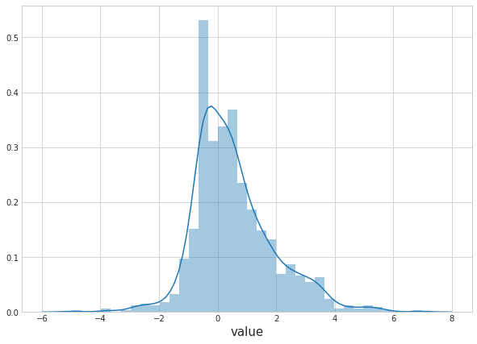
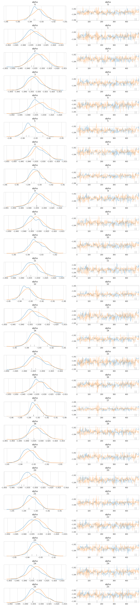
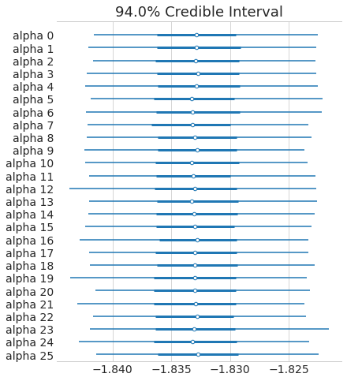

# DEMETER2 in Stan


```python
import pystan
import numpy as np
import pandas as pd
from matplotlib import pyplot as plt
import arviz as az
from pathlib import Path
import seaborn as sns
from timeit import default_timer as timer
import warnings

plt.style.use('seaborn-whitegrid')
plt.rcParams['figure.figsize'] = (10.0, 7.0)
plt.rcParams['axes.titlesize'] = 18
plt.rcParams['axes.labelsize'] = 15

modeling_data_dir = Path('../modeling_data')

warnings.filterwarnings(action='ignore', 
                        message='Argument backend_kwargs has not effect in matplotlib.plot_distSupplied value won\'t be used')
```

    /home/jc604/.conda/envs/demeter2-stan/lib/python3.7/site-packages/ipykernel/ipkernel.py:287: DeprecationWarning: `should_run_async` will not call `transform_cell` automatically in the future. Please pass the result to `transformed_cell` argument and any exception that happen during thetransform in `preprocessing_exc_tuple` in IPython 7.17 and above.
      and should_run_async(code)


## Data preparation


```python
modeling_data = pd.read_csv(modeling_data_dir / 'subset_modeling_data.csv')
modeling_data.head()
```


<div>
<style scoped>
    .dataframe tbody tr th:only-of-type {
        vertical-align: middle;
    }

    .dataframe tbody tr th {
        vertical-align: top;
    }

    .dataframe thead th {
        text-align: right;
    }
</style>
<table border="1" class="dataframe">
  <thead>
    <tr style="text-align: right;">
      <th></th>
      <th>barcode_sequence</th>
      <th>cell_line</th>
      <th>lfc</th>
      <th>batch</th>
      <th>gene_symbol</th>
    </tr>
  </thead>
  <tbody>
    <tr>
      <th>0</th>
      <td>ACAGAAGAAATTCTGGCAGAT</td>
      <td>ln215_central_nervous_system</td>
      <td>1.966515</td>
      <td>1</td>
      <td>EIF6</td>
    </tr>
    <tr>
      <th>1</th>
      <td>ACAGAAGAAATTCTGGCAGAT</td>
      <td>ln382_central_nervous_system</td>
      <td>1.289606</td>
      <td>1</td>
      <td>EIF6</td>
    </tr>
    <tr>
      <th>2</th>
      <td>ACAGAAGAAATTCTGGCAGAT</td>
      <td>efo21_ovary</td>
      <td>0.625725</td>
      <td>1</td>
      <td>EIF6</td>
    </tr>
    <tr>
      <th>3</th>
      <td>ACAGAAGAAATTCTGGCAGAT</td>
      <td>jhesoad1_oesophagus</td>
      <td>1.392272</td>
      <td>1</td>
      <td>EIF6</td>
    </tr>
    <tr>
      <th>4</th>
      <td>ACAGAAGAAATTCTGGCAGAT</td>
      <td>km12_large_intestine</td>
      <td>0.820838</td>
      <td>1</td>
      <td>EIF6</td>
    </tr>
  </tbody>
</table>
</div>


## Exploratory data analysis


```python
genes = set(modeling_data.gene_symbol.to_list())
fig, axes = plt.subplots(5, 3, figsize=(9, 9))
for ax, gene in zip(axes.flat, genes):
    lfc = modeling_data[modeling_data.gene_symbol == gene].lfc
    sns.distplot(lfc, kde=True, hist=False, ax=ax, kde_kws={'shade': True}, color='b')
    
    y_data = ax.lines[0].get_ydata()
    ax.vlines(x=0, ymin=0, ymax=np.max(y_data) * 1.05, linestyles='dashed')
    
    ax.set_title(gene, fontsize=12)
    ax.set_xlabel(None)


axes[4, 2].axis('off')
axes[4, 1].axis('off')
fig.tight_layout(pad=1.0)
plt.show()
```


```python
cell_lines = set(modeling_data.cell_line.to_list())
for cell_line in cell_lines:
    lfc = modeling_data[modeling_data.cell_line == cell_line].lfc
    sns.distplot(lfc, kde=True, hist=False, label=None, kde_kws={'alpha': 0.2})

plt.title('LFC distributions')
plt.xlabel('LFC')
plt.show()
```


```python
sns.distplot(modeling_data.lfc)
plt.show()
```


```python
modeling_data[['barcode_sequence', 'gene_symbol']].drop_duplicates().groupby('gene_symbol').count()
```


<div>
<style scoped>
    .dataframe tbody tr th:only-of-type {
        vertical-align: middle;
    }

    .dataframe tbody tr th {
        vertical-align: top;
    }

    .dataframe thead th {
        text-align: right;
    }
</style>
<table border="1" class="dataframe">
  <thead>
    <tr style="text-align: right;">
      <th></th>
      <th>barcode_sequence</th>
    </tr>
    <tr>
      <th>gene_symbol</th>
      <th></th>
    </tr>
  </thead>
  <tbody>
    <tr>
      <th>BRAF</th>
      <td>8</td>
    </tr>
    <tr>
      <th>COG3</th>
      <td>5</td>
    </tr>
    <tr>
      <th>COL8A1</th>
      <td>5</td>
    </tr>
    <tr>
      <th>EGFR</th>
      <td>19</td>
    </tr>
    <tr>
      <th>EIF6</th>
      <td>5</td>
    </tr>
    <tr>
      <th>ESPL1</th>
      <td>5</td>
    </tr>
    <tr>
      <th>GRK5</th>
      <td>5</td>
    </tr>
    <tr>
      <th>KRAS</th>
      <td>11</td>
    </tr>
    <tr>
      <th>PTK2</th>
      <td>23</td>
    </tr>
    <tr>
      <th>RC3H2</th>
      <td>4</td>
    </tr>
    <tr>
      <th>RHBDL2</th>
      <td>5</td>
    </tr>
    <tr>
      <th>SDHB</th>
      <td>5</td>
    </tr>
    <tr>
      <th>TRIM39</th>
      <td>9</td>
    </tr>
  </tbody>
</table>
</div>


```python
lfc_corr = modeling_data \
    .pivot(index='cell_line', columns='barcode_sequence', values='lfc') \
    .corr()

mask = np.triu(np.ones_like(lfc_corr, dtype=np.bool), k=0)
f, ax = plt.subplots(figsize=(15, 13))
cmap = sns.diverging_palette(220, 10, as_cmap=True)
sns.heatmap(lfc_corr, mask=mask, 
            cmap=cmap, center=0, 
            square=True, linewidths=0.5, cbar_kws={'shrink': 0.5})
plt.xlabel('barcode')
plt.ylabel('barcode')
plt.title('Correlation of LFC of barcodes')
plt.show()
```


## Modeling


```python
models_dir = Path('..', 'models')
```


```python
modeling_data.head()
```


<div>
<style scoped>
    .dataframe tbody tr th:only-of-type {
        vertical-align: middle;
    }

    .dataframe tbody tr th {
        vertical-align: top;
    }

    .dataframe thead th {
        text-align: right;
    }
</style>
<table border="1" class="dataframe">
  <thead>
    <tr style="text-align: right;">
      <th></th>
      <th>barcode_sequence</th>
      <th>cell_line</th>
      <th>lfc</th>
      <th>batch</th>
      <th>gene_symbol</th>
    </tr>
  </thead>
  <tbody>
    <tr>
      <th>0</th>
      <td>ACAGAAGAAATTCTGGCAGAT</td>
      <td>ln215_central_nervous_system</td>
      <td>1.966515</td>
      <td>1</td>
      <td>EIF6</td>
    </tr>
    <tr>
      <th>1</th>
      <td>ACAGAAGAAATTCTGGCAGAT</td>
      <td>ln382_central_nervous_system</td>
      <td>1.289606</td>
      <td>1</td>
      <td>EIF6</td>
    </tr>
    <tr>
      <th>2</th>
      <td>ACAGAAGAAATTCTGGCAGAT</td>
      <td>efo21_ovary</td>
      <td>0.625725</td>
      <td>1</td>
      <td>EIF6</td>
    </tr>
    <tr>
      <th>3</th>
      <td>ACAGAAGAAATTCTGGCAGAT</td>
      <td>jhesoad1_oesophagus</td>
      <td>1.392272</td>
      <td>1</td>
      <td>EIF6</td>
    </tr>
    <tr>
      <th>4</th>
      <td>ACAGAAGAAATTCTGGCAGAT</td>
      <td>km12_large_intestine</td>
      <td>0.820838</td>
      <td>1</td>
      <td>EIF6</td>
    </tr>
  </tbody>
</table>
</div>


Select only a few cell lines while model building.


```python
len(np.unique(modeling_data.cell_line))
```


    501


```python
np.random.seed(123)
cell_lines = np.random.choice(np.unique(modeling_data.cell_line), 20)
modeling_data = modeling_data[modeling_data.cell_line.isin(cell_lines)]
modeling_data.shape
```


    (1810, 5)


```python
np.unique(modeling_data.gene_symbol)
```


    array(['BRAF', 'COG3', 'COL8A1', 'EGFR', 'EIF6', 'ESPL1', 'GRK5', 'KRAS',
           'PTK2', 'RC3H2', 'RHBDL2', 'SDHB', 'TRIM39'], dtype=object)


```python
model_testing_genes = ['COG3', 'KRAS', 'COL8A1', 'EIF6']
modeling_data = modeling_data[modeling_data.gene_symbol.isin(model_testing_genes)]
```


```python
def add_categorical_idx(df, col):
    df[f'{col}_idx'] = df[col].astype('category').cat.codes + 1
    return df

for col in ['barcode_sequence', 'cell_line', 'gene_symbol']:
    modeling_data = add_categorical_idx(modeling_data, col)

modeling_data = modeling_data.reset_index(drop=True)
modeling_data.head()
```


<div>
<style scoped>
    .dataframe tbody tr th:only-of-type {
        vertical-align: middle;
    }

    .dataframe tbody tr th {
        vertical-align: top;
    }

    .dataframe thead th {
        text-align: right;
    }
</style>
<table border="1" class="dataframe">
  <thead>
    <tr style="text-align: right;">
      <th></th>
      <th>barcode_sequence</th>
      <th>cell_line</th>
      <th>lfc</th>
      <th>batch</th>
      <th>gene_symbol</th>
      <th>barcode_sequence_idx</th>
      <th>cell_line_idx</th>
      <th>gene_symbol_idx</th>
    </tr>
  </thead>
  <tbody>
    <tr>
      <th>0</th>
      <td>ACAGAAGAAATTCTGGCAGAT</td>
      <td>efo21_ovary</td>
      <td>0.625725</td>
      <td>1</td>
      <td>EIF6</td>
      <td>1</td>
      <td>7</td>
      <td>3</td>
    </tr>
    <tr>
      <th>1</th>
      <td>ACAGAAGAAATTCTGGCAGAT</td>
      <td>dbtrg05mg_central_nervous_system</td>
      <td>2.145082</td>
      <td>2</td>
      <td>EIF6</td>
      <td>1</td>
      <td>6</td>
      <td>3</td>
    </tr>
    <tr>
      <th>2</th>
      <td>ACAGAAGAAATTCTGGCAGAT</td>
      <td>bt20_breast</td>
      <td>0.932751</td>
      <td>2</td>
      <td>EIF6</td>
      <td>1</td>
      <td>2</td>
      <td>3</td>
    </tr>
    <tr>
      <th>3</th>
      <td>ACAGAAGAAATTCTGGCAGAT</td>
      <td>calu1_lung</td>
      <td>1.519675</td>
      <td>2</td>
      <td>EIF6</td>
      <td>1</td>
      <td>3</td>
      <td>3</td>
    </tr>
    <tr>
      <th>4</th>
      <td>ACAGAAGAAATTCTGGCAGAT</td>
      <td>opm2_haematopoietic_and_lymphoid_tissue</td>
      <td>0.509560</td>
      <td>2</td>
      <td>EIF6</td>
      <td>1</td>
      <td>17</td>
      <td>3</td>
    </tr>
  </tbody>
</table>
</div>


Binary matrix of $[shRNA \times gene]$.


```python
shrna_gene_matrix = modeling_data[['barcode_sequence_idx', 'gene_symbol_idx']] \
    .drop_duplicates() \
    .reset_index(drop=True) \
    .assign(value = lambda df: np.ones(df.shape[0], dtype=int)) \
    .pivot(index='barcode_sequence_idx', columns='gene_symbol_idx', values='value') \
    .fillna(0) \
    .to_numpy() \
    .astype(int)

shrna_gene_matrix
```


    array([[0, 0, 1, 0],
           [0, 0, 1, 0],
           [0, 1, 0, 0],
           [0, 0, 0, 1],
           [0, 0, 0, 1],
           [1, 0, 0, 0],
           [1, 0, 0, 0],
           [0, 0, 0, 1],
           [0, 0, 0, 1],
           [0, 0, 0, 1],
           [1, 0, 0, 0],
           [0, 0, 0, 1],
           [0, 0, 0, 1],
           [0, 0, 1, 0],
           [0, 0, 0, 1],
           [0, 0, 0, 1],
           [0, 0, 0, 1],
           [0, 0, 0, 1],
           [1, 0, 0, 0],
           [0, 1, 0, 0],
           [0, 1, 0, 0],
           [1, 0, 0, 0],
           [0, 1, 0, 0],
           [0, 1, 0, 0],
           [0, 0, 1, 0],
           [0, 0, 1, 0]])


```python
shrna_gene_matrix.shape
```


    (26, 4)


## Model 1. Just an intercept

$$
D \sim N(\mu, \sigma) \\
\mu = \alpha \\
\alpha \sim N(0, 5) \\
\sigma \sim \text{HalfCauchy}(0, 5)
$$

**Model data.**


```python
d2_m1_data = {
    'N': int(modeling_data.shape[0]),
    'y': modeling_data.lfc
}
```

**Compile model.**


```python
start = timer()
d2_m1_file = models_dir / 'd2_m1.cpp'
d2_m1 = pystan.StanModel(file=d2_m1_file.as_posix())
end = timer()
print(f'{(end - start) / 60:.2f} minutes to compile model')
```

    INFO:pystan:COMPILING THE C++ CODE FOR MODEL anon_model_2a3da92f7ba3e62805394cf29daed746 NOW.


    0.90 minutes to compile model


```python
d2_m1_fit = d2_m1.sampling(data=d2_m1_data, iter=2000, chains=2)
```


```python
pystan.check_hmc_diagnostics(d2_m1_fit)
```


    {'n_eff': True,
     'Rhat': True,
     'divergence': True,
     'treedepth': True,
     'energy': True}


```python
az_d2_m1 = az.from_pystan(posterior=d2_m1_fit,
                          posterior_predictive='y_pred',
                          observed_data=['y'],
                          posterior_model=d2_m1)
az.summary(az_d2_m1)
```


<div>
<style scoped>
    .dataframe tbody tr th:only-of-type {
        vertical-align: middle;
    }

    .dataframe tbody tr th {
        vertical-align: top;
    }

    .dataframe thead th {
        text-align: right;
    }
</style>
<table border="1" class="dataframe">
  <thead>
    <tr style="text-align: right;">
      <th></th>
      <th>mean</th>
      <th>sd</th>
      <th>hpd_3%</th>
      <th>hpd_97%</th>
      <th>mcse_mean</th>
      <th>mcse_sd</th>
      <th>ess_mean</th>
      <th>ess_sd</th>
      <th>ess_bulk</th>
      <th>ess_tail</th>
      <th>r_hat</th>
    </tr>
  </thead>
  <tbody>
    <tr>
      <th>alpha</th>
      <td>-1.832</td>
      <td>0.070</td>
      <td>-1.959</td>
      <td>-1.697</td>
      <td>0.002</td>
      <td>0.001</td>
      <td>1823.0</td>
      <td>1823.0</td>
      <td>1826.0</td>
      <td>1306.0</td>
      <td>1.0</td>
    </tr>
    <tr>
      <th>sigma</th>
      <td>1.652</td>
      <td>0.049</td>
      <td>1.558</td>
      <td>1.740</td>
      <td>0.001</td>
      <td>0.001</td>
      <td>2092.0</td>
      <td>2082.0</td>
      <td>2091.0</td>
      <td>1466.0</td>
      <td>1.0</td>
    </tr>
  </tbody>
</table>
</div>


```python
az.plot_trace(az_d2_m1)
plt.show()
```

    /home/jc604/.conda/envs/demeter2-stan/lib/python3.7/site-packages/arviz/plots/backends/matplotlib/distplot.py:38: UserWarning: Argument backend_kwargs has not effect in matplotlib.plot_distSupplied value won't be used
      "Argument backend_kwargs has not effect in matplotlib.plot_dist"
    /home/jc604/.conda/envs/demeter2-stan/lib/python3.7/site-packages/arviz/plots/backends/matplotlib/distplot.py:38: UserWarning: Argument backend_kwargs has not effect in matplotlib.plot_distSupplied value won't be used
      "Argument backend_kwargs has not effect in matplotlib.plot_dist"
    /home/jc604/.conda/envs/demeter2-stan/lib/python3.7/site-packages/arviz/plots/backends/matplotlib/distplot.py:38: UserWarning: Argument backend_kwargs has not effect in matplotlib.plot_distSupplied value won't be used
      "Argument backend_kwargs has not effect in matplotlib.plot_dist"
    /home/jc604/.conda/envs/demeter2-stan/lib/python3.7/site-packages/arviz/plots/backends/matplotlib/distplot.py:38: UserWarning: Argument backend_kwargs has not effect in matplotlib.plot_distSupplied value won't be used
      "Argument backend_kwargs has not effect in matplotlib.plot_dist"


```python
az.plot_forest(az_d2_m1, combined=True)
plt.show()
```


```python
az.plot_ppc(az_d2_m1, data_pairs={'y':'y_pred'}, num_pp_samples=50)
plt.show()
```


## Model 2. Varying intercept by shRNA

$$
D_{i|s} \sim N(\mu_{i|s}, \sigma) \\
\mu = \alpha_{i|s} \\
\alpha \sim N(\mu_{\alpha}, \sigma_{\alpha}) \\
\mu_{\alpha} \sim N(0, 2) \\
\sigma_{\alpha} \sim \text{HalfCauchy}(0, 2) \\
\sigma \sim \text{HalfCauchy}(0, 5)
$$

### Generative model for a prior predictive check


```python
N = 1000
S = 100
shrna_barcodes = list(range(1, S+1))
shrna_barcodes_idx = np.repeat(shrna_barcodes, N/S)
```


```python
d2_m2_gen_data = {
    'N': N,
    'S': S,
    'shrna': shrna_barcodes_idx
}
```


```python
start = timer()
d2_m2_gen_file = models_dir / 'd2_m2_generative.cpp'
d2_m2_gen = pystan.StanModel(file=d2_m2_gen_file.as_posix())
end = timer()
print(f'{(end - start) / 60:.2f} minutes to compile model')
```

    INFO:pystan:COMPILING THE C++ CODE FOR MODEL anon_model_112516ecd402d13dafa0de6e631a9e45 NOW.


    0.86 minutes to compile model


```python
d2_m2_gen_fit = d2_m2_gen.sampling(data=d2_m2_gen_data, iter=10, chains=1, algorithm='Fixed_param')
```

    WARNING:pystan:`warmup=0` forced with `algorithm="Fixed_param"`.


```python
az_d2_m2_gen = az.from_pystan(d2_m2_gen_fit)
```


```python
df = d2_m2_gen_fit.to_dataframe() \
    .drop(['chain', 'draw', 'warmup'], axis=1) \
    .melt(var_name='parameter', value_name='value')
df = df[df.parameter.str.contains('alpha\[')]
sns.distplot(df.value)
plt.show()
```





```python
df = d2_m2_gen_fit.to_dataframe() \
    .drop(['chain', 'draw', 'warmup'], axis=1) \
    .melt(var_name='parameter', value_name='value')
df = df[df.parameter.str.contains('y_pred')]
sns.distplot(df.value)
plt.show()
```


```python
sns.distplot(modeling_data.lfc)
plt.show()
```


**Model data**


```python
d2_m2_data = {
    'N': int(modeling_data.shape[0]),
    'S': np.max(modeling_data.barcode_sequence_idx),
    
    'shrna': modeling_data.barcode_sequence_idx,
    
    'y': modeling_data.lfc,
}
```


```python
d2_m2_data['S']
```


    26


**Compile model.**

The current problem is that the various values for `alpha` of different shRNA are the same because `sigma_alpha` is so small.
Maybe try with just two shRNA, but I need to figure out why the value for `sigma_alpha` is shrinking so fast.


```python
start = timer()
d2_m2_file = models_dir / 'd2_m2.cpp'
d2_m2 = pystan.StanModel(file=d2_m2_file.as_posix())
end = timer()
print(f'{(end - start) / 60:.2f} minutes to compile model')
```

    INFO:pystan:COMPILING THE C++ CODE FOR MODEL anon_model_a255b296c6c7188c1c436073d69e94c9 NOW.


    0.90 minutes to compile model


```python
d2_m2_fit = d2_m2.sampling(data=d2_m2_data, iter=1000, chains=2)
```

    WARNING:pystan:Rhat above 1.1 or below 0.9 indicates that the chains very likely have not mixed
    WARNING:pystan:3 of 1000 iterations ended with a divergence (0.3 %).
    WARNING:pystan:Try running with adapt_delta larger than 0.8 to remove the divergences.
    WARNING:pystan:Chain 1: E-BFMI = 0.167
    WARNING:pystan:E-BFMI below 0.2 indicates you may need to reparameterize your model


```python
pystan.check_hmc_diagnostics(d2_m2_fit)
```

    WARNING:pystan:Rhat above 1.1 or below 0.9 indicates that the chains very likely have not mixed
    WARNING:pystan:3 of 1000 iterations ended with a divergence (0.3 %).
    WARNING:pystan:Try running with adapt_delta larger than 0.8 to remove the divergences.
    WARNING:pystan:Chain 1: E-BFMI = 0.167
    WARNING:pystan:E-BFMI below 0.2 indicates you may need to reparameterize your model


    {'n_eff': True,
     'Rhat': False,
     'divergence': False,
     'treedepth': True,
     'energy': False}


```python
az_d2_m2 = az.from_pystan(posterior=d2_m2_fit,
                          posterior_predictive='y_pred',
                          observed_data=['y'],
                          posterior_model=d2_m2)
az.summary(az_d2_m2).head()
```


<div>
<style scoped>
    .dataframe tbody tr th:only-of-type {
        vertical-align: middle;
    }

    .dataframe tbody tr th {
        vertical-align: top;
    }

    .dataframe thead th {
        text-align: right;
    }
</style>
<table border="1" class="dataframe">
  <thead>
    <tr style="text-align: right;">
      <th></th>
      <th>mean</th>
      <th>sd</th>
      <th>hpd_3%</th>
      <th>hpd_97%</th>
      <th>mcse_mean</th>
      <th>mcse_sd</th>
      <th>ess_mean</th>
      <th>ess_sd</th>
      <th>ess_bulk</th>
      <th>ess_tail</th>
      <th>r_hat</th>
    </tr>
  </thead>
  <tbody>
    <tr>
      <th>mu_alpha</th>
      <td>-1.833</td>
      <td>0.004</td>
      <td>-1.839</td>
      <td>-1.826</td>
      <td>0.000</td>
      <td>0.0</td>
      <td>71.0</td>
      <td>71.0</td>
      <td>72.0</td>
      <td>60.0</td>
      <td>1.02</td>
    </tr>
    <tr>
      <th>sigma_alpha</th>
      <td>0.004</td>
      <td>0.002</td>
      <td>0.001</td>
      <td>0.007</td>
      <td>0.001</td>
      <td>0.0</td>
      <td>10.0</td>
      <td>10.0</td>
      <td>9.0</td>
      <td>76.0</td>
      <td>1.17</td>
    </tr>
    <tr>
      <th>alpha[0]</th>
      <td>-1.833</td>
      <td>0.005</td>
      <td>-1.842</td>
      <td>-1.823</td>
      <td>0.000</td>
      <td>0.0</td>
      <td>137.0</td>
      <td>137.0</td>
      <td>132.0</td>
      <td>307.0</td>
      <td>1.01</td>
    </tr>
    <tr>
      <th>alpha[1]</th>
      <td>-1.833</td>
      <td>0.005</td>
      <td>-1.842</td>
      <td>-1.823</td>
      <td>0.000</td>
      <td>0.0</td>
      <td>148.0</td>
      <td>148.0</td>
      <td>145.0</td>
      <td>363.0</td>
      <td>1.01</td>
    </tr>
    <tr>
      <th>alpha[2]</th>
      <td>-1.833</td>
      <td>0.005</td>
      <td>-1.842</td>
      <td>-1.823</td>
      <td>0.000</td>
      <td>0.0</td>
      <td>129.0</td>
      <td>129.0</td>
      <td>129.0</td>
      <td>526.0</td>
      <td>1.01</td>
    </tr>
  </tbody>
</table>
</div>


```python
az.plot_trace(az_d2_m2, var_names=['alpha'])
plt.show()
```

    /home/jc604/.conda/envs/demeter2-stan/lib/python3.7/site-packages/ipykernel/ipkernel.py:287: DeprecationWarning: `should_run_async` will not call `transform_cell` automatically in the future. Please pass the result to `transformed_cell` argument and any exception that happen during thetransform in `preprocessing_exc_tuple` in IPython 7.17 and above.
      and should_run_async(code)





```python
az.plot_forest(az_d2_m2, combined=True, var_names=['alpha'])
plt.show()
```

    /home/jc604/.conda/envs/demeter2-stan/lib/python3.7/site-packages/ipykernel/ipkernel.py:287: DeprecationWarning: `should_run_async` will not call `transform_cell` automatically in the future. Please pass the result to `transformed_cell` argument and any exception that happen during thetransform in `preprocessing_exc_tuple` in IPython 7.17 and above.
      and should_run_async(code)





```python
az.plot_ppc(az_d2_m2, data_pairs={'y':'y_pred'}, num_pp_samples=50)
plt.show()
```


```python
d2_m2_fit
```

    /home/jc604/.conda/envs/demeter2-stan/lib/python3.7/site-packages/ipykernel/ipkernel.py:287: DeprecationWarning: `should_run_async` will not call `transform_cell` automatically in the future. Please pass the result to `transformed_cell` argument and any exception that happen during thetransform in `preprocessing_exc_tuple` in IPython 7.17 and above.
      and should_run_async(code)
    WARNING:pystan:Truncated summary with the 'fit.__repr__' method. For the full summary use 'print(fit)'


    
    Warning: Shown data is truncated to 100 parameters
    For the full summary use 'print(fit)'
    
    Inference for Stan model: anon_model_a255b296c6c7188c1c436073d69e94c9.
    2 chains, each with iter=1000; warmup=500; thin=1; 
    post-warmup draws per chain=500, total post-warmup draws=1000.
    
                  mean se_mean     sd   2.5%    25%    50%    75%  97.5%  n_eff   Rhat
    mu_alpha     -1.83  4.2e-4 3.6e-3  -1.84  -1.84  -1.83  -1.83  -1.83     71   1.02
    sigma_alpha 3.9e-3  5.0e-4 2.0e-3 1.2e-3 2.4e-3 3.6e-3 5.0e-3 8.5e-3     16   1.15
    alpha[1]     -1.83  4.5e-4 5.3e-3  -1.84  -1.84  -1.83  -1.83  -1.82    138   1.01
    alpha[2]     -1.83  4.4e-4 5.4e-3  -1.84  -1.84  -1.83  -1.83  -1.82    148   1.01
    alpha[3]     -1.83  4.6e-4 5.2e-3  -1.84  -1.84  -1.83  -1.83  -1.82    128   1.01
    alpha[4]     -1.83  4.6e-4 5.3e-3  -1.84  -1.84  -1.83  -1.83  -1.82    136   1.01
    alpha[5]     -1.83  4.8e-4 5.4e-3  -1.84  -1.84  -1.83  -1.83  -1.82    124   1.02
    alpha[6]     -1.83  4.5e-4 5.5e-3  -1.84  -1.84  -1.83  -1.83  -1.82    146   1.01
    alpha[7]     -1.83  4.6e-4 5.4e-3  -1.84  -1.84  -1.83  -1.83  -1.82    137   1.01
    alpha[8]     -1.83  4.4e-4 5.3e-3  -1.84  -1.84  -1.83  -1.83  -1.82    145   1.01
    alpha[9]     -1.83  4.4e-4 5.1e-3  -1.84  -1.84  -1.83  -1.83  -1.82    138   1.01
    alpha[10]    -1.83  4.4e-4 5.1e-3  -1.84  -1.84  -1.83  -1.83  -1.82    135   1.01
    alpha[11]    -1.83  4.4e-4 5.2e-3  -1.84  -1.84  -1.83  -1.83  -1.82    140   1.01
    alpha[12]    -1.83  4.2e-4 5.0e-3  -1.84  -1.84  -1.83  -1.83  -1.82    143   1.01
    alpha[13]    -1.83  4.3e-4 5.5e-3  -1.84  -1.84  -1.83  -1.83  -1.82    163   1.01
    alpha[14]    -1.83  4.7e-4 5.1e-3  -1.84  -1.84  -1.83  -1.83  -1.82    120   1.01
    alpha[15]    -1.83  4.2e-4 5.4e-3  -1.84  -1.84  -1.83  -1.83  -1.82    162    1.0
    alpha[16]    -1.83  4.1e-4 5.1e-3  -1.84  -1.84  -1.83  -1.83  -1.82    154   1.01
    alpha[17]    -1.83  4.2e-4 5.3e-3  -1.84  -1.84  -1.83  -1.83  -1.82    158   1.01
    alpha[18]    -1.83  4.1e-4 5.4e-3  -1.84  -1.84  -1.83  -1.83  -1.82    176   1.01
    alpha[19]    -1.83  4.1e-4 5.3e-3  -1.84  -1.84  -1.83  -1.83  -1.82    168   1.01
    alpha[20]    -1.83  4.8e-4 5.3e-3  -1.84  -1.84  -1.83  -1.83  -1.82    122   1.01
    alpha[21]    -1.83  4.3e-4 5.0e-3  -1.84  -1.84  -1.83  -1.83  -1.82    137   1.01
    alpha[22]    -1.83  4.1e-4 5.5e-3  -1.84  -1.84  -1.83  -1.83  -1.82    175   1.01
    alpha[23]    -1.83  4.6e-4 5.0e-3  -1.84  -1.84  -1.83  -1.83  -1.82    116   1.01
    alpha[24]    -1.83  4.6e-4 5.4e-3  -1.84  -1.84  -1.83  -1.83  -1.82    139   1.01
    alpha[25]    -1.83  4.7e-4 5.4e-3  -1.84  -1.84  -1.83  -1.83  -1.82    128   1.01
    alpha[26]    -1.83  4.4e-4 5.2e-3  -1.84  -1.84  -1.83  -1.83  -1.82    138   1.01
    sigma         1.65  6.3e-5 2.2e-3   1.64   1.65   1.65   1.65   1.65   1180    1.0
    y_pred[1]    -1.86    0.05   1.65  -5.27  -2.92  -1.85  -0.71   1.23    933    1.0
    y_pred[2]    -1.86    0.05   1.67   -5.2  -2.96  -1.84  -0.74   1.23   1015    1.0
    y_pred[3]    -1.85    0.06   1.66  -5.17   -3.0  -1.82  -0.81   1.47    859    1.0
    y_pred[4]    -1.78    0.06   1.71  -5.25   -2.9  -1.84  -0.64   1.61    865    1.0
    y_pred[5]    -1.85    0.05   1.64  -5.12  -2.98  -1.85  -0.65   1.11    938    1.0
    y_pred[6]    -1.84    0.05   1.64  -5.13  -2.93  -1.85  -0.73   1.26    947    1.0
    y_pred[7]    -1.94    0.05   1.62  -5.08   -3.0  -1.96  -0.83   1.37    963    1.0
    y_pred[8]    -1.82    0.05   1.64  -4.85  -2.97  -1.85  -0.79   1.53   1034    1.0
    y_pred[9]    -1.83    0.06   1.68  -5.16  -2.98  -1.83  -0.62   1.38    900    1.0
    y_pred[10]   -1.96    0.06   1.63  -5.22  -3.02  -1.96  -0.88   1.32    861    1.0
    y_pred[11]   -1.77    0.05   1.62  -5.05  -2.77  -1.74  -0.69   1.34    995    1.0
    y_pred[12]   -1.84    0.05   1.71  -5.07  -2.96  -1.85  -0.68   1.79   1062    1.0
    y_pred[13]   -1.83    0.05   1.62  -5.13  -2.98  -1.83  -0.75   1.21   1069    1.0
    y_pred[14]   -1.85    0.05   1.64  -4.89  -3.06  -1.85  -0.72   1.32    902    1.0
    y_pred[15]   -1.86    0.05    1.7  -5.15  -2.96  -1.92  -0.67   1.35    974    1.0
    y_pred[16]   -1.74    0.05    1.6  -4.87  -2.73  -1.73  -0.66   1.48    963    1.0
    y_pred[17]   -1.81    0.05   1.56  -4.64  -2.83  -1.89  -0.71   1.31   1140    1.0
    y_pred[18]   -1.87    0.06   1.66  -5.06  -2.97  -1.89  -0.78   1.33    837    1.0
    y_pred[19]   -1.79    0.05   1.62   -4.8  -2.88  -1.79  -0.75   1.38    989    1.0
    y_pred[20]   -1.73    0.05   1.62  -4.77  -2.75  -1.78  -0.68    1.6    949    1.0
    y_pred[21]   -1.86    0.05   1.64  -4.89  -3.03   -1.8  -0.74   1.32    970    1.0
    y_pred[22]   -1.88    0.05   1.64   -5.0  -2.95  -1.91  -0.77   1.38    962    1.0
    y_pred[23]    -1.8    0.05   1.65  -5.02  -2.93  -1.84  -0.69    1.4   1041    1.0
    y_pred[24]   -1.86    0.06   1.67  -5.11  -2.98  -1.86  -0.74   1.55    890    1.0
    y_pred[25]   -1.85    0.05   1.65  -5.08  -2.92  -1.89  -0.77   1.44   1152    1.0
    y_pred[26]   -1.87    0.05   1.64  -5.03  -2.93  -1.85   -0.8   1.31   1000    1.0
    y_pred[27]   -1.89    0.05   1.61  -5.12  -2.98  -1.89  -0.75    1.1   1052    1.0
    y_pred[28]   -1.83    0.05   1.68   -5.1  -2.91  -1.83  -0.78   1.47    946    1.0
    y_pred[29]   -1.87    0.05    1.6  -5.06  -2.91  -1.87  -0.83   1.31    974    1.0
    y_pred[30]   -1.78    0.06   1.67  -5.18  -2.83  -1.78  -0.62   1.49    811    1.0
    y_pred[31]   -1.86    0.05   1.65  -4.97  -3.03   -1.9  -0.73    1.4   1245    1.0
    y_pred[32]   -1.93    0.06   1.67  -5.23  -3.05   -1.9  -0.77   1.44    891    1.0
    y_pred[33]    -1.8    0.05   1.67  -5.03  -2.87  -1.79  -0.77   1.49   1042    1.0
    y_pred[34]   -1.83    0.05   1.66  -5.13   -3.0  -1.79  -0.74   1.45   1025    1.0
    y_pred[35]   -1.89    0.05   1.62  -5.08  -3.04  -1.89  -0.82    1.3    953    1.0
    y_pred[36]   -1.93    0.05   1.63  -5.08  -3.02  -1.93  -0.82   1.23    970    1.0
    y_pred[37]   -1.81    0.05   1.56   -4.9  -2.84  -1.82  -0.73   1.14    997    1.0
    y_pred[38]   -1.82    0.06   1.68  -5.14  -2.92  -1.87  -0.68   1.44    856    1.0
    y_pred[39]   -1.87    0.05   1.64  -5.25  -2.94  -1.85  -0.77   1.39    989    1.0
    y_pred[40]   -1.73    0.05    1.6  -4.92  -2.78  -1.76  -0.63   1.43   1084    1.0
    y_pred[41]   -1.86    0.05    1.7  -5.31  -2.97  -1.88  -0.68   1.42   1054    1.0
    y_pred[42]   -1.83    0.05   1.61  -5.11  -2.92  -1.77  -0.76   1.27   1033    1.0
    y_pred[43]   -1.92    0.05   1.69  -5.46  -3.02  -1.92  -0.86   1.56    980    1.0
    y_pred[44]   -1.78    0.06   1.62  -5.05   -2.9  -1.78  -0.67   1.43    823    1.0
    y_pred[45]   -1.79    0.05   1.64  -5.09  -2.86  -1.79  -0.63   1.43   1032    1.0
    y_pred[46]   -1.79    0.05   1.64   -5.1  -2.95  -1.78  -0.63   1.37    930    1.0
    y_pred[47]   -1.79    0.05    1.7  -5.19  -2.91  -1.77  -0.67   1.46   1057    1.0
    y_pred[48]    -1.8    0.05   1.65  -5.03  -2.91  -1.84  -0.67   1.37   1015    1.0
    y_pred[49]    -1.8    0.05   1.62  -5.31  -2.85   -1.8  -0.73   1.53   1085    1.0
    y_pred[50]   -1.89    0.05   1.64  -5.25  -3.01  -1.88  -0.75    1.3   1004    1.0
    y_pred[51]   -1.83    0.06    1.7   -5.2  -2.99  -1.79  -0.75   1.64    923    1.0
    y_pred[52]   -1.87    0.05   1.66   -5.2  -3.01  -1.82  -0.83   1.33   1007    1.0
    y_pred[53]   -1.81    0.05   1.62  -5.05  -2.85  -1.76   -0.7   1.21    933    1.0
    y_pred[54]    -1.8    0.06   1.66  -5.03   -2.9  -1.84  -0.66   1.61    879    1.0
    y_pred[55]   -1.87    0.05    1.7  -5.25  -3.04  -1.88  -0.73   1.42    959    1.0
    y_pred[56]   -1.92    0.05   1.61  -5.16  -2.98  -1.92  -0.87   1.04    972    1.0
    y_pred[57]   -1.85    0.05   1.68  -5.15  -2.99  -1.83  -0.67   1.56    970    1.0
    y_pred[58]   -1.84    0.05   1.67  -5.07  -2.99  -1.87  -0.72   1.49    934    1.0
    y_pred[59]   -1.88    0.05   1.69  -5.28  -3.01  -1.82  -0.73    1.5   1040    1.0
    y_pred[60]   -1.81    0.05   1.61  -4.83  -2.94  -1.84   -0.7   1.27   1087    1.0
    y_pred[61]   -1.82    0.05   1.67  -5.21  -2.92  -1.82  -0.68   1.49    953    1.0
    y_pred[62]   -1.85    0.06   1.69  -5.24  -2.97  -1.78  -0.71   1.45    918    1.0
    y_pred[63]    -1.8    0.05   1.68   -5.1  -2.84  -1.77  -0.64   1.26    994    1.0
    y_pred[64]   -1.81    0.05   1.65  -5.24   -2.9  -1.81  -0.67   1.38    948    1.0
    y_pred[65]   -1.83    0.05   1.67  -5.03  -2.96  -1.81  -0.68    1.5    940    1.0
    y_pred[66]   -1.86    0.05   1.63  -5.12  -2.95  -1.87   -0.7   1.23   1091    1.0
    y_pred[67]   -1.88    0.06   1.62  -5.11  -2.99  -1.84   -0.8   1.34    764    1.0
    y_pred[68]   -1.84    0.06   1.63  -5.19  -2.91  -1.82   -0.7   1.38    870    1.0
    y_pred[69]   -1.84    0.05    1.6  -5.07  -2.92  -1.78  -0.76   1.15    971    1.0
    y_pred[70]   -1.77    0.05   1.64  -4.87  -2.86  -1.75   -0.7   1.56   1061    1.0
    lp__        -2.7e5    3.99  13.62 -2.7e5 -2.7e5 -2.7e5 -2.7e5 -2.7e5     12   1.19
    
    Samples were drawn using NUTS at Sat Aug 22 18:16:56 2020.
    For each parameter, n_eff is a crude measure of effective sample size,
    and Rhat is the potential scale reduction factor on split chains (at 
    convergence, Rhat=1).


```python

```
