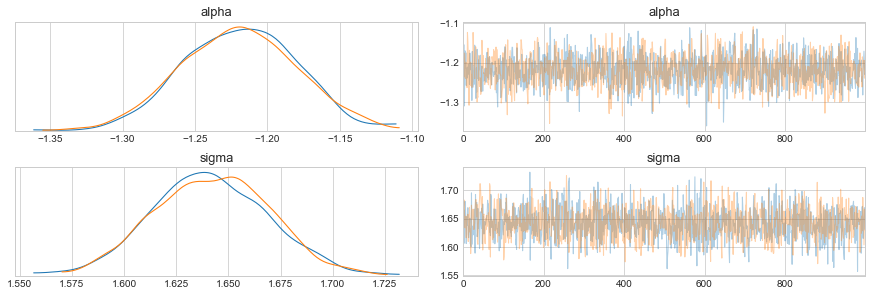
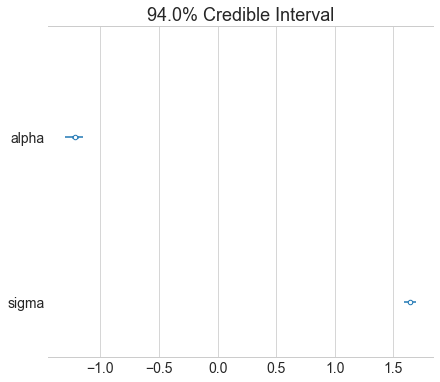
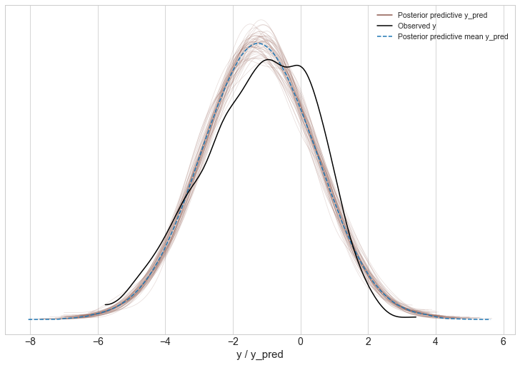
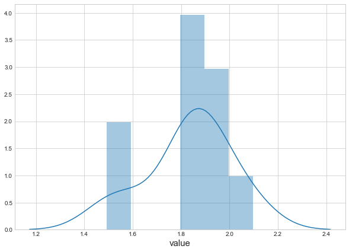
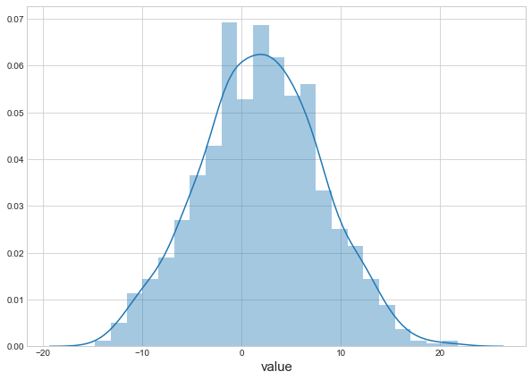
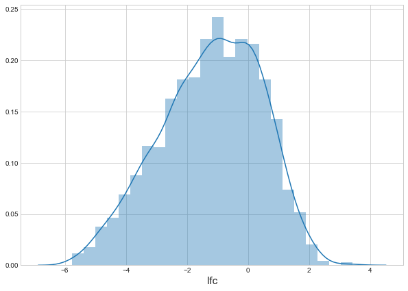

# DEMETER2 in Stan


```python
import pystan
import numpy as np
import pandas as pd
from matplotlib import pyplot as plt
import arviz as az
from pathlib import Path
import seaborn as sns
from timeit import default_timer as timer

plt.style.use('seaborn-whitegrid')
plt.rcParams['figure.figsize'] = (10.0, 7.0)
plt.rcParams['axes.titlesize'] = 18
plt.rcParams['axes.labelsize'] = 15

modeling_data_dir = Path('../modeling_data')
```

## Data preparation


```python
modeling_data = pd.read_csv(modeling_data_dir / 'subset_modeling_data.csv')
modeling_data.head()
```


<div>
<style scoped>
    .dataframe tbody tr th:only-of-type {
        vertical-align: middle;
    }

    .dataframe tbody tr th {
        vertical-align: top;
    }

    .dataframe thead th {
        text-align: right;
    }
</style>
<table border="1" class="dataframe">
  <thead>
    <tr style="text-align: right;">
      <th></th>
      <th>barcode_sequence</th>
      <th>cell_line</th>
      <th>lfc</th>
      <th>batch</th>
      <th>gene_symbol</th>
    </tr>
  </thead>
  <tbody>
    <tr>
      <th>0</th>
      <td>ACAGAAGAAATTCTGGCAGAT</td>
      <td>ln215_central_nervous_system</td>
      <td>1.966515</td>
      <td>1</td>
      <td>EIF6</td>
    </tr>
    <tr>
      <th>1</th>
      <td>ACAGAAGAAATTCTGGCAGAT</td>
      <td>ln382_central_nervous_system</td>
      <td>1.289606</td>
      <td>1</td>
      <td>EIF6</td>
    </tr>
    <tr>
      <th>2</th>
      <td>ACAGAAGAAATTCTGGCAGAT</td>
      <td>efo21_ovary</td>
      <td>0.625725</td>
      <td>1</td>
      <td>EIF6</td>
    </tr>
    <tr>
      <th>3</th>
      <td>ACAGAAGAAATTCTGGCAGAT</td>
      <td>jhesoad1_oesophagus</td>
      <td>1.392272</td>
      <td>1</td>
      <td>EIF6</td>
    </tr>
    <tr>
      <th>4</th>
      <td>ACAGAAGAAATTCTGGCAGAT</td>
      <td>km12_large_intestine</td>
      <td>0.820838</td>
      <td>1</td>
      <td>EIF6</td>
    </tr>
  </tbody>
</table>
</div>


## Exploratory data analysis


```python
genes = set(modeling_data.gene_symbol.to_list())
fig, axes = plt.subplots(5, 3, figsize=(9, 9))
for ax, gene in zip(axes.flat, genes):
    lfc = modeling_data[modeling_data.gene_symbol == gene].lfc
    sns.distplot(lfc, kde=True, hist=False, ax=ax, kde_kws={'shade': True}, color='b')
    
    y_data = ax.lines[0].get_ydata()
    ax.vlines(x=0, ymin=0, ymax=np.max(y_data) * 1.05, linestyles='dashed')
    
    ax.set_title(gene, fontsize=12)
    ax.set_xlabel(None)


axes[4, 2].axis('off')
axes[4, 1].axis('off')
fig.tight_layout(pad=1.0)
plt.show()
```


```python
cell_lines = set(modeling_data.cell_line.to_list())
for cell_line in cell_lines:
    lfc = modeling_data[modeling_data.cell_line == cell_line].lfc
    sns.distplot(lfc, kde=True, hist=False, label=None, kde_kws={'alpha': 0.2})

plt.title('LFC distributions')
plt.xlabel('LFC')
plt.show()
```


```python
sns.distplot(modeling_data.lfc)
plt.show()
```


```python
modeling_data[['barcode_sequence', 'gene_symbol']].drop_duplicates().groupby('gene_symbol').count()
```


<div>
<style scoped>
    .dataframe tbody tr th:only-of-type {
        vertical-align: middle;
    }

    .dataframe tbody tr th {
        vertical-align: top;
    }

    .dataframe thead th {
        text-align: right;
    }
</style>
<table border="1" class="dataframe">
  <thead>
    <tr style="text-align: right;">
      <th></th>
      <th>barcode_sequence</th>
    </tr>
    <tr>
      <th>gene_symbol</th>
      <th></th>
    </tr>
  </thead>
  <tbody>
    <tr>
      <th>BRAF</th>
      <td>8</td>
    </tr>
    <tr>
      <th>COG3</th>
      <td>5</td>
    </tr>
    <tr>
      <th>COL8A1</th>
      <td>5</td>
    </tr>
    <tr>
      <th>EGFR</th>
      <td>19</td>
    </tr>
    <tr>
      <th>EIF6</th>
      <td>5</td>
    </tr>
    <tr>
      <th>ESPL1</th>
      <td>5</td>
    </tr>
    <tr>
      <th>GRK5</th>
      <td>5</td>
    </tr>
    <tr>
      <th>KRAS</th>
      <td>11</td>
    </tr>
    <tr>
      <th>PTK2</th>
      <td>23</td>
    </tr>
    <tr>
      <th>RC3H2</th>
      <td>4</td>
    </tr>
    <tr>
      <th>RHBDL2</th>
      <td>5</td>
    </tr>
    <tr>
      <th>SDHB</th>
      <td>5</td>
    </tr>
    <tr>
      <th>TRIM39</th>
      <td>9</td>
    </tr>
  </tbody>
</table>
</div>


```python
lfc_corr = modeling_data \
    .pivot(index='cell_line', columns='barcode_sequence', values='lfc') \
    .corr()

mask = np.triu(np.ones_like(lfc_corr, dtype=np.bool), k=0)
f, ax = plt.subplots(figsize=(15, 13))
cmap = sns.diverging_palette(220, 10, as_cmap=True)
sns.heatmap(lfc_corr, mask=mask, 
            cmap=cmap, center=0, 
            square=True, linewidths=0.5, cbar_kws={'shrink': 0.5})
plt.xlabel('barcode')
plt.ylabel('barcode')
plt.title('Correlation of LFC of barcodes')
plt.show()
```


## Modeling


```python
models_dir = Path('..', 'models')
```


```python
modeling_data.head()
```


<div>
<style scoped>
    .dataframe tbody tr th:only-of-type {
        vertical-align: middle;
    }

    .dataframe tbody tr th {
        vertical-align: top;
    }

    .dataframe thead th {
        text-align: right;
    }
</style>
<table border="1" class="dataframe">
  <thead>
    <tr style="text-align: right;">
      <th></th>
      <th>barcode_sequence</th>
      <th>cell_line</th>
      <th>lfc</th>
      <th>batch</th>
      <th>gene_symbol</th>
    </tr>
  </thead>
  <tbody>
    <tr>
      <th>0</th>
      <td>ACAGAAGAAATTCTGGCAGAT</td>
      <td>ln215_central_nervous_system</td>
      <td>1.966515</td>
      <td>1</td>
      <td>EIF6</td>
    </tr>
    <tr>
      <th>1</th>
      <td>ACAGAAGAAATTCTGGCAGAT</td>
      <td>ln382_central_nervous_system</td>
      <td>1.289606</td>
      <td>1</td>
      <td>EIF6</td>
    </tr>
    <tr>
      <th>2</th>
      <td>ACAGAAGAAATTCTGGCAGAT</td>
      <td>efo21_ovary</td>
      <td>0.625725</td>
      <td>1</td>
      <td>EIF6</td>
    </tr>
    <tr>
      <th>3</th>
      <td>ACAGAAGAAATTCTGGCAGAT</td>
      <td>jhesoad1_oesophagus</td>
      <td>1.392272</td>
      <td>1</td>
      <td>EIF6</td>
    </tr>
    <tr>
      <th>4</th>
      <td>ACAGAAGAAATTCTGGCAGAT</td>
      <td>km12_large_intestine</td>
      <td>0.820838</td>
      <td>1</td>
      <td>EIF6</td>
    </tr>
  </tbody>
</table>
</div>


Select only a few cell lines while model building.


```python
len(np.unique(modeling_data.cell_line))
```


    501


```python
np.random.seed(123)
cell_lines = np.random.choice(np.unique(modeling_data.cell_line), 20)
modeling_data = modeling_data[modeling_data.cell_line.isin(cell_lines)]
modeling_data.shape
```


    (1810, 5)


```python
def add_categorical_idx(df, col):
    df[f'{col}_idx'] = df[col].astype('category').cat.codes + 1
    return df

for col in ['barcode_sequence', 'cell_line', 'gene_symbol']:
    modeling_data = add_categorical_idx(modeling_data, col)

modeling_data = modeling_data.reset_index(drop=True)
modeling_data.head()
```


<div>
<style scoped>
    .dataframe tbody tr th:only-of-type {
        vertical-align: middle;
    }

    .dataframe tbody tr th {
        vertical-align: top;
    }

    .dataframe thead th {
        text-align: right;
    }
</style>
<table border="1" class="dataframe">
  <thead>
    <tr style="text-align: right;">
      <th></th>
      <th>barcode_sequence</th>
      <th>cell_line</th>
      <th>lfc</th>
      <th>batch</th>
      <th>gene_symbol</th>
      <th>barcode_sequence_idx</th>
      <th>cell_line_idx</th>
      <th>gene_symbol_idx</th>
    </tr>
  </thead>
  <tbody>
    <tr>
      <th>0</th>
      <td>ACAGAAGAAATTCTGGCAGAT</td>
      <td>efo21_ovary</td>
      <td>0.625725</td>
      <td>1</td>
      <td>EIF6</td>
      <td>1</td>
      <td>7</td>
      <td>5</td>
    </tr>
    <tr>
      <th>1</th>
      <td>ACAGAAGAAATTCTGGCAGAT</td>
      <td>dbtrg05mg_central_nervous_system</td>
      <td>2.145082</td>
      <td>2</td>
      <td>EIF6</td>
      <td>1</td>
      <td>6</td>
      <td>5</td>
    </tr>
    <tr>
      <th>2</th>
      <td>ACAGAAGAAATTCTGGCAGAT</td>
      <td>bt20_breast</td>
      <td>0.932751</td>
      <td>2</td>
      <td>EIF6</td>
      <td>1</td>
      <td>2</td>
      <td>5</td>
    </tr>
    <tr>
      <th>3</th>
      <td>ACAGAAGAAATTCTGGCAGAT</td>
      <td>calu1_lung</td>
      <td>1.519675</td>
      <td>2</td>
      <td>EIF6</td>
      <td>1</td>
      <td>3</td>
      <td>5</td>
    </tr>
    <tr>
      <th>4</th>
      <td>ACAGAAGAAATTCTGGCAGAT</td>
      <td>opm2_haematopoietic_and_lymphoid_tissue</td>
      <td>0.509560</td>
      <td>2</td>
      <td>EIF6</td>
      <td>1</td>
      <td>17</td>
      <td>5</td>
    </tr>
  </tbody>
</table>
</div>


Binary matrix of $[shRNA \times gene]$.


```python
shrna_gene_matrix = modeling_data[['barcode_sequence_idx', 'gene_symbol_idx']] \
    .drop_duplicates() \
    .reset_index(drop=True) \
    .assign(value = lambda df: np.ones(df.shape[0], dtype=int)) \
    .pivot(index='barcode_sequence_idx', columns='gene_symbol_idx', values='value') \
    .fillna(0) \
    .to_numpy() \
    .astype(int)

shrna_gene_matrix
```


    array([[0, 0, 0, ..., 0, 0, 0],
           [0, 0, 0, ..., 0, 0, 0],
           [0, 0, 0, ..., 0, 0, 0],
           ...,
           [0, 0, 0, ..., 0, 0, 0],
           [0, 0, 0, ..., 0, 0, 0],
           [0, 0, 0, ..., 0, 0, 1]])


```python
shrna_gene_matrix.shape
```


    (109, 13)


## Model 1. Just an intercept

$$
D \sim N(\mu, \sigma) \\
\mu = \alpha \\
\alpha \sim N(0, 5) \\
\sigma \sim \text{HalfCauchy}(0, 5)
$$

**Model data.**


```python
d2_m1_data = {
    'N': int(modeling_data.shape[0]),
    'y': modeling_data.lfc
}
```

**Compile model.**


```python
start = timer()
d2_m1_file = models_dir / 'd2_m1.cpp'
d2_m1 = pystan.StanModel(file=d2_m1_file.as_posix())
end = timer()
print(f'{(end - start) / 60:.2f} minutes to compile model')
```

    INFO:pystan:COMPILING THE C++ CODE FOR MODEL anon_model_2a3da92f7ba3e62805394cf29daed746 NOW.


    1.10 minutes to compile model


```python
d2_m1_fit = d2_m1.sampling(data=d2_m1_data, iter=2000, chains=2)
```

    WARNING:pystan:Maximum (flat) parameter count (1000) exceeded: skipping diagnostic tests for n_eff and Rhat.
    To run all diagnostics call pystan.check_hmc_diagnostics(fit)


```python
pystan.check_hmc_diagnostics(d2_m1_fit)
```


    {'n_eff': True,
     'Rhat': True,
     'divergence': True,
     'treedepth': True,
     'energy': True}


```python
az_d2_m1 = az.from_pystan(posterior=d2_m1_fit,
                          posterior_predictive='y_pred',
                          observed_data=['y'],
                          posterior_model=d2_m1)
az.summary(az_d2_m1)
```


<div>
<style scoped>
    .dataframe tbody tr th:only-of-type {
        vertical-align: middle;
    }

    .dataframe tbody tr th {
        vertical-align: top;
    }

    .dataframe thead th {
        text-align: right;
    }
</style>
<table border="1" class="dataframe">
  <thead>
    <tr style="text-align: right;">
      <th></th>
      <th>mean</th>
      <th>sd</th>
      <th>hpd_3%</th>
      <th>hpd_97%</th>
      <th>mcse_mean</th>
      <th>mcse_sd</th>
      <th>ess_mean</th>
      <th>ess_sd</th>
      <th>ess_bulk</th>
      <th>ess_tail</th>
      <th>r_hat</th>
    </tr>
  </thead>
  <tbody>
    <tr>
      <th>alpha</th>
      <td>-1.219</td>
      <td>0.039</td>
      <td>-1.299</td>
      <td>-1.153</td>
      <td>0.001</td>
      <td>0.001</td>
      <td>1813.0</td>
      <td>1813.0</td>
      <td>1805.0</td>
      <td>1413.0</td>
      <td>1.0</td>
    </tr>
    <tr>
      <th>sigma</th>
      <td>1.642</td>
      <td>0.028</td>
      <td>1.588</td>
      <td>1.691</td>
      <td>0.001</td>
      <td>0.000</td>
      <td>1767.0</td>
      <td>1767.0</td>
      <td>1760.0</td>
      <td>1313.0</td>
      <td>1.0</td>
    </tr>
  </tbody>
</table>
</div>


```python
az.plot_trace(az_d2_m1)
plt.show()
```

    /usr/local/Caskroom/miniconda/base/envs/demeter2-stan-demo/lib/python3.7/site-packages/arviz/plots/backends/matplotlib/distplot.py:38: UserWarning: Argument backend_kwargs has not effect in matplotlib.plot_distSupplied value won't be used
      "Argument backend_kwargs has not effect in matplotlib.plot_dist"
    /usr/local/Caskroom/miniconda/base/envs/demeter2-stan-demo/lib/python3.7/site-packages/arviz/plots/backends/matplotlib/distplot.py:38: UserWarning: Argument backend_kwargs has not effect in matplotlib.plot_distSupplied value won't be used
      "Argument backend_kwargs has not effect in matplotlib.plot_dist"
    /usr/local/Caskroom/miniconda/base/envs/demeter2-stan-demo/lib/python3.7/site-packages/arviz/plots/backends/matplotlib/distplot.py:38: UserWarning: Argument backend_kwargs has not effect in matplotlib.plot_distSupplied value won't be used
      "Argument backend_kwargs has not effect in matplotlib.plot_dist"
    /usr/local/Caskroom/miniconda/base/envs/demeter2-stan-demo/lib/python3.7/site-packages/arviz/plots/backends/matplotlib/distplot.py:38: UserWarning: Argument backend_kwargs has not effect in matplotlib.plot_distSupplied value won't be used
      "Argument backend_kwargs has not effect in matplotlib.plot_dist"





```python
az.plot_forest(az_d2_m1, combined=True)
plt.show()
```





```python
az.plot_ppc(az_d2_m1, data_pairs={'y':'y_pred'}, num_pp_samples=50)
plt.show()
```





## Model 2. Varying intercept by shRNA

$$
D_{i|s} \sim N(\mu_{i|s}, \sigma) \\
\mu = \alpha_{i|s} \\
\alpha \sim N(\mu_{\alpha}, \sigma_{\alpha}) \\
\mu_{\alpha} \sim N(0, 2) \\
\sigma_{\alpha} \sim \text{HalfCauchy}(0, 2) \\
\sigma \sim \text{HalfCauchy}(0, 5)
$$

### Generative model for a prior predictive check


```python
N = 1000
S = 10
shrna_barcodes = list(range(1, S+1))
shrna_barcodes_idx = np.repeat(shrna_barcodes, N/S)
```


```python
d2_m2_gen_data = {
    'N': N,
    'S': S,
    'shrna': shrna_barcodes_idx
}
```


```python
start = timer()
d2_m2_gen_file = models_dir / 'd2_m2_generative.cpp'
d2_m2_gen = pystan.StanModel(file=d2_m2_gen_file.as_posix())
end = timer()
print(f'{(end - start) / 60:.2f} minutes to compile model')
```

    INFO:pystan:COMPILING THE C++ CODE FOR MODEL anon_model_498bda6ce0d89bc883367436cb6ab0a6 NOW.


    0.94 minutes to compile model


```python
d2_m2_gen_fit = d2_m2_gen.sampling(data=d2_m2_gen_data, iter=1, chains=1, algorithm='Fixed_param')
```


```python
az_d2_m2_gen = az.from_pystan(d2_m2_gen_fit)
```


```python
df = d2_m2_gen_fit.to_dataframe() \
    .drop(['chain', 'draw', 'warmup'], axis=1) \
    .melt(var_name='parameter', value_name='value')
df = df[df.parameter.str.contains('alpha\[')]
sns.distplot(df.value)
plt.show()
```





```python
df = d2_m2_gen_fit.to_dataframe() \
    .drop(['chain', 'draw', 'warmup'], axis=1) \
    .melt(var_name='parameter', value_name='value')
df = df[df.parameter.str.contains('y_pred')]
sns.distplot(df.value)
plt.show()
```





```python
sns.distplot(modeling_data.lfc)
```


    <matplotlib.axes._subplots.AxesSubplot at 0x1a338d0e50>





```python

```


```python

```


```python

```


```python

```


```python

```

**Model data**


```python
d2_m2_data = {
    'N': int(modeling_data.shape[0]),
    'S': np.max(modeling_data.barcode_sequence_idx),
    
    'shrna': modeling_data.barcode_sequence_idx,
    
    'y': modeling_data.lfc,
}
```

**Compile model.**

start = timer()
d2_m2_file = models_dir / 'd2_m2.cpp'
d2_m2 = pystan.StanModel(file=d2_m2_file.as_posix())
end = timer()
print(f'{(end - start) / 60:.2f} minutes to compile model')

d2_m2_fit = d2_m2.sampling(data=d2_m2_data, iter=2000, chains=2)


```python

```
