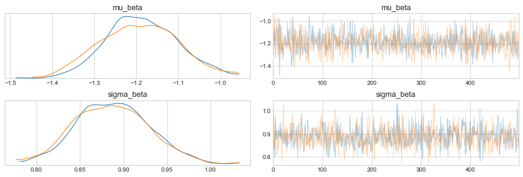

# DEMETER2 in Stan


```python
import pystan
import numpy as np
import pandas as pd
from matplotlib import pyplot as plt
import arviz as az
from pathlib import Path
import seaborn as sns
from timeit import default_timer as timer

plt.style.use('seaborn-whitegrid')
plt.rcParams['figure.figsize'] = (10.0, 7.0)
plt.rcParams['axes.titlesize'] = 18
plt.rcParams['axes.labelsize'] = 15

modeling_data_dir = Path('../modeling_data')
```

## Data preparation


```python
modeling_data = pd.read_csv(modeling_data_dir / 'subset_modeling_data.csv')
modeling_data.head()
```


<div>
<style scoped>
    .dataframe tbody tr th:only-of-type {
        vertical-align: middle;
    }

    .dataframe tbody tr th {
        vertical-align: top;
    }

    .dataframe thead th {
        text-align: right;
    }
</style>
<table border="1" class="dataframe">
  <thead>
    <tr style="text-align: right;">
      <th></th>
      <th>barcode_sequence</th>
      <th>cell_line</th>
      <th>lfc</th>
      <th>batch</th>
      <th>gene_symbol</th>
    </tr>
  </thead>
  <tbody>
    <tr>
      <th>0</th>
      <td>ACAGAAGAAATTCTGGCAGAT</td>
      <td>ln215_central_nervous_system</td>
      <td>1.966515</td>
      <td>1</td>
      <td>EIF6</td>
    </tr>
    <tr>
      <th>1</th>
      <td>ACAGAAGAAATTCTGGCAGAT</td>
      <td>ln382_central_nervous_system</td>
      <td>1.289606</td>
      <td>1</td>
      <td>EIF6</td>
    </tr>
    <tr>
      <th>2</th>
      <td>ACAGAAGAAATTCTGGCAGAT</td>
      <td>efo21_ovary</td>
      <td>0.625725</td>
      <td>1</td>
      <td>EIF6</td>
    </tr>
    <tr>
      <th>3</th>
      <td>ACAGAAGAAATTCTGGCAGAT</td>
      <td>jhesoad1_oesophagus</td>
      <td>1.392272</td>
      <td>1</td>
      <td>EIF6</td>
    </tr>
    <tr>
      <th>4</th>
      <td>ACAGAAGAAATTCTGGCAGAT</td>
      <td>km12_large_intestine</td>
      <td>0.820838</td>
      <td>1</td>
      <td>EIF6</td>
    </tr>
  </tbody>
</table>
</div>


## Exploratory data analysis


```python
genes = set(modeling_data.gene_symbol.to_list())
for gene in genes:
    lfc = modeling_data[modeling_data.gene_symbol == gene].lfc
    sns.distplot(lfc, kde=True, hist=False, label=gene)

plt.title('LFC distributions')
plt.xlabel('LFC')
plt.legend()
plt.show()
```


```python
cell_lines = set(modeling_data.cell_line.to_list())
for cell_line in cell_lines:
    lfc = modeling_data[modeling_data.cell_line == cell_line].lfc
    sns.distplot(lfc, kde=True, hist=False, label=None, kde_kws={'alpha': 0.2})

plt.title('LFC distributions')
plt.xlabel('LFC')
plt.show()
```


```python
modeling_data[['barcode_sequence', 'gene_symbol']].drop_duplicates().groupby('gene_symbol').count()
```


<div>
<style scoped>
    .dataframe tbody tr th:only-of-type {
        vertical-align: middle;
    }

    .dataframe tbody tr th {
        vertical-align: top;
    }

    .dataframe thead th {
        text-align: right;
    }
</style>
<table border="1" class="dataframe">
  <thead>
    <tr style="text-align: right;">
      <th></th>
      <th>barcode_sequence</th>
    </tr>
    <tr>
      <th>gene_symbol</th>
      <th></th>
    </tr>
  </thead>
  <tbody>
    <tr>
      <th>BRAF</th>
      <td>8</td>
    </tr>
    <tr>
      <th>COG3</th>
      <td>5</td>
    </tr>
    <tr>
      <th>COL8A1</th>
      <td>5</td>
    </tr>
    <tr>
      <th>EGFR</th>
      <td>19</td>
    </tr>
    <tr>
      <th>EIF6</th>
      <td>5</td>
    </tr>
    <tr>
      <th>ESPL1</th>
      <td>5</td>
    </tr>
    <tr>
      <th>GRK5</th>
      <td>5</td>
    </tr>
    <tr>
      <th>KRAS</th>
      <td>11</td>
    </tr>
    <tr>
      <th>PTK2</th>
      <td>23</td>
    </tr>
    <tr>
      <th>RC3H2</th>
      <td>4</td>
    </tr>
    <tr>
      <th>RHBDL2</th>
      <td>5</td>
    </tr>
    <tr>
      <th>SDHB</th>
      <td>5</td>
    </tr>
    <tr>
      <th>TRIM39</th>
      <td>9</td>
    </tr>
  </tbody>
</table>
</div>


```python
lfc_corr = modeling_data \
    .pivot(index='cell_line', columns='barcode_sequence', values='lfc') \
    .corr()

mask = np.triu(np.ones_like(lfc_corr, dtype=np.bool), k=0)
f, ax = plt.subplots(figsize=(15, 13))
cmap = sns.diverging_palette(220, 10, as_cmap=True)
sns.heatmap(lfc_corr, mask=mask, 
            cmap=cmap, center=0, 
            square=True, linewidths=0.5, cbar_kws={'shrink': 0.5})
plt.xlabel('barcode')
plt.ylabel('barcode')
plt.title('Correlation of LFC of barcodes')
plt.show()
```


## Modeling


```python
models_dir = Path('..', 'models')
```


```python
modeling_data.head()
```


<div>
<style scoped>
    .dataframe tbody tr th:only-of-type {
        vertical-align: middle;
    }

    .dataframe tbody tr th {
        vertical-align: top;
    }

    .dataframe thead th {
        text-align: right;
    }
</style>
<table border="1" class="dataframe">
  <thead>
    <tr style="text-align: right;">
      <th></th>
      <th>barcode_sequence</th>
      <th>cell_line</th>
      <th>lfc</th>
      <th>batch</th>
      <th>gene_symbol</th>
    </tr>
  </thead>
  <tbody>
    <tr>
      <th>0</th>
      <td>ACAGAAGAAATTCTGGCAGAT</td>
      <td>ln215_central_nervous_system</td>
      <td>1.966515</td>
      <td>1</td>
      <td>EIF6</td>
    </tr>
    <tr>
      <th>1</th>
      <td>ACAGAAGAAATTCTGGCAGAT</td>
      <td>ln382_central_nervous_system</td>
      <td>1.289606</td>
      <td>1</td>
      <td>EIF6</td>
    </tr>
    <tr>
      <th>2</th>
      <td>ACAGAAGAAATTCTGGCAGAT</td>
      <td>efo21_ovary</td>
      <td>0.625725</td>
      <td>1</td>
      <td>EIF6</td>
    </tr>
    <tr>
      <th>3</th>
      <td>ACAGAAGAAATTCTGGCAGAT</td>
      <td>jhesoad1_oesophagus</td>
      <td>1.392272</td>
      <td>1</td>
      <td>EIF6</td>
    </tr>
    <tr>
      <th>4</th>
      <td>ACAGAAGAAATTCTGGCAGAT</td>
      <td>km12_large_intestine</td>
      <td>0.820838</td>
      <td>1</td>
      <td>EIF6</td>
    </tr>
  </tbody>
</table>
</div>


Select only a few cell lines while model building.


```python
np.random.seed(123)
cell_lines = np.random.choice(np.unique(modeling_data.cell_line), 30)
modeling_data = modeling_data[modeling_data.cell_line.isin(cell_lines)]
modeling_data.shape
```


    (2587, 5)


```python
def add_categorical_idx(df, col):
    df[f'{col}_idx'] = df[col].astype('category').cat.codes + 1
    return df

for col in ['barcode_sequence', 'cell_line', 'gene_symbol']:
    modeling_data = add_categorical_idx(modeling_data, col)

modeling_data = modeling_data.reset_index(drop=True)
modeling_data.head()
```


<div>
<style scoped>
    .dataframe tbody tr th:only-of-type {
        vertical-align: middle;
    }

    .dataframe tbody tr th {
        vertical-align: top;
    }

    .dataframe thead th {
        text-align: right;
    }
</style>
<table border="1" class="dataframe">
  <thead>
    <tr style="text-align: right;">
      <th></th>
      <th>barcode_sequence</th>
      <th>cell_line</th>
      <th>lfc</th>
      <th>batch</th>
      <th>gene_symbol</th>
      <th>barcode_sequence_idx</th>
      <th>cell_line_idx</th>
      <th>gene_symbol_idx</th>
    </tr>
  </thead>
  <tbody>
    <tr>
      <th>0</th>
      <td>ACAGAAGAAATTCTGGCAGAT</td>
      <td>efo21_ovary</td>
      <td>0.625725</td>
      <td>1</td>
      <td>EIF6</td>
      <td>1</td>
      <td>8</td>
      <td>5</td>
    </tr>
    <tr>
      <th>1</th>
      <td>ACAGAAGAAATTCTGGCAGAT</td>
      <td>dbtrg05mg_central_nervous_system</td>
      <td>2.145082</td>
      <td>2</td>
      <td>EIF6</td>
      <td>1</td>
      <td>7</td>
      <td>5</td>
    </tr>
    <tr>
      <th>2</th>
      <td>ACAGAAGAAATTCTGGCAGAT</td>
      <td>bt20_breast</td>
      <td>0.932751</td>
      <td>2</td>
      <td>EIF6</td>
      <td>1</td>
      <td>2</td>
      <td>5</td>
    </tr>
    <tr>
      <th>3</th>
      <td>ACAGAAGAAATTCTGGCAGAT</td>
      <td>kns60_central_nervous_system</td>
      <td>0.803835</td>
      <td>2</td>
      <td>EIF6</td>
      <td>1</td>
      <td>15</td>
      <td>5</td>
    </tr>
    <tr>
      <th>4</th>
      <td>ACAGAAGAAATTCTGGCAGAT</td>
      <td>calu1_lung</td>
      <td>1.519675</td>
      <td>2</td>
      <td>EIF6</td>
      <td>1</td>
      <td>3</td>
      <td>5</td>
    </tr>
  </tbody>
</table>
</div>


Binary matrix of $[shRNA \times gene]$.


```python
shrna_gene_matrix = modeling_data[['barcode_sequence_idx', 'gene_symbol_idx']] \
    .drop_duplicates() \
    .reset_index(drop=True) \
    .assign(value = lambda df: np.ones(df.shape[0], dtype=int)) \
    .pivot(index='barcode_sequence_idx', columns='gene_symbol_idx', values='value') \
    .fillna(0) \
    .to_numpy() \
    .astype(int)

shrna_gene_matrix
```


    array([[0, 0, 0, ..., 0, 0, 0],
           [0, 0, 0, ..., 0, 0, 0],
           [0, 0, 0, ..., 0, 0, 0],
           ...,
           [0, 0, 0, ..., 0, 0, 0],
           [0, 0, 0, ..., 0, 0, 0],
           [0, 0, 0, ..., 0, 0, 1]])


```python
shrna_gene_matrix.shape
```


    (109, 13)


```python
# d2_stan_data = {
#     'N': int(modeling_data.shape[0]),
#     'I': len(np.unique(modeling_data.barcode_sequence_idx)),
#     'J': len(np.unique(modeling_data.cell_line_idx)),
#     'K': len(np.unique(modeling_data.batch)),
#     'L': len(np.unique(modeling_data.gene_symbol_idx)),
    
#     'shrna': modeling_data.barcode_sequence_idx,
#     'cell_line': modeling_data.cell_line_idx,
#     'batch': modeling_data.batch,
#     'gene': modeling_data.gene_symbol_idx,
    
#     'y': modeling_data.lfc,
# }
```

**Model data.**


```python
d2_stan_data = {
    'N': int(modeling_data.shape[0]),
    'I': len(np.unique(modeling_data.barcode_sequence_idx)),
    
    'shrna': modeling_data.barcode_sequence_idx,
    
    'y': modeling_data.lfc
}
```

**Compile model.**


```python
start = timer()
d2_stan_file = models_dir / 'd2_stan_model_2.stan'
d2_stan_model = pystan.StanModel(file=d2_stan_file.as_posix())
end = timer()
print(f'{(end - start) / 60:.2f} minutes to compile model')
```

    INFO:pystan:COMPILING THE C++ CODE FOR MODEL anon_model_a558ff61f54edac101a6efc3dd3eda69 NOW.


    1.01 minutes to compile model


**Sample from posterior.**


```python
start = timer()
d2_stan_fit = d2_stan_model.sampling(data=d2_stan_data, iter=1000, chains=2)
end = timer()
print(f'{(end - start) / 60:.2f} minutes to sample from posterior.')
```

    WARNING:pystan:Maximum (flat) parameter count (1000) exceeded: skipping diagnostic tests for n_eff and Rhat.
    To run all diagnostics call pystan.check_hmc_diagnostics(fit)


    0.08 minutes to sample from posterior.


```python
pystan.check_hmc_diagnostics(d2_stan_fit)
```


    {'n_eff': True,
     'Rhat': True,
     'divergence': True,
     'treedepth': True,
     'energy': True}


```python
az_d2_stan = az.from_pystan(
    posterior=d2_stan_fit,
    posterior_predictive='yhat',
    observed_data=['y'],
    posterior_model=d2_stan_model
)
az.summary(az_d2_stan)
```


<div>
<style scoped>
    .dataframe tbody tr th:only-of-type {
        vertical-align: middle;
    }

    .dataframe tbody tr th {
        vertical-align: top;
    }

    .dataframe thead th {
        text-align: right;
    }
</style>
<table border="1" class="dataframe">
  <thead>
    <tr style="text-align: right;">
      <th></th>
      <th>mean</th>
      <th>sd</th>
      <th>hpd_3%</th>
      <th>hpd_97%</th>
      <th>mcse_mean</th>
      <th>mcse_sd</th>
      <th>ess_mean</th>
      <th>ess_sd</th>
      <th>ess_bulk</th>
      <th>ess_tail</th>
      <th>r_hat</th>
    </tr>
  </thead>
  <tbody>
    <tr>
      <th>mu_beta</th>
      <td>-1.190</td>
      <td>0.088</td>
      <td>-1.354</td>
      <td>-1.023</td>
      <td>0.002</td>
      <td>0.002</td>
      <td>1410.0</td>
      <td>1396.0</td>
      <td>1402.0</td>
      <td>728.0</td>
      <td>1.00</td>
    </tr>
    <tr>
      <th>sigma_beta</th>
      <td>0.888</td>
      <td>0.044</td>
      <td>0.812</td>
      <td>0.976</td>
      <td>0.001</td>
      <td>0.001</td>
      <td>1233.0</td>
      <td>1224.0</td>
      <td>1250.0</td>
      <td>781.0</td>
      <td>1.00</td>
    </tr>
    <tr>
      <th>beta[0]</th>
      <td>0.643</td>
      <td>0.204</td>
      <td>0.295</td>
      <td>1.038</td>
      <td>0.006</td>
      <td>0.004</td>
      <td>1238.0</td>
      <td>1191.0</td>
      <td>1233.0</td>
      <td>755.0</td>
      <td>1.01</td>
    </tr>
    <tr>
      <th>beta[1]</th>
      <td>-0.279</td>
      <td>0.200</td>
      <td>-0.660</td>
      <td>0.094</td>
      <td>0.005</td>
      <td>0.005</td>
      <td>1366.0</td>
      <td>907.0</td>
      <td>1379.0</td>
      <td>797.0</td>
      <td>1.00</td>
    </tr>
    <tr>
      <th>beta[2]</th>
      <td>-0.619</td>
      <td>0.205</td>
      <td>-0.994</td>
      <td>-0.236</td>
      <td>0.006</td>
      <td>0.005</td>
      <td>1172.0</td>
      <td>882.0</td>
      <td>1081.0</td>
      <td>596.0</td>
      <td>1.01</td>
    </tr>
    <tr>
      <th>...</th>
      <td>...</td>
      <td>...</td>
      <td>...</td>
      <td>...</td>
      <td>...</td>
      <td>...</td>
      <td>...</td>
      <td>...</td>
      <td>...</td>
      <td>...</td>
      <td>...</td>
    </tr>
    <tr>
      <th>mu[2582]</th>
      <td>-1.377</td>
      <td>0.272</td>
      <td>-1.882</td>
      <td>-0.873</td>
      <td>0.007</td>
      <td>0.005</td>
      <td>1573.0</td>
      <td>1373.0</td>
      <td>1551.0</td>
      <td>727.0</td>
      <td>1.01</td>
    </tr>
    <tr>
      <th>mu[2583]</th>
      <td>-1.377</td>
      <td>0.272</td>
      <td>-1.882</td>
      <td>-0.873</td>
      <td>0.007</td>
      <td>0.005</td>
      <td>1573.0</td>
      <td>1373.0</td>
      <td>1551.0</td>
      <td>727.0</td>
      <td>1.01</td>
    </tr>
    <tr>
      <th>mu[2584]</th>
      <td>-1.377</td>
      <td>0.272</td>
      <td>-1.882</td>
      <td>-0.873</td>
      <td>0.007</td>
      <td>0.005</td>
      <td>1573.0</td>
      <td>1373.0</td>
      <td>1551.0</td>
      <td>727.0</td>
      <td>1.01</td>
    </tr>
    <tr>
      <th>mu[2585]</th>
      <td>-1.377</td>
      <td>0.272</td>
      <td>-1.882</td>
      <td>-0.873</td>
      <td>0.007</td>
      <td>0.005</td>
      <td>1573.0</td>
      <td>1373.0</td>
      <td>1551.0</td>
      <td>727.0</td>
      <td>1.01</td>
    </tr>
    <tr>
      <th>mu[2586]</th>
      <td>-1.377</td>
      <td>0.272</td>
      <td>-1.882</td>
      <td>-0.873</td>
      <td>0.007</td>
      <td>0.005</td>
      <td>1573.0</td>
      <td>1373.0</td>
      <td>1551.0</td>
      <td>727.0</td>
      <td>1.01</td>
    </tr>
  </tbody>
</table>
<p>2699 rows × 11 columns</p>
</div>


```python
az.plot_trace(az_d2_stan, var_names=['mu_beta', 'sigma_beta'])
plt.show()
```

    /usr/local/Caskroom/miniconda/base/envs/demeter2-stan-demo/lib/python3.7/site-packages/arviz/plots/backends/matplotlib/distplot.py:38: UserWarning: Argument backend_kwargs has not effect in matplotlib.plot_distSupplied value won't be used
      "Argument backend_kwargs has not effect in matplotlib.plot_dist"
    /usr/local/Caskroom/miniconda/base/envs/demeter2-stan-demo/lib/python3.7/site-packages/arviz/plots/backends/matplotlib/distplot.py:38: UserWarning: Argument backend_kwargs has not effect in matplotlib.plot_distSupplied value won't be used
      "Argument backend_kwargs has not effect in matplotlib.plot_dist"
    /usr/local/Caskroom/miniconda/base/envs/demeter2-stan-demo/lib/python3.7/site-packages/arviz/plots/backends/matplotlib/distplot.py:38: UserWarning: Argument backend_kwargs has not effect in matplotlib.plot_distSupplied value won't be used
      "Argument backend_kwargs has not effect in matplotlib.plot_dist"
    /usr/local/Caskroom/miniconda/base/envs/demeter2-stan-demo/lib/python3.7/site-packages/arviz/plots/backends/matplotlib/distplot.py:38: UserWarning: Argument backend_kwargs has not effect in matplotlib.plot_distSupplied value won't be used
      "Argument backend_kwargs has not effect in matplotlib.plot_dist"





```python
az.plot_forest(az_d2_stan, var_names='beta', combined=True, figsize=(6, 20))
plt.show()
```


```python
d2_stan_fit.to_dataframe()
```


<div>
<style scoped>
    .dataframe tbody tr th:only-of-type {
        vertical-align: middle;
    }

    .dataframe tbody tr th {
        vertical-align: top;
    }

    .dataframe thead th {
        text-align: right;
    }
</style>
<table border="1" class="dataframe">
  <thead>
    <tr style="text-align: right;">
      <th></th>
      <th>chain</th>
      <th>draw</th>
      <th>warmup</th>
      <th>mu_beta</th>
      <th>sigma_beta</th>
      <th>beta[1]</th>
      <th>beta[2]</th>
      <th>beta[3]</th>
      <th>beta[4]</th>
      <th>beta[5]</th>
      <th>...</th>
      <th>yhat[2585]</th>
      <th>yhat[2586]</th>
      <th>yhat[2587]</th>
      <th>lp__</th>
      <th>accept_stat__</th>
      <th>stepsize__</th>
      <th>treedepth__</th>
      <th>n_leapfrog__</th>
      <th>divergent__</th>
      <th>energy__</th>
    </tr>
  </thead>
  <tbody>
    <tr>
      <th>0</th>
      <td>0</td>
      <td>0</td>
      <td>0</td>
      <td>-1.049408</td>
      <td>0.825869</td>
      <td>0.645257</td>
      <td>-0.590221</td>
      <td>-0.878327</td>
      <td>0.187351</td>
      <td>-1.841066</td>
      <td>...</td>
      <td>-0.047915</td>
      <td>-0.801671</td>
      <td>-1.541574</td>
      <td>-1988.971359</td>
      <td>0.837264</td>
      <td>0.395390</td>
      <td>7</td>
      <td>255</td>
      <td>0</td>
      <td>2040.212250</td>
    </tr>
    <tr>
      <th>1</th>
      <td>0</td>
      <td>1</td>
      <td>0</td>
      <td>-1.108819</td>
      <td>0.832297</td>
      <td>0.665721</td>
      <td>-0.506640</td>
      <td>-0.799964</td>
      <td>0.195323</td>
      <td>-1.821193</td>
      <td>...</td>
      <td>-1.463775</td>
      <td>-1.219973</td>
      <td>-1.086690</td>
      <td>-1990.694927</td>
      <td>0.758736</td>
      <td>0.395390</td>
      <td>4</td>
      <td>15</td>
      <td>0</td>
      <td>2053.227271</td>
    </tr>
    <tr>
      <th>2</th>
      <td>0</td>
      <td>2</td>
      <td>0</td>
      <td>-1.224717</td>
      <td>0.912140</td>
      <td>0.713571</td>
      <td>-0.027183</td>
      <td>-0.441680</td>
      <td>0.134803</td>
      <td>-2.072578</td>
      <td>...</td>
      <td>-0.860595</td>
      <td>-0.950568</td>
      <td>-0.945576</td>
      <td>-1987.254594</td>
      <td>0.937763</td>
      <td>0.395390</td>
      <td>4</td>
      <td>31</td>
      <td>0</td>
      <td>2040.024388</td>
    </tr>
    <tr>
      <th>3</th>
      <td>0</td>
      <td>3</td>
      <td>0</td>
      <td>-1.058389</td>
      <td>0.798282</td>
      <td>0.697961</td>
      <td>-0.221139</td>
      <td>-0.693913</td>
      <td>0.214325</td>
      <td>-1.676556</td>
      <td>...</td>
      <td>-3.053670</td>
      <td>-2.028790</td>
      <td>-1.769880</td>
      <td>-1988.348382</td>
      <td>0.769453</td>
      <td>0.395390</td>
      <td>4</td>
      <td>15</td>
      <td>0</td>
      <td>2045.970578</td>
    </tr>
    <tr>
      <th>4</th>
      <td>0</td>
      <td>4</td>
      <td>0</td>
      <td>-1.126221</td>
      <td>0.805568</td>
      <td>0.616773</td>
      <td>-0.581930</td>
      <td>-0.514296</td>
      <td>0.204807</td>
      <td>-1.675137</td>
      <td>...</td>
      <td>-1.591246</td>
      <td>-1.774926</td>
      <td>-1.877553</td>
      <td>-1993.803838</td>
      <td>0.923430</td>
      <td>0.395390</td>
      <td>4</td>
      <td>31</td>
      <td>0</td>
      <td>2035.541577</td>
    </tr>
    <tr>
      <th>...</th>
      <td>...</td>
      <td>...</td>
      <td>...</td>
      <td>...</td>
      <td>...</td>
      <td>...</td>
      <td>...</td>
      <td>...</td>
      <td>...</td>
      <td>...</td>
      <td>...</td>
      <td>...</td>
      <td>...</td>
      <td>...</td>
      <td>...</td>
      <td>...</td>
      <td>...</td>
      <td>...</td>
      <td>...</td>
      <td>...</td>
      <td>...</td>
    </tr>
    <tr>
      <th>995</th>
      <td>1</td>
      <td>495</td>
      <td>0</td>
      <td>-1.218046</td>
      <td>0.879811</td>
      <td>0.661233</td>
      <td>0.025270</td>
      <td>-0.763057</td>
      <td>-0.031203</td>
      <td>-1.979244</td>
      <td>...</td>
      <td>-1.123098</td>
      <td>-1.718323</td>
      <td>-0.081384</td>
      <td>-1991.957705</td>
      <td>0.984182</td>
      <td>0.440405</td>
      <td>5</td>
      <td>63</td>
      <td>0</td>
      <td>2046.471965</td>
    </tr>
    <tr>
      <th>996</th>
      <td>1</td>
      <td>496</td>
      <td>0</td>
      <td>-1.123918</td>
      <td>0.872889</td>
      <td>0.834393</td>
      <td>-0.774555</td>
      <td>-0.384811</td>
      <td>0.283169</td>
      <td>-2.173340</td>
      <td>...</td>
      <td>-2.475588</td>
      <td>-2.299393</td>
      <td>-2.035461</td>
      <td>-1997.213557</td>
      <td>0.674914</td>
      <td>0.440405</td>
      <td>3</td>
      <td>15</td>
      <td>0</td>
      <td>2062.597582</td>
    </tr>
    <tr>
      <th>997</th>
      <td>1</td>
      <td>497</td>
      <td>0</td>
      <td>-1.103700</td>
      <td>0.865963</td>
      <td>0.726330</td>
      <td>-0.616696</td>
      <td>-0.423589</td>
      <td>0.220079</td>
      <td>-2.224683</td>
      <td>...</td>
      <td>-1.026237</td>
      <td>-0.646308</td>
      <td>0.633815</td>
      <td>-1995.559778</td>
      <td>0.848649</td>
      <td>0.440405</td>
      <td>5</td>
      <td>63</td>
      <td>0</td>
      <td>2056.587481</td>
    </tr>
    <tr>
      <th>998</th>
      <td>1</td>
      <td>498</td>
      <td>0</td>
      <td>-1.297169</td>
      <td>0.878485</td>
      <td>0.381442</td>
      <td>-0.290991</td>
      <td>-0.860071</td>
      <td>0.347411</td>
      <td>-1.606862</td>
      <td>...</td>
      <td>-4.319800</td>
      <td>-0.568595</td>
      <td>-2.522868</td>
      <td>-2003.604753</td>
      <td>0.829050</td>
      <td>0.440405</td>
      <td>3</td>
      <td>7</td>
      <td>0</td>
      <td>2055.063955</td>
    </tr>
    <tr>
      <th>999</th>
      <td>1</td>
      <td>499</td>
      <td>0</td>
      <td>-1.331909</td>
      <td>0.842262</td>
      <td>0.342574</td>
      <td>-0.393352</td>
      <td>-0.491857</td>
      <td>0.080703</td>
      <td>-1.684695</td>
      <td>...</td>
      <td>-3.239669</td>
      <td>0.197889</td>
      <td>-2.686466</td>
      <td>-2006.498121</td>
      <td>0.774766</td>
      <td>0.440405</td>
      <td>3</td>
      <td>7</td>
      <td>0</td>
      <td>2067.105069</td>
    </tr>
  </tbody>
</table>
<p>1000 rows × 5296 columns</p>
</div>


```python
az.plot_ppc(az_d2_stan, data_pairs={'y':'yhat'}, num_pp_samples=50)
plt.show()
```


```python

```
