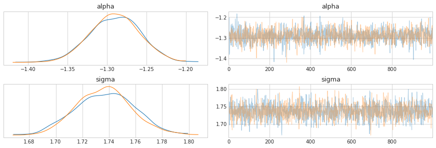
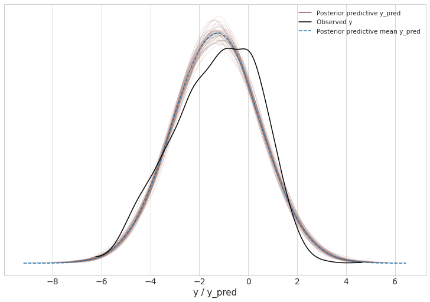

# DEMETER2 in Stan


```python
import pystan
import numpy as np
import pandas as pd
from matplotlib import pyplot as plt
import arviz as az
from pathlib import Path
import seaborn as sns
from timeit import default_timer as timer

plt.style.use('seaborn-whitegrid')
plt.rcParams['figure.figsize'] = (10.0, 7.0)
plt.rcParams['axes.titlesize'] = 18
plt.rcParams['axes.labelsize'] = 15

modeling_data_dir = Path('../modeling_data')
```

## Data preparation


```python
modeling_data = pd.read_csv(modeling_data_dir / 'subset_modeling_data.csv')
modeling_data.head()
```


<div>
<style scoped>
    .dataframe tbody tr th:only-of-type {
        vertical-align: middle;
    }

    .dataframe tbody tr th {
        vertical-align: top;
    }

    .dataframe thead th {
        text-align: right;
    }
</style>
<table border="1" class="dataframe">
  <thead>
    <tr style="text-align: right;">
      <th></th>
      <th>barcode_sequence</th>
      <th>cell_line</th>
      <th>lfc</th>
      <th>batch</th>
      <th>gene_symbol</th>
    </tr>
  </thead>
  <tbody>
    <tr>
      <th>0</th>
      <td>ACAGAAGAAATTCTGGCAGAT</td>
      <td>ln215_central_nervous_system</td>
      <td>1.966515</td>
      <td>1</td>
      <td>EIF6</td>
    </tr>
    <tr>
      <th>1</th>
      <td>ACAGAAGAAATTCTGGCAGAT</td>
      <td>ln382_central_nervous_system</td>
      <td>1.289606</td>
      <td>1</td>
      <td>EIF6</td>
    </tr>
    <tr>
      <th>2</th>
      <td>ACAGAAGAAATTCTGGCAGAT</td>
      <td>efo21_ovary</td>
      <td>0.625725</td>
      <td>1</td>
      <td>EIF6</td>
    </tr>
    <tr>
      <th>3</th>
      <td>ACAGAAGAAATTCTGGCAGAT</td>
      <td>jhesoad1_oesophagus</td>
      <td>1.392272</td>
      <td>1</td>
      <td>EIF6</td>
    </tr>
    <tr>
      <th>4</th>
      <td>ACAGAAGAAATTCTGGCAGAT</td>
      <td>km12_large_intestine</td>
      <td>0.820838</td>
      <td>1</td>
      <td>EIF6</td>
    </tr>
  </tbody>
</table>
</div>


## Exploratory data analysis


```python
genes = set(modeling_data.gene_symbol.to_list())
fig, axes = plt.subplots(5, 3, figsize=(9, 9))
for ax, gene in zip(axes.flat, genes):
    lfc = modeling_data[modeling_data.gene_symbol == gene].lfc
    sns.distplot(lfc, kde=True, hist=False, ax=ax, kde_kws={'shade': True}, color='b')
    
    y_data = ax.lines[0].get_ydata()
    ax.vlines(x=0, ymin=0, ymax=np.max(y_data) * 1.05, linestyles='dashed')
    
    ax.set_title(gene, fontsize=12)
    ax.set_xlabel(None)


axes[4, 2].axis('off')
axes[4, 1].axis('off')
fig.tight_layout(pad=1.0)
plt.show()
```


```python
cell_lines = set(modeling_data.cell_line.to_list())
for cell_line in cell_lines:
    lfc = modeling_data[modeling_data.cell_line == cell_line].lfc
    sns.distplot(lfc, kde=True, hist=False, label=None, kde_kws={'alpha': 0.2})

plt.title('LFC distributions')
plt.xlabel('LFC')
plt.show()
```


```python
sns.distplot(modeling_data.lfc)
plt.show()
```


```python
modeling_data[['barcode_sequence', 'gene_symbol']].drop_duplicates().groupby('gene_symbol').count()
```


<div>
<style scoped>
    .dataframe tbody tr th:only-of-type {
        vertical-align: middle;
    }

    .dataframe tbody tr th {
        vertical-align: top;
    }

    .dataframe thead th {
        text-align: right;
    }
</style>
<table border="1" class="dataframe">
  <thead>
    <tr style="text-align: right;">
      <th></th>
      <th>barcode_sequence</th>
    </tr>
    <tr>
      <th>gene_symbol</th>
      <th></th>
    </tr>
  </thead>
  <tbody>
    <tr>
      <th>BRAF</th>
      <td>8</td>
    </tr>
    <tr>
      <th>COG3</th>
      <td>5</td>
    </tr>
    <tr>
      <th>COL8A1</th>
      <td>5</td>
    </tr>
    <tr>
      <th>EGFR</th>
      <td>19</td>
    </tr>
    <tr>
      <th>EIF6</th>
      <td>5</td>
    </tr>
    <tr>
      <th>ESPL1</th>
      <td>5</td>
    </tr>
    <tr>
      <th>GRK5</th>
      <td>5</td>
    </tr>
    <tr>
      <th>KRAS</th>
      <td>11</td>
    </tr>
    <tr>
      <th>PTK2</th>
      <td>23</td>
    </tr>
    <tr>
      <th>RC3H2</th>
      <td>4</td>
    </tr>
    <tr>
      <th>RHBDL2</th>
      <td>5</td>
    </tr>
    <tr>
      <th>SDHB</th>
      <td>5</td>
    </tr>
    <tr>
      <th>TRIM39</th>
      <td>9</td>
    </tr>
  </tbody>
</table>
</div>


```python
lfc_corr = modeling_data \
    .pivot(index='cell_line', columns='barcode_sequence', values='lfc') \
    .corr()

mask = np.triu(np.ones_like(lfc_corr, dtype=np.bool), k=0)
f, ax = plt.subplots(figsize=(15, 13))
cmap = sns.diverging_palette(220, 10, as_cmap=True)
sns.heatmap(lfc_corr, mask=mask, 
            cmap=cmap, center=0, 
            square=True, linewidths=0.5, cbar_kws={'shrink': 0.5})
plt.xlabel('barcode')
plt.ylabel('barcode')
plt.title('Correlation of LFC of barcodes')
plt.show()
```


## Modeling


```python
models_dir = Path('..', 'models')
```


```python
modeling_data.head()
```


<div>
<style scoped>
    .dataframe tbody tr th:only-of-type {
        vertical-align: middle;
    }

    .dataframe tbody tr th {
        vertical-align: top;
    }

    .dataframe thead th {
        text-align: right;
    }
</style>
<table border="1" class="dataframe">
  <thead>
    <tr style="text-align: right;">
      <th></th>
      <th>barcode_sequence</th>
      <th>cell_line</th>
      <th>lfc</th>
      <th>batch</th>
      <th>gene_symbol</th>
    </tr>
  </thead>
  <tbody>
    <tr>
      <th>0</th>
      <td>ACAGAAGAAATTCTGGCAGAT</td>
      <td>ln215_central_nervous_system</td>
      <td>1.966515</td>
      <td>1</td>
      <td>EIF6</td>
    </tr>
    <tr>
      <th>1</th>
      <td>ACAGAAGAAATTCTGGCAGAT</td>
      <td>ln382_central_nervous_system</td>
      <td>1.289606</td>
      <td>1</td>
      <td>EIF6</td>
    </tr>
    <tr>
      <th>2</th>
      <td>ACAGAAGAAATTCTGGCAGAT</td>
      <td>efo21_ovary</td>
      <td>0.625725</td>
      <td>1</td>
      <td>EIF6</td>
    </tr>
    <tr>
      <th>3</th>
      <td>ACAGAAGAAATTCTGGCAGAT</td>
      <td>jhesoad1_oesophagus</td>
      <td>1.392272</td>
      <td>1</td>
      <td>EIF6</td>
    </tr>
    <tr>
      <th>4</th>
      <td>ACAGAAGAAATTCTGGCAGAT</td>
      <td>km12_large_intestine</td>
      <td>0.820838</td>
      <td>1</td>
      <td>EIF6</td>
    </tr>
  </tbody>
</table>
</div>


Select only a few cell lines while model building.


```python
len(np.unique(modeling_data.cell_line))
```


    501


```python
np.random.seed(123)
cell_lines = np.random.choice(np.unique(modeling_data.cell_line), 100)
modeling_data = modeling_data[modeling_data.cell_line.isin(cell_lines)]
modeling_data.shape
```


    (8243, 5)


```python
def add_categorical_idx(df, col):
    df[f'{col}_idx'] = df[col].astype('category').cat.codes + 1
    return df

for col in ['barcode_sequence', 'cell_line', 'gene_symbol']:
    modeling_data = add_categorical_idx(modeling_data, col)

modeling_data = modeling_data.reset_index(drop=True)
modeling_data.head()
```


<div>
<style scoped>
    .dataframe tbody tr th:only-of-type {
        vertical-align: middle;
    }

    .dataframe tbody tr th {
        vertical-align: top;
    }

    .dataframe thead th {
        text-align: right;
    }
</style>
<table border="1" class="dataframe">
  <thead>
    <tr style="text-align: right;">
      <th></th>
      <th>barcode_sequence</th>
      <th>cell_line</th>
      <th>lfc</th>
      <th>batch</th>
      <th>gene_symbol</th>
      <th>barcode_sequence_idx</th>
      <th>cell_line_idx</th>
      <th>gene_symbol_idx</th>
    </tr>
  </thead>
  <tbody>
    <tr>
      <th>0</th>
      <td>ACAGAAGAAATTCTGGCAGAT</td>
      <td>efo21_ovary</td>
      <td>0.625725</td>
      <td>1</td>
      <td>EIF6</td>
      <td>1</td>
      <td>16</td>
      <td>5</td>
    </tr>
    <tr>
      <th>1</th>
      <td>ACAGAAGAAATTCTGGCAGAT</td>
      <td>igrov1_ovary</td>
      <td>0.041360</td>
      <td>1</td>
      <td>EIF6</td>
      <td>1</td>
      <td>32</td>
      <td>5</td>
    </tr>
    <tr>
      <th>2</th>
      <td>ACAGAAGAAATTCTGGCAGAT</td>
      <td>colo783_skin</td>
      <td>1.368993</td>
      <td>1</td>
      <td>EIF6</td>
      <td>1</td>
      <td>9</td>
      <td>5</td>
    </tr>
    <tr>
      <th>3</th>
      <td>ACAGAAGAAATTCTGGCAGAT</td>
      <td>tccsup_urinary_tract</td>
      <td>-0.743686</td>
      <td>1</td>
      <td>EIF6</td>
      <td>1</td>
      <td>84</td>
      <td>5</td>
    </tr>
    <tr>
      <th>4</th>
      <td>ACAGAAGAAATTCTGGCAGAT</td>
      <td>thp1_haematopoietic_and_lymphoid_tissue</td>
      <td>0.441765</td>
      <td>1</td>
      <td>EIF6</td>
      <td>1</td>
      <td>85</td>
      <td>5</td>
    </tr>
  </tbody>
</table>
</div>


Binary matrix of $[shRNA \times gene]$.


```python
shrna_gene_matrix = modeling_data[['barcode_sequence_idx', 'gene_symbol_idx']] \
    .drop_duplicates() \
    .reset_index(drop=True) \
    .assign(value = lambda df: np.ones(df.shape[0], dtype=int)) \
    .pivot(index='barcode_sequence_idx', columns='gene_symbol_idx', values='value') \
    .fillna(0) \
    .to_numpy() \
    .astype(int)

shrna_gene_matrix
```


    array([[0, 0, 0, ..., 0, 0, 0],
           [0, 0, 0, ..., 0, 0, 0],
           [0, 0, 0, ..., 0, 0, 0],
           ...,
           [0, 0, 0, ..., 0, 0, 0],
           [0, 0, 0, ..., 0, 0, 0],
           [0, 0, 0, ..., 0, 0, 1]])


```python
shrna_gene_matrix.shape
```


    (109, 13)


```python
# d2_stan_data = {
#     'N': int(modeling_data.shape[0]),
#     'I': len(np.unique(modeling_data.barcode_sequence_idx)),
#     'J': len(np.unique(modeling_data.cell_line_idx)),
#     'K': len(np.unique(modeling_data.batch)),
#     'L': len(np.unique(modeling_data.gene_symbol_idx)),
    
#     'shrna': modeling_data.barcode_sequence_idx,
#     'cell_line': modeling_data.cell_line_idx,
#     'batch': modeling_data.batch,
#     'gene': modeling_data.gene_symbol_idx,
    
#     'y': modeling_data.lfc,
# }
```

**Model data.**


```python
d2_stan_data = {
    'N': int(modeling_data.shape[0]),
    'I': len(np.unique(modeling_data.barcode_sequence_idx)),
    'J': len(np.unique(modeling_data.cell_line_idx)),
    'L': len(np.unique(modeling_data.gene_symbol_idx)),
    
    'shrna': modeling_data.barcode_sequence_idx,
    'cell_line': modeling_data.cell_line_idx,
    'gene': modeling_data.gene_symbol_idx,
    
    'y': modeling_data.lfc
}
```

**Compile model.**


```python
start = timer()
d2_stan_file = models_dir / 'd2_stan_model_2.cpp'
d2_stan_model = pystan.StanModel(file=d2_stan_file.as_posix())
end = timer()
print(f'{(end - start) / 60:.2f} minutes to compile model')
```

    INFO:pystan:COMPILING THE C++ CODE FOR MODEL anon_model_bce6bef0f8943d3c1f50a70a883a3f3a NOW.


    1.00 minutes to compile model


**Sample from posterior.**


```python
start = timer()
d2_stan_fit = d2_stan_model.sampling(data=d2_stan_data, iter=2000, chains=2)
end = timer()
print(f'{(end - start) / 60:.2f} minutes to sample from posterior.')
```

    WARNING:pystan:Maximum (flat) parameter count (1000) exceeded: skipping diagnostic tests for n_eff and Rhat.
    To run all diagnostics call pystan.check_hmc_diagnostics(fit)
    WARNING:pystan:46 of 2000 iterations ended with a divergence (2.3 %).
    WARNING:pystan:Try running with adapt_delta larger than 0.8 to remove the divergences.
    WARNING:pystan:1208 of 2000 iterations saturated the maximum tree depth of 10 (60.4 %)
    WARNING:pystan:Run again with max_treedepth larger than 10 to avoid saturation
    WARNING:pystan:Chain 1: E-BFMI = 0.00646
    WARNING:pystan:Chain 2: E-BFMI = 0.0399
    WARNING:pystan:E-BFMI below 0.2 indicates you may need to reparameterize your model


    86.06 minutes to sample from posterior.


```python
pystan.check_hmc_diagnostics(d2_stan_fit)
```

    WARNING:pystan:n_eff / iter below 0.001 indicates that the effective sample size has likely been overestimated
    WARNING:pystan:Rhat above 1.1 or below 0.9 indicates that the chains very likely have not mixed
    WARNING:pystan:46 of 2000 iterations ended with a divergence (2.3 %).
    WARNING:pystan:Try running with adapt_delta larger than 0.8 to remove the divergences.
    WARNING:pystan:1208 of 2000 iterations saturated the maximum tree depth of 10 (60.4 %)
    WARNING:pystan:Run again with max_treedepth larger than 10 to avoid saturation
    WARNING:pystan:Chain 1: E-BFMI = 0.00646
    WARNING:pystan:Chain 2: E-BFMI = 0.0399
    WARNING:pystan:E-BFMI below 0.2 indicates you may need to reparameterize your model


    {'n_eff': False,
     'Rhat': False,
     'divergence': False,
     'treedepth': False,
     'energy': False}


```python
az_d2_stan = az.from_pystan(
    posterior=d2_stan_fit,
    posterior_predictive='yhat',
    observed_data=['y'],
    posterior_model=d2_stan_model
)
fit_summary = az.summary(az_d2_stan)
fit_summary
```


<div>
<style scoped>
    .dataframe tbody tr th:only-of-type {
        vertical-align: middle;
    }

    .dataframe tbody tr th {
        vertical-align: top;
    }

    .dataframe thead th {
        text-align: right;
    }
</style>
<table border="1" class="dataframe">
  <thead>
    <tr style="text-align: right;">
      <th></th>
      <th>mean</th>
      <th>sd</th>
      <th>hpd_3%</th>
      <th>hpd_97%</th>
      <th>mcse_mean</th>
      <th>mcse_sd</th>
      <th>ess_mean</th>
      <th>ess_sd</th>
      <th>ess_bulk</th>
      <th>ess_tail</th>
      <th>r_hat</th>
    </tr>
  </thead>
  <tbody>
    <tr>
      <th>q[0]</th>
      <td>-9416.637</td>
      <td>4135.176</td>
      <td>-17851.139</td>
      <td>-3401.688</td>
      <td>2688.631</td>
      <td>2202.300</td>
      <td>2.0</td>
      <td>2.0</td>
      <td>2.0</td>
      <td>11.0</td>
      <td>2.42</td>
    </tr>
    <tr>
      <th>q[1]</th>
      <td>-6632.106</td>
      <td>3051.197</td>
      <td>-11994.276</td>
      <td>-2547.648</td>
      <td>1995.366</td>
      <td>1637.844</td>
      <td>2.0</td>
      <td>2.0</td>
      <td>3.0</td>
      <td>12.0</td>
      <td>2.28</td>
    </tr>
    <tr>
      <th>q[2]</th>
      <td>-6168.424</td>
      <td>2876.174</td>
      <td>-12053.657</td>
      <td>-2597.165</td>
      <td>1864.711</td>
      <td>1525.865</td>
      <td>2.0</td>
      <td>2.0</td>
      <td>3.0</td>
      <td>11.0</td>
      <td>2.21</td>
    </tr>
    <tr>
      <th>q[3]</th>
      <td>-6952.604</td>
      <td>3260.876</td>
      <td>-12730.041</td>
      <td>-2159.801</td>
      <td>1973.289</td>
      <td>1579.385</td>
      <td>3.0</td>
      <td>3.0</td>
      <td>3.0</td>
      <td>11.0</td>
      <td>2.02</td>
    </tr>
    <tr>
      <th>q[4]</th>
      <td>-9292.417</td>
      <td>3979.386</td>
      <td>-16386.073</td>
      <td>-3460.581</td>
      <td>2465.763</td>
      <td>1987.642</td>
      <td>3.0</td>
      <td>3.0</td>
      <td>3.0</td>
      <td>11.0</td>
      <td>2.16</td>
    </tr>
    <tr>
      <th>...</th>
      <td>...</td>
      <td>...</td>
      <td>...</td>
      <td>...</td>
      <td>...</td>
      <td>...</td>
      <td>...</td>
      <td>...</td>
      <td>...</td>
      <td>...</td>
      <td>...</td>
    </tr>
    <tr>
      <th>mu[8238]</th>
      <td>0.098</td>
      <td>0.114</td>
      <td>-0.100</td>
      <td>0.324</td>
      <td>0.003</td>
      <td>0.003</td>
      <td>1130.0</td>
      <td>867.0</td>
      <td>1145.0</td>
      <td>1186.0</td>
      <td>1.00</td>
    </tr>
    <tr>
      <th>mu[8239]</th>
      <td>0.083</td>
      <td>0.097</td>
      <td>-0.086</td>
      <td>0.264</td>
      <td>0.003</td>
      <td>0.002</td>
      <td>1259.0</td>
      <td>983.0</td>
      <td>1280.0</td>
      <td>1206.0</td>
      <td>1.00</td>
    </tr>
    <tr>
      <th>mu[8240]</th>
      <td>0.085</td>
      <td>0.099</td>
      <td>-0.093</td>
      <td>0.269</td>
      <td>0.003</td>
      <td>0.002</td>
      <td>1020.0</td>
      <td>832.0</td>
      <td>1073.0</td>
      <td>1194.0</td>
      <td>1.00</td>
    </tr>
    <tr>
      <th>mu[8241]</th>
      <td>0.080</td>
      <td>0.094</td>
      <td>-0.097</td>
      <td>0.253</td>
      <td>0.003</td>
      <td>0.002</td>
      <td>1254.0</td>
      <td>1035.0</td>
      <td>1245.0</td>
      <td>1134.0</td>
      <td>1.00</td>
    </tr>
    <tr>
      <th>mu[8242]</th>
      <td>0.082</td>
      <td>0.095</td>
      <td>-0.095</td>
      <td>0.252</td>
      <td>0.003</td>
      <td>0.002</td>
      <td>1054.0</td>
      <td>966.0</td>
      <td>1070.0</td>
      <td>1132.0</td>
      <td>1.00</td>
    </tr>
  </tbody>
</table>
<p>9630 rows × 11 columns</p>
</div>


```python
sns.distplot(fit_summary.r_hat)
```


    <matplotlib.axes._subplots.AxesSubplot at 0x1a301702d0>


```python
az.plot_trace(az_d2_stan, var_names=['mu_alpha', 'sigma_alpha'])
plt.show()
```

    /usr/local/Caskroom/miniconda/base/envs/demeter2-stan-demo/lib/python3.7/site-packages/arviz/plots/backends/matplotlib/distplot.py:38: UserWarning: Argument backend_kwargs has not effect in matplotlib.plot_distSupplied value won't be used
      "Argument backend_kwargs has not effect in matplotlib.plot_dist"
    /usr/local/Caskroom/miniconda/base/envs/demeter2-stan-demo/lib/python3.7/site-packages/arviz/plots/backends/matplotlib/distplot.py:38: UserWarning: Argument backend_kwargs has not effect in matplotlib.plot_distSupplied value won't be used
      "Argument backend_kwargs has not effect in matplotlib.plot_dist"
    /usr/local/Caskroom/miniconda/base/envs/demeter2-stan-demo/lib/python3.7/site-packages/arviz/plots/backends/matplotlib/distplot.py:38: UserWarning: Argument backend_kwargs has not effect in matplotlib.plot_distSupplied value won't be used
      "Argument backend_kwargs has not effect in matplotlib.plot_dist"
    /usr/local/Caskroom/miniconda/base/envs/demeter2-stan-demo/lib/python3.7/site-packages/arviz/plots/backends/matplotlib/distplot.py:38: UserWarning: Argument backend_kwargs has not effect in matplotlib.plot_distSupplied value won't be used
      "Argument backend_kwargs has not effect in matplotlib.plot_dist"


```python
az.plot_forest(az_d2_stan, var_names='alpha', combined=True, figsize=(6, 20))
plt.show()
```





```python
az.plot_forest(az_d2_stan, var_names='q', combined=False, figsize=(6, 10))
plt.show()
```


```python
d2_stan_fit.to_dataframe()
```


<div>
<style scoped>
    .dataframe tbody tr th:only-of-type {
        vertical-align: middle;
    }

    .dataframe tbody tr th {
        vertical-align: top;
    }

    .dataframe thead th {
        text-align: right;
    }
</style>
<table border="1" class="dataframe">
  <thead>
    <tr style="text-align: right;">
      <th></th>
      <th>chain</th>
      <th>draw</th>
      <th>warmup</th>
      <th>q[1]</th>
      <th>q[2]</th>
      <th>q[3]</th>
      <th>q[4]</th>
      <th>q[5]</th>
      <th>q[6]</th>
      <th>q[7]</th>
      <th>...</th>
      <th>yhat[8241]</th>
      <th>yhat[8242]</th>
      <th>yhat[8243]</th>
      <th>lp__</th>
      <th>accept_stat__</th>
      <th>stepsize__</th>
      <th>treedepth__</th>
      <th>n_leapfrog__</th>
      <th>divergent__</th>
      <th>energy__</th>
    </tr>
  </thead>
  <tbody>
    <tr>
      <th>0</th>
      <td>0</td>
      <td>0</td>
      <td>0</td>
      <td>-3059.375951</td>
      <td>-2355.499214</td>
      <td>-2449.040916</td>
      <td>-2526.349751</td>
      <td>-2782.628505</td>
      <td>-3338.322976</td>
      <td>-3084.890886</td>
      <td>...</td>
      <td>-0.828107</td>
      <td>0.221874</td>
      <td>-0.325438</td>
      <td>1153.611750</td>
      <td>9.403261e-01</td>
      <td>0.001204</td>
      <td>10</td>
      <td>1023</td>
      <td>0</td>
      <td>-465.057978</td>
    </tr>
    <tr>
      <th>1</th>
      <td>0</td>
      <td>1</td>
      <td>0</td>
      <td>-3069.061137</td>
      <td>-2088.701714</td>
      <td>-2388.372145</td>
      <td>-2159.801221</td>
      <td>-2897.396739</td>
      <td>-3480.646116</td>
      <td>-2945.116064</td>
      <td>...</td>
      <td>1.117705</td>
      <td>0.188410</td>
      <td>1.223637</td>
      <td>1204.581053</td>
      <td>8.900876e-01</td>
      <td>0.001204</td>
      <td>10</td>
      <td>1023</td>
      <td>0</td>
      <td>-483.643496</td>
    </tr>
    <tr>
      <th>2</th>
      <td>0</td>
      <td>2</td>
      <td>0</td>
      <td>-3144.215362</td>
      <td>-2121.746655</td>
      <td>-2350.028698</td>
      <td>-2178.038528</td>
      <td>-2741.308865</td>
      <td>-3581.943795</td>
      <td>-2807.688959</td>
      <td>...</td>
      <td>-1.654180</td>
      <td>-1.022869</td>
      <td>-0.025370</td>
      <td>1188.952471</td>
      <td>9.626327e-01</td>
      <td>0.001204</td>
      <td>10</td>
      <td>1023</td>
      <td>0</td>
      <td>-498.150166</td>
    </tr>
    <tr>
      <th>3</th>
      <td>0</td>
      <td>3</td>
      <td>0</td>
      <td>-3136.574632</td>
      <td>-2184.065182</td>
      <td>-2336.946457</td>
      <td>-2295.407805</td>
      <td>-2799.056528</td>
      <td>-3584.225128</td>
      <td>-2906.473552</td>
      <td>...</td>
      <td>-0.529787</td>
      <td>0.702890</td>
      <td>0.059859</td>
      <td>1201.422244</td>
      <td>8.871039e-01</td>
      <td>0.001204</td>
      <td>10</td>
      <td>1023</td>
      <td>0</td>
      <td>-483.148393</td>
    </tr>
    <tr>
      <th>4</th>
      <td>0</td>
      <td>4</td>
      <td>0</td>
      <td>-3149.935959</td>
      <td>-1994.040581</td>
      <td>-2452.227231</td>
      <td>-2238.521970</td>
      <td>-2809.275028</td>
      <td>-3573.704163</td>
      <td>-3049.314886</td>
      <td>...</td>
      <td>0.335599</td>
      <td>0.185383</td>
      <td>-0.330007</td>
      <td>1219.404185</td>
      <td>9.839279e-01</td>
      <td>0.001204</td>
      <td>10</td>
      <td>1023</td>
      <td>0</td>
      <td>-531.292039</td>
    </tr>
    <tr>
      <th>...</th>
      <td>...</td>
      <td>...</td>
      <td>...</td>
      <td>...</td>
      <td>...</td>
      <td>...</td>
      <td>...</td>
      <td>...</td>
      <td>...</td>
      <td>...</td>
      <td>...</td>
      <td>...</td>
      <td>...</td>
      <td>...</td>
      <td>...</td>
      <td>...</td>
      <td>...</td>
      <td>...</td>
      <td>...</td>
      <td>...</td>
      <td>...</td>
    </tr>
    <tr>
      <th>1995</th>
      <td>1</td>
      <td>995</td>
      <td>0</td>
      <td>-19152.378888</td>
      <td>-13719.713718</td>
      <td>-11376.946021</td>
      <td>-16342.122456</td>
      <td>-15588.554333</td>
      <td>-21623.084970</td>
      <td>-16567.328979</td>
      <td>...</td>
      <td>-0.054959</td>
      <td>0.365720</td>
      <td>0.265134</td>
      <td>3107.553317</td>
      <td>1.108038e-04</td>
      <td>0.003413</td>
      <td>8</td>
      <td>255</td>
      <td>0</td>
      <td>-2391.859633</td>
    </tr>
    <tr>
      <th>1996</th>
      <td>1</td>
      <td>996</td>
      <td>0</td>
      <td>-19152.378888</td>
      <td>-13719.713718</td>
      <td>-11376.946021</td>
      <td>-16342.122456</td>
      <td>-15588.554333</td>
      <td>-21623.084970</td>
      <td>-16567.328979</td>
      <td>...</td>
      <td>0.399200</td>
      <td>-0.589628</td>
      <td>0.275871</td>
      <td>3107.553317</td>
      <td>9.867745e-07</td>
      <td>0.003413</td>
      <td>8</td>
      <td>255</td>
      <td>0</td>
      <td>-2410.312359</td>
    </tr>
    <tr>
      <th>1997</th>
      <td>1</td>
      <td>997</td>
      <td>0</td>
      <td>-19152.411307</td>
      <td>-13717.486240</td>
      <td>-11382.988360</td>
      <td>-16342.189949</td>
      <td>-15582.589176</td>
      <td>-21639.709928</td>
      <td>-16574.559053</td>
      <td>...</td>
      <td>-0.034296</td>
      <td>-0.117942</td>
      <td>-0.146637</td>
      <td>3099.358616</td>
      <td>5.762867e-03</td>
      <td>0.003413</td>
      <td>6</td>
      <td>106</td>
      <td>1</td>
      <td>-2450.106520</td>
    </tr>
    <tr>
      <th>1998</th>
      <td>1</td>
      <td>998</td>
      <td>0</td>
      <td>-19152.411307</td>
      <td>-13717.486240</td>
      <td>-11382.988360</td>
      <td>-16342.189949</td>
      <td>-15582.589176</td>
      <td>-21639.709928</td>
      <td>-16574.559053</td>
      <td>...</td>
      <td>-0.662530</td>
      <td>0.003479</td>
      <td>0.907341</td>
      <td>3099.358616</td>
      <td>8.069089e-08</td>
      <td>0.003413</td>
      <td>8</td>
      <td>255</td>
      <td>0</td>
      <td>-2419.353789</td>
    </tr>
    <tr>
      <th>1999</th>
      <td>1</td>
      <td>999</td>
      <td>0</td>
      <td>-19152.411307</td>
      <td>-13717.486240</td>
      <td>-11382.988360</td>
      <td>-16342.189949</td>
      <td>-15582.589176</td>
      <td>-21639.709928</td>
      <td>-16574.559053</td>
      <td>...</td>
      <td>0.243122</td>
      <td>0.055816</td>
      <td>-0.618995</td>
      <td>3099.358616</td>
      <td>1.666968e-05</td>
      <td>0.003413</td>
      <td>8</td>
      <td>255</td>
      <td>0</td>
      <td>-2437.795398</td>
    </tr>
  </tbody>
</table>
<p>2000 rows × 17883 columns</p>
</div>


```python
az.plot_ppc(az_d2_stan, data_pairs={'y':'yhat'}, num_pp_samples=50)
plt.show()
```





```python

```
