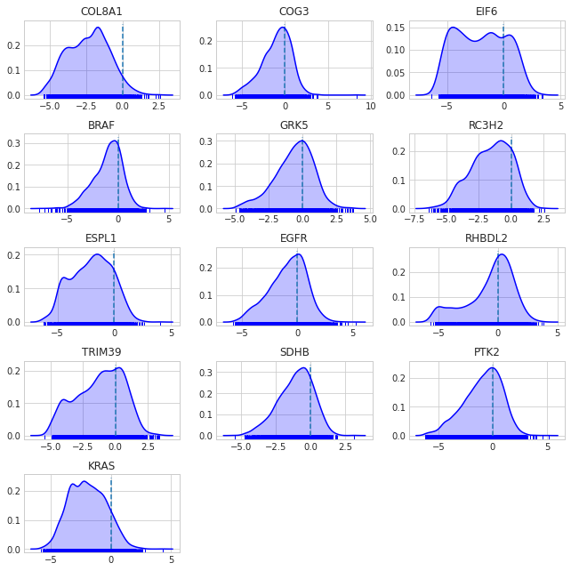

# DEMETER2 in Stan


```python
import pystan
import numpy as np
import pandas as pd
from matplotlib import pyplot as plt
import arviz
from pathlib import Path
import seaborn as sns

plt.style.use('seaborn-whitegrid')
plt.rcParams['figure.figsize'] = (10.0, 7.0)
plt.rcParams['axes.titlesize'] = 18
plt.rcParams['axes.labelsize'] = 15

modeling_data_dir = Path('../modeling_data')
```

## Data preparation


```python
modeling_data = pd.read_csv(modeling_data_dir / 'subset_modeling_data.csv')
modeling_data.head()
```


<div>
<style scoped>
    .dataframe tbody tr th:only-of-type {
        vertical-align: middle;
    }

    .dataframe tbody tr th {
        vertical-align: top;
    }

    .dataframe thead th {
        text-align: right;
    }
</style>
<table border="1" class="dataframe">
  <thead>
    <tr style="text-align: right;">
      <th></th>
      <th>barcode_sequence</th>
      <th>cell_line</th>
      <th>lfc</th>
      <th>batch</th>
      <th>gene_symbol</th>
    </tr>
  </thead>
  <tbody>
    <tr>
      <th>0</th>
      <td>ACAGAAGAAATTCTGGCAGAT</td>
      <td>ln215_central_nervous_system</td>
      <td>1.966515</td>
      <td>1</td>
      <td>EIF6</td>
    </tr>
    <tr>
      <th>1</th>
      <td>ACAGAAGAAATTCTGGCAGAT</td>
      <td>ln382_central_nervous_system</td>
      <td>1.289606</td>
      <td>1</td>
      <td>EIF6</td>
    </tr>
    <tr>
      <th>2</th>
      <td>ACAGAAGAAATTCTGGCAGAT</td>
      <td>efo21_ovary</td>
      <td>0.625725</td>
      <td>1</td>
      <td>EIF6</td>
    </tr>
    <tr>
      <th>3</th>
      <td>ACAGAAGAAATTCTGGCAGAT</td>
      <td>jhesoad1_oesophagus</td>
      <td>1.392272</td>
      <td>1</td>
      <td>EIF6</td>
    </tr>
    <tr>
      <th>4</th>
      <td>ACAGAAGAAATTCTGGCAGAT</td>
      <td>km12_large_intestine</td>
      <td>0.820838</td>
      <td>1</td>
      <td>EIF6</td>
    </tr>
  </tbody>
</table>
</div>


## Exploratory data analysis


```python
genes = set(modeling_data.gene_symbol.to_list())
for gene in genes:
    lfc = modeling_data[modeling_data.gene_symbol == gene].lfc
    sns.distplot(lfc, kde=True, hist=False, label=gene)

plt.title('LFC distributions')
plt.xlabel('LFC')
plt.legend()
plt.show()
```


```python
cell_lines = set(modeling_data.cell_line.to_list())
for cell_line in cell_lines:
    lfc = modeling_data[modeling_data.cell_line == cell_line].lfc
    sns.distplot(lfc, kde=True, hist=False, label=None, kde_kws={'alpha': 0.2})

plt.title('LFC distributions')
plt.xlabel('LFC')
plt.show()
```





```python
modeling_data[['barcode_sequence', 'gene_symbol']].drop_duplicates().groupby('gene_symbol').count()
```


<div>
<style scoped>
    .dataframe tbody tr th:only-of-type {
        vertical-align: middle;
    }

    .dataframe tbody tr th {
        vertical-align: top;
    }

    .dataframe thead th {
        text-align: right;
    }
</style>
<table border="1" class="dataframe">
  <thead>
    <tr style="text-align: right;">
      <th></th>
      <th>barcode_sequence</th>
    </tr>
    <tr>
      <th>gene_symbol</th>
      <th></th>
    </tr>
  </thead>
  <tbody>
    <tr>
      <th>BRAF</th>
      <td>8</td>
    </tr>
    <tr>
      <th>COG3</th>
      <td>5</td>
    </tr>
    <tr>
      <th>COL8A1</th>
      <td>5</td>
    </tr>
    <tr>
      <th>EGFR</th>
      <td>19</td>
    </tr>
    <tr>
      <th>EIF6</th>
      <td>5</td>
    </tr>
    <tr>
      <th>ESPL1</th>
      <td>5</td>
    </tr>
    <tr>
      <th>GRK5</th>
      <td>5</td>
    </tr>
    <tr>
      <th>KRAS</th>
      <td>11</td>
    </tr>
    <tr>
      <th>PTK2</th>
      <td>23</td>
    </tr>
    <tr>
      <th>RC3H2</th>
      <td>4</td>
    </tr>
    <tr>
      <th>RHBDL2</th>
      <td>5</td>
    </tr>
    <tr>
      <th>SDHB</th>
      <td>5</td>
    </tr>
    <tr>
      <th>TRIM39</th>
      <td>9</td>
    </tr>
  </tbody>
</table>
</div>


```python
lfc_corr = modeling_data \
    .pivot(index='cell_line', columns='barcode_sequence', values='lfc') \
    .corr()

mask = np.triu(np.ones_like(lfc_corr, dtype=np.bool), k=0)
f, ax = plt.subplots(figsize=(15, 13))
cmap = sns.diverging_palette(220, 10, as_cmap=True)
sns.heatmap(lfc_corr, mask=mask, 
            cmap=cmap, center=0, 
            square=True, linewidths=0.5, cbar_kws={'shrink': 0.5})
plt.xlabel('barcode')
plt.ylabel('barcode')
plt.title('Correlation of LFC of barcodes')
plt.show()
```


## Modeling


```python
models_dir = Path('..', 'models')
```


```python
modeling_data.head()
```


<div>
<style scoped>
    .dataframe tbody tr th:only-of-type {
        vertical-align: middle;
    }

    .dataframe tbody tr th {
        vertical-align: top;
    }

    .dataframe thead th {
        text-align: right;
    }
</style>
<table border="1" class="dataframe">
  <thead>
    <tr style="text-align: right;">
      <th></th>
      <th>barcode_sequence</th>
      <th>cell_line</th>
      <th>lfc</th>
      <th>batch</th>
      <th>gene_symbol</th>
    </tr>
  </thead>
  <tbody>
    <tr>
      <th>0</th>
      <td>ACAGAAGAAATTCTGGCAGAT</td>
      <td>ln215_central_nervous_system</td>
      <td>1.966515</td>
      <td>1</td>
      <td>EIF6</td>
    </tr>
    <tr>
      <th>1</th>
      <td>ACAGAAGAAATTCTGGCAGAT</td>
      <td>ln382_central_nervous_system</td>
      <td>1.289606</td>
      <td>1</td>
      <td>EIF6</td>
    </tr>
    <tr>
      <th>2</th>
      <td>ACAGAAGAAATTCTGGCAGAT</td>
      <td>efo21_ovary</td>
      <td>0.625725</td>
      <td>1</td>
      <td>EIF6</td>
    </tr>
    <tr>
      <th>3</th>
      <td>ACAGAAGAAATTCTGGCAGAT</td>
      <td>jhesoad1_oesophagus</td>
      <td>1.392272</td>
      <td>1</td>
      <td>EIF6</td>
    </tr>
    <tr>
      <th>4</th>
      <td>ACAGAAGAAATTCTGGCAGAT</td>
      <td>km12_large_intestine</td>
      <td>0.820838</td>
      <td>1</td>
      <td>EIF6</td>
    </tr>
  </tbody>
</table>
</div>


```python
def add_categorical_idx(df, col):
    df[f'{col}_idx'] = df[col].astype('category').cat.codes + 1
    return df

for col in ['barcode_sequence', 'cell_line', 'gene_symbol']:
    modeling_data = add_categorical_idx(modeling_data, col)

modeling_data.head()
```


<div>
<style scoped>
    .dataframe tbody tr th:only-of-type {
        vertical-align: middle;
    }

    .dataframe tbody tr th {
        vertical-align: top;
    }

    .dataframe thead th {
        text-align: right;
    }
</style>
<table border="1" class="dataframe">
  <thead>
    <tr style="text-align: right;">
      <th></th>
      <th>barcode_sequence</th>
      <th>cell_line</th>
      <th>lfc</th>
      <th>batch</th>
      <th>gene_symbol</th>
      <th>barcode_sequence_idx</th>
      <th>cell_line_idx</th>
      <th>gene_symbol_idx</th>
    </tr>
  </thead>
  <tbody>
    <tr>
      <th>0</th>
      <td>ACAGAAGAAATTCTGGCAGAT</td>
      <td>ln215_central_nervous_system</td>
      <td>1.966515</td>
      <td>1</td>
      <td>EIF6</td>
      <td>1</td>
      <td>233</td>
      <td>5</td>
    </tr>
    <tr>
      <th>1</th>
      <td>ACAGAAGAAATTCTGGCAGAT</td>
      <td>ln382_central_nervous_system</td>
      <td>1.289606</td>
      <td>1</td>
      <td>EIF6</td>
      <td>1</td>
      <td>238</td>
      <td>5</td>
    </tr>
    <tr>
      <th>2</th>
      <td>ACAGAAGAAATTCTGGCAGAT</td>
      <td>efo21_ovary</td>
      <td>0.625725</td>
      <td>1</td>
      <td>EIF6</td>
      <td>1</td>
      <td>97</td>
      <td>5</td>
    </tr>
    <tr>
      <th>3</th>
      <td>ACAGAAGAAATTCTGGCAGAT</td>
      <td>jhesoad1_oesophagus</td>
      <td>1.392272</td>
      <td>1</td>
      <td>EIF6</td>
      <td>1</td>
      <td>186</td>
      <td>5</td>
    </tr>
    <tr>
      <th>4</th>
      <td>ACAGAAGAAATTCTGGCAGAT</td>
      <td>km12_large_intestine</td>
      <td>0.820838</td>
      <td>1</td>
      <td>EIF6</td>
      <td>1</td>
      <td>203</td>
      <td>5</td>
    </tr>
  </tbody>
</table>
</div>


```python
d2_stan_data = {
    'N': int(modeling_data.shape[0]),
    'I': len(np.unique(modeling_data.barcode_sequence_idx)),
    'J': len(np.unique(modeling_data.cell_line_idx)),
    'K': len(np.unique(modeling_data.batch)),
    'L': len(np.unique(modeling_data.gene_symbol_idx)),
    
    'cell_line': modeling_data.cell_line_idx,
    'batch': modeling_data.batch,
    
    'y': modeling_data.lfc,
}
```


```python
d2_stan_file = models_dir / 'd2_stan_model_1.stan'
d2_stan_model = pystan.StanModel(file=d2_stan_file.as_posix())
```

    INFO:pystan:COMPILING THE C++ CODE FOR MODEL anon_model_c09d2794a076bd6ccd7d58bc741e7b05 NOW.


```python
d2_stan_fit = d2_stan_model.sampling(data=d2_stan_data, iter=1000, chains=2)
```

    Process ForkPoolWorker-1:
    Process ForkPoolWorker-3:
    Process ForkPoolWorker-4:
    Traceback (most recent call last):
    Traceback (most recent call last):
    Traceback (most recent call last):
      File "/usr/local/Caskroom/miniconda/base/envs/demeter2-stan-demo/lib/python3.7/multiprocessing/process.py", line 297, in _bootstrap
        self.run()
      File "/usr/local/Caskroom/miniconda/base/envs/demeter2-stan-demo/lib/python3.7/multiprocessing/process.py", line 297, in _bootstrap
        self.run()
      File "/usr/local/Caskroom/miniconda/base/envs/demeter2-stan-demo/lib/python3.7/multiprocessing/process.py", line 297, in _bootstrap
        self.run()
      File "/usr/local/Caskroom/miniconda/base/envs/demeter2-stan-demo/lib/python3.7/multiprocessing/process.py", line 99, in run
        self._target(*self._args, **self._kwargs)
      File "/usr/local/Caskroom/miniconda/base/envs/demeter2-stan-demo/lib/python3.7/multiprocessing/process.py", line 99, in run
        self._target(*self._args, **self._kwargs)
      File "/usr/local/Caskroom/miniconda/base/envs/demeter2-stan-demo/lib/python3.7/multiprocessing/process.py", line 99, in run
        self._target(*self._args, **self._kwargs)
      File "/usr/local/Caskroom/miniconda/base/envs/demeter2-stan-demo/lib/python3.7/multiprocessing/pool.py", line 110, in worker
        task = get()
      File "/usr/local/Caskroom/miniconda/base/envs/demeter2-stan-demo/lib/python3.7/multiprocessing/pool.py", line 110, in worker
        task = get()
      File "/usr/local/Caskroom/miniconda/base/envs/demeter2-stan-demo/lib/python3.7/multiprocessing/pool.py", line 110, in worker
        task = get()
      File "/usr/local/Caskroom/miniconda/base/envs/demeter2-stan-demo/lib/python3.7/multiprocessing/queues.py", line 352, in get
        res = self._reader.recv_bytes()
      File "/usr/local/Caskroom/miniconda/base/envs/demeter2-stan-demo/lib/python3.7/multiprocessing/queues.py", line 351, in get
        with self._rlock:
      File "/usr/local/Caskroom/miniconda/base/envs/demeter2-stan-demo/lib/python3.7/multiprocessing/queues.py", line 351, in get
        with self._rlock:
      File "/usr/local/Caskroom/miniconda/base/envs/demeter2-stan-demo/lib/python3.7/multiprocessing/synchronize.py", line 95, in __enter__
        return self._semlock.__enter__()
      File "/usr/local/Caskroom/miniconda/base/envs/demeter2-stan-demo/lib/python3.7/multiprocessing/connection.py", line 216, in recv_bytes
        buf = self._recv_bytes(maxlength)
      File "/usr/local/Caskroom/miniconda/base/envs/demeter2-stan-demo/lib/python3.7/multiprocessing/synchronize.py", line 95, in __enter__
        return self._semlock.__enter__()
    KeyboardInterrupt
      File "/usr/local/Caskroom/miniconda/base/envs/demeter2-stan-demo/lib/python3.7/multiprocessing/connection.py", line 407, in _recv_bytes
        buf = self._recv(4)
    KeyboardInterrupt
      File "/usr/local/Caskroom/miniconda/base/envs/demeter2-stan-demo/lib/python3.7/multiprocessing/connection.py", line 379, in _recv
        chunk = read(handle, remaining)
    KeyboardInterrupt
    Process ForkPoolWorker-5:
    Process ForkPoolWorker-7:
    Process ForkPoolWorker-6:
    Traceback (most recent call last):
    Traceback (most recent call last):
    Traceback (most recent call last):
      File "/usr/local/Caskroom/miniconda/base/envs/demeter2-stan-demo/lib/python3.7/multiprocessing/process.py", line 297, in _bootstrap
        self.run()
      File "/usr/local/Caskroom/miniconda/base/envs/demeter2-stan-demo/lib/python3.7/multiprocessing/process.py", line 297, in _bootstrap
        self.run()
      File "/usr/local/Caskroom/miniconda/base/envs/demeter2-stan-demo/lib/python3.7/multiprocessing/process.py", line 297, in _bootstrap
        self.run()
      File "/usr/local/Caskroom/miniconda/base/envs/demeter2-stan-demo/lib/python3.7/multiprocessing/process.py", line 99, in run
        self._target(*self._args, **self._kwargs)
      File "/usr/local/Caskroom/miniconda/base/envs/demeter2-stan-demo/lib/python3.7/multiprocessing/process.py", line 99, in run
        self._target(*self._args, **self._kwargs)
      File "/usr/local/Caskroom/miniconda/base/envs/demeter2-stan-demo/lib/python3.7/multiprocessing/process.py", line 99, in run
        self._target(*self._args, **self._kwargs)
      File "/usr/local/Caskroom/miniconda/base/envs/demeter2-stan-demo/lib/python3.7/multiprocessing/pool.py", line 110, in worker
        task = get()
      File "/usr/local/Caskroom/miniconda/base/envs/demeter2-stan-demo/lib/python3.7/multiprocessing/pool.py", line 110, in worker
        task = get()
      File "/usr/local/Caskroom/miniconda/base/envs/demeter2-stan-demo/lib/python3.7/multiprocessing/pool.py", line 110, in worker
        task = get()
      File "/usr/local/Caskroom/miniconda/base/envs/demeter2-stan-demo/lib/python3.7/multiprocessing/queues.py", line 351, in get
        with self._rlock:
      File "/usr/local/Caskroom/miniconda/base/envs/demeter2-stan-demo/lib/python3.7/multiprocessing/queues.py", line 351, in get
        with self._rlock:
      File "/usr/local/Caskroom/miniconda/base/envs/demeter2-stan-demo/lib/python3.7/multiprocessing/synchronize.py", line 95, in __enter__
        return self._semlock.__enter__()
      File "/usr/local/Caskroom/miniconda/base/envs/demeter2-stan-demo/lib/python3.7/multiprocessing/queues.py", line 352, in get
        res = self._reader.recv_bytes()
      File "/usr/local/Caskroom/miniconda/base/envs/demeter2-stan-demo/lib/python3.7/multiprocessing/synchronize.py", line 95, in __enter__
        return self._semlock.__enter__()
    KeyboardInterrupt
      File "/usr/local/Caskroom/miniconda/base/envs/demeter2-stan-demo/lib/python3.7/multiprocessing/connection.py", line 216, in recv_bytes
        buf = self._recv_bytes(maxlength)
    KeyboardInterrupt
      File "/usr/local/Caskroom/miniconda/base/envs/demeter2-stan-demo/lib/python3.7/multiprocessing/connection.py", line 407, in _recv_bytes
        buf = self._recv(4)
      File "/usr/local/Caskroom/miniconda/base/envs/demeter2-stan-demo/lib/python3.7/multiprocessing/connection.py", line 379, in _recv
        chunk = read(handle, remaining)
    KeyboardInterrupt


    ---------------------------------------------------------------------------

    KeyboardInterrupt                         Traceback (most recent call last)

    /usr/local/Caskroom/miniconda/base/envs/demeter2-stan-demo/lib/python3.7/site-packages/pystan/model.py in _map_parallel(function, args, n_jobs)
         84             pool = multiprocessing.Pool(processes=n_jobs)
    ---> 85             map_result = pool.map(function, args)
         86         finally:


    /usr/local/Caskroom/miniconda/base/envs/demeter2-stan-demo/lib/python3.7/multiprocessing/pool.py in map(self, func, iterable, chunksize)
        267         '''
    --> 268         return self._map_async(func, iterable, mapstar, chunksize).get()
        269 


    /usr/local/Caskroom/miniconda/base/envs/demeter2-stan-demo/lib/python3.7/multiprocessing/pool.py in get(self, timeout)
        650     def get(self, timeout=None):
    --> 651         self.wait(timeout)
        652         if not self.ready():


    /usr/local/Caskroom/miniconda/base/envs/demeter2-stan-demo/lib/python3.7/multiprocessing/pool.py in wait(self, timeout)
        647     def wait(self, timeout=None):
    --> 648         self._event.wait(timeout)
        649 


    /usr/local/Caskroom/miniconda/base/envs/demeter2-stan-demo/lib/python3.7/threading.py in wait(self, timeout)
        551             if not signaled:
    --> 552                 signaled = self._cond.wait(timeout)
        553             return signaled


    /usr/local/Caskroom/miniconda/base/envs/demeter2-stan-demo/lib/python3.7/threading.py in wait(self, timeout)
        295             if timeout is None:
    --> 296                 waiter.acquire()
        297                 gotit = True


    KeyboardInterrupt: 

    
    During handling of the above exception, another exception occurred:


    KeyboardInterrupt                         Traceback (most recent call last)

    <ipython-input-12-eefaa22f4ffc> in <module>
    ----> 1 d2_stan_fit = d2_stan_model.sampling(data=d2_stan_data, iter=1000, chains=2)
    

    /usr/local/Caskroom/miniconda/base/envs/demeter2-stan-demo/lib/python3.7/site-packages/pystan/model.py in sampling(self, data, pars, chains, iter, warmup, thin, seed, init, sample_file, diagnostic_file, verbose, algorithm, control, n_jobs, **kwargs)
        776         call_sampler_args = izip(itertools.repeat(data), args_list, itertools.repeat(pars))
        777         call_sampler_star = self.module._call_sampler_star
    --> 778         ret_and_samples = _map_parallel(call_sampler_star, call_sampler_args, n_jobs)
        779         samples = [smpl for _, smpl in ret_and_samples]
        780 


    /usr/local/Caskroom/miniconda/base/envs/demeter2-stan-demo/lib/python3.7/site-packages/pystan/model.py in _map_parallel(function, args, n_jobs)
         86         finally:
         87             pool.close()
    ---> 88             pool.join()
         89     else:
         90         map_result = list(map(function, args))


    /usr/local/Caskroom/miniconda/base/envs/demeter2-stan-demo/lib/python3.7/multiprocessing/pool.py in join(self)
        554         elif self._state not in (CLOSE, TERMINATE):
        555             raise ValueError("In unknown state")
    --> 556         self._worker_handler.join()
        557         self._task_handler.join()
        558         self._result_handler.join()


    /usr/local/Caskroom/miniconda/base/envs/demeter2-stan-demo/lib/python3.7/threading.py in join(self, timeout)
       1042 
       1043         if timeout is None:
    -> 1044             self._wait_for_tstate_lock()
       1045         else:
       1046             # the behavior of a negative timeout isn't documented, but


    /usr/local/Caskroom/miniconda/base/envs/demeter2-stan-demo/lib/python3.7/threading.py in _wait_for_tstate_lock(self, block, timeout)
       1058         if lock is None:  # already determined that the C code is done
       1059             assert self._is_stopped
    -> 1060         elif lock.acquire(block, timeout):
       1061             lock.release()
       1062             self._stop()


    KeyboardInterrupt: 


    Process ForkPoolWorker-9:
    Process ForkPoolWorker-10:
    Process ForkPoolWorker-8:
    Traceback (most recent call last):
    Traceback (most recent call last):
    Traceback (most recent call last):
      File "/usr/local/Caskroom/miniconda/base/envs/demeter2-stan-demo/lib/python3.7/multiprocessing/process.py", line 297, in _bootstrap
        self.run()
      File "/usr/local/Caskroom/miniconda/base/envs/demeter2-stan-demo/lib/python3.7/multiprocessing/process.py", line 297, in _bootstrap
        self.run()
      File "/usr/local/Caskroom/miniconda/base/envs/demeter2-stan-demo/lib/python3.7/multiprocessing/process.py", line 297, in _bootstrap
        self.run()
      File "/usr/local/Caskroom/miniconda/base/envs/demeter2-stan-demo/lib/python3.7/multiprocessing/process.py", line 99, in run
        self._target(*self._args, **self._kwargs)
      File "/usr/local/Caskroom/miniconda/base/envs/demeter2-stan-demo/lib/python3.7/multiprocessing/process.py", line 99, in run
        self._target(*self._args, **self._kwargs)
      File "/usr/local/Caskroom/miniconda/base/envs/demeter2-stan-demo/lib/python3.7/multiprocessing/process.py", line 99, in run
        self._target(*self._args, **self._kwargs)
      File "/usr/local/Caskroom/miniconda/base/envs/demeter2-stan-demo/lib/python3.7/multiprocessing/pool.py", line 110, in worker
        task = get()
      File "/usr/local/Caskroom/miniconda/base/envs/demeter2-stan-demo/lib/python3.7/multiprocessing/pool.py", line 110, in worker
        task = get()
      File "/usr/local/Caskroom/miniconda/base/envs/demeter2-stan-demo/lib/python3.7/multiprocessing/pool.py", line 110, in worker
        task = get()
      File "/usr/local/Caskroom/miniconda/base/envs/demeter2-stan-demo/lib/python3.7/multiprocessing/queues.py", line 351, in get
        with self._rlock:
      File "/usr/local/Caskroom/miniconda/base/envs/demeter2-stan-demo/lib/python3.7/multiprocessing/queues.py", line 351, in get
        with self._rlock:
      File "/usr/local/Caskroom/miniconda/base/envs/demeter2-stan-demo/lib/python3.7/multiprocessing/queues.py", line 352, in get
        res = self._reader.recv_bytes()
      File "/usr/local/Caskroom/miniconda/base/envs/demeter2-stan-demo/lib/python3.7/multiprocessing/synchronize.py", line 95, in __enter__
        return self._semlock.__enter__()
      File "/usr/local/Caskroom/miniconda/base/envs/demeter2-stan-demo/lib/python3.7/multiprocessing/connection.py", line 216, in recv_bytes
        buf = self._recv_bytes(maxlength)
      File "/usr/local/Caskroom/miniconda/base/envs/demeter2-stan-demo/lib/python3.7/multiprocessing/synchronize.py", line 95, in __enter__
        return self._semlock.__enter__()
      File "/usr/local/Caskroom/miniconda/base/envs/demeter2-stan-demo/lib/python3.7/multiprocessing/connection.py", line 407, in _recv_bytes
        buf = self._recv(4)
    KeyboardInterrupt
    KeyboardInterrupt
      File "/usr/local/Caskroom/miniconda/base/envs/demeter2-stan-demo/lib/python3.7/multiprocessing/connection.py", line 379, in _recv
        chunk = read(handle, remaining)
    KeyboardInterrupt


```python

```


```python
d2_stan_fit
```


```python

```


```python

```
