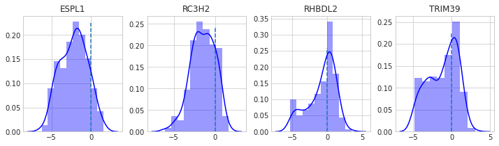
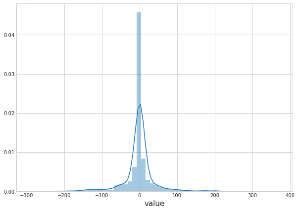
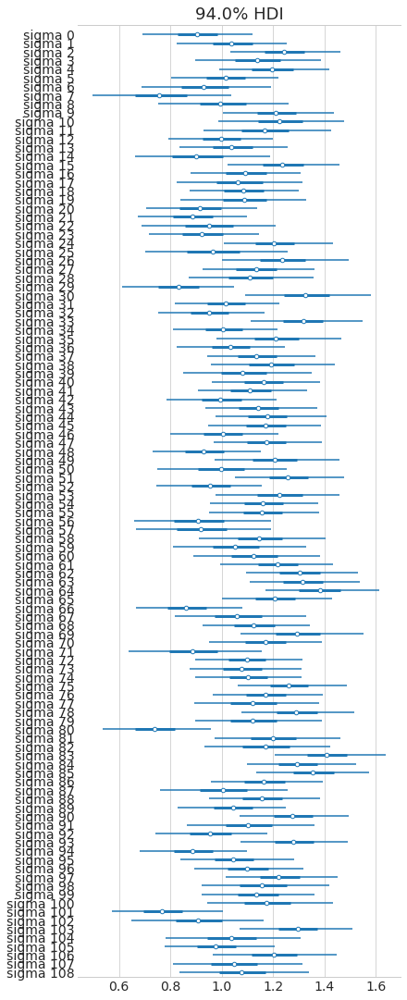
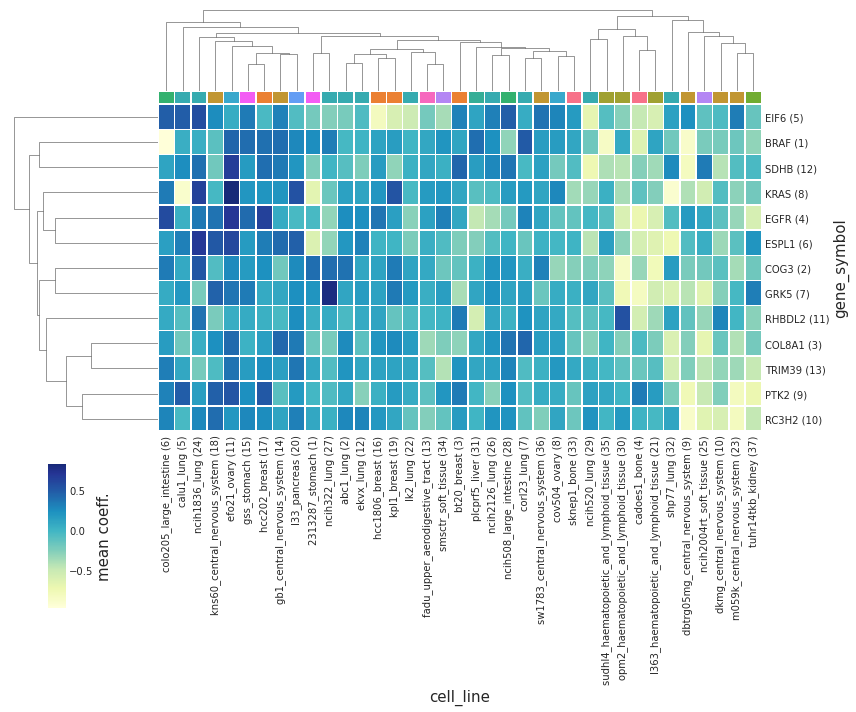
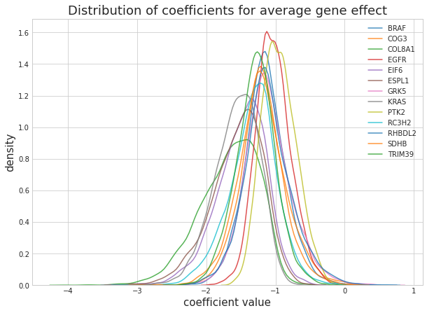
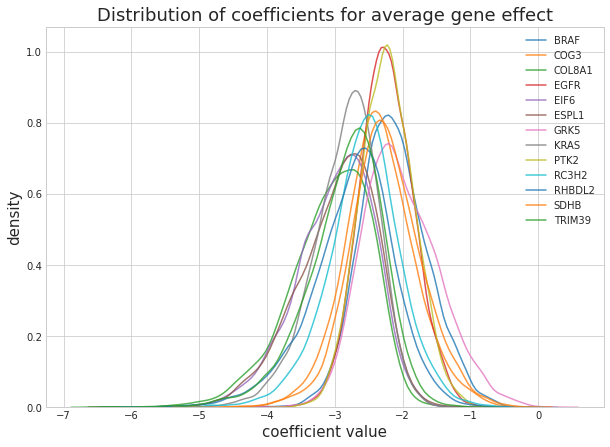

# DEMETER2 in Stan


```python
import pystan
import numpy as np
import pandas as pd
from matplotlib import pyplot as plt
import arviz as az
from pathlib import Path
import seaborn as sns
from timeit import default_timer as timer
import warnings
import re
from notebook_modules.pystan_helpers import StanModel_cache

plt.style.use('seaborn-whitegrid')
plt.rcParams['figure.figsize'] = (10.0, 7.0)
plt.rcParams['axes.titlesize'] = 18
plt.rcParams['axes.labelsize'] = 15

modeling_data_dir = Path('../modeling_data')

warnings.filterwarnings(action='ignore', 
                        message='Argument backend_kwargs has not effect in matplotlib.plot_distSupplied value won\'t be used')
```

## Data preparation


```python
modeling_data = pd.read_csv(modeling_data_dir / 'subset_modeling_data.csv')
modeling_data.head()
```


<div>
<style scoped>
    .dataframe tbody tr th:only-of-type {
        vertical-align: middle;
    }

    .dataframe tbody tr th {
        vertical-align: top;
    }

    .dataframe thead th {
        text-align: right;
    }
</style>
<table border="1" class="dataframe">
  <thead>
    <tr style="text-align: right;">
      <th></th>
      <th>barcode_sequence</th>
      <th>cell_line</th>
      <th>lfc</th>
      <th>batch</th>
      <th>gene_symbol</th>
    </tr>
  </thead>
  <tbody>
    <tr>
      <th>0</th>
      <td>ACAGAAGAAATTCTGGCAGAT</td>
      <td>ln215_central_nervous_system</td>
      <td>1.966515</td>
      <td>1</td>
      <td>EIF6</td>
    </tr>
    <tr>
      <th>1</th>
      <td>ACAGAAGAAATTCTGGCAGAT</td>
      <td>ln382_central_nervous_system</td>
      <td>1.289606</td>
      <td>1</td>
      <td>EIF6</td>
    </tr>
    <tr>
      <th>2</th>
      <td>ACAGAAGAAATTCTGGCAGAT</td>
      <td>efo21_ovary</td>
      <td>0.625725</td>
      <td>1</td>
      <td>EIF6</td>
    </tr>
    <tr>
      <th>3</th>
      <td>ACAGAAGAAATTCTGGCAGAT</td>
      <td>jhesoad1_oesophagus</td>
      <td>1.392272</td>
      <td>1</td>
      <td>EIF6</td>
    </tr>
    <tr>
      <th>4</th>
      <td>ACAGAAGAAATTCTGGCAGAT</td>
      <td>km12_large_intestine</td>
      <td>0.820838</td>
      <td>1</td>
      <td>EIF6</td>
    </tr>
  </tbody>
</table>
</div>


## Exploratory data analysis


```python
genes = set(modeling_data.gene_symbol.to_list())
fig, axes = plt.subplots(5, 3, figsize=(9, 9))
for ax, gene in zip(axes.flat, genes):
    lfc = modeling_data[modeling_data.gene_symbol == gene].lfc
    sns.distplot(lfc, kde=True, hist=False, rug=True, ax=ax, kde_kws={'shade': True}, color='b')
    
    y_data = ax.lines[0].get_ydata()
    ax.vlines(x=0, ymin=0, ymax=np.max(y_data) * 1.05, linestyles='dashed')
    
    ax.set_title(gene, fontsize=12)
    ax.set_xlabel(None)


axes[4, 2].axis('off')
axes[4, 1].axis('off')
fig.tight_layout(pad=1.0)
plt.show()
```


```python
cell_lines = set(modeling_data.cell_line.to_list())
for cell_line in cell_lines:
    lfc = modeling_data[modeling_data.cell_line == cell_line].lfc
    sns.distplot(lfc, kde=True, hist=False, label=None, kde_kws={'alpha': 0.2})

plt.title('LFC distributions')
plt.xlabel('LFC')
plt.show()
```


```python
sns.distplot(modeling_data.lfc)
plt.show()
```


```python
modeling_data[['barcode_sequence', 'gene_symbol']].drop_duplicates().groupby('gene_symbol').count()
```


<div>
<style scoped>
    .dataframe tbody tr th:only-of-type {
        vertical-align: middle;
    }

    .dataframe tbody tr th {
        vertical-align: top;
    }

    .dataframe thead th {
        text-align: right;
    }
</style>
<table border="1" class="dataframe">
  <thead>
    <tr style="text-align: right;">
      <th></th>
      <th>barcode_sequence</th>
    </tr>
    <tr>
      <th>gene_symbol</th>
      <th></th>
    </tr>
  </thead>
  <tbody>
    <tr>
      <th>BRAF</th>
      <td>8</td>
    </tr>
    <tr>
      <th>COG3</th>
      <td>5</td>
    </tr>
    <tr>
      <th>COL8A1</th>
      <td>5</td>
    </tr>
    <tr>
      <th>EGFR</th>
      <td>19</td>
    </tr>
    <tr>
      <th>EIF6</th>
      <td>5</td>
    </tr>
    <tr>
      <th>ESPL1</th>
      <td>5</td>
    </tr>
    <tr>
      <th>GRK5</th>
      <td>5</td>
    </tr>
    <tr>
      <th>KRAS</th>
      <td>11</td>
    </tr>
    <tr>
      <th>PTK2</th>
      <td>23</td>
    </tr>
    <tr>
      <th>RC3H2</th>
      <td>4</td>
    </tr>
    <tr>
      <th>RHBDL2</th>
      <td>5</td>
    </tr>
    <tr>
      <th>SDHB</th>
      <td>5</td>
    </tr>
    <tr>
      <th>TRIM39</th>
      <td>9</td>
    </tr>
  </tbody>
</table>
</div>


```python
lfc_corr = modeling_data \
    .pivot(index='cell_line', columns='barcode_sequence', values='lfc') \
    .corr()

mask = np.triu(np.ones_like(lfc_corr, dtype=np.bool), k=0)
f, ax = plt.subplots(figsize=(15, 13))
cmap = sns.diverging_palette(220, 10, as_cmap=True)
sns.heatmap(lfc_corr, mask=mask, 
            cmap=cmap, center=0, 
            square=True, linewidths=0.5, cbar_kws={'shrink': 0.5})
plt.xlabel('barcode')
plt.ylabel('barcode')
plt.title('Correlation of LFC of barcodes')
plt.show()
```


## Modeling


```python
models_dir = Path('..', 'models')
```


```python
modeling_data.head()
```


<div>
<style scoped>
    .dataframe tbody tr th:only-of-type {
        vertical-align: middle;
    }

    .dataframe tbody tr th {
        vertical-align: top;
    }

    .dataframe thead th {
        text-align: right;
    }
</style>
<table border="1" class="dataframe">
  <thead>
    <tr style="text-align: right;">
      <th></th>
      <th>barcode_sequence</th>
      <th>cell_line</th>
      <th>lfc</th>
      <th>batch</th>
      <th>gene_symbol</th>
    </tr>
  </thead>
  <tbody>
    <tr>
      <th>0</th>
      <td>ACAGAAGAAATTCTGGCAGAT</td>
      <td>ln215_central_nervous_system</td>
      <td>1.966515</td>
      <td>1</td>
      <td>EIF6</td>
    </tr>
    <tr>
      <th>1</th>
      <td>ACAGAAGAAATTCTGGCAGAT</td>
      <td>ln382_central_nervous_system</td>
      <td>1.289606</td>
      <td>1</td>
      <td>EIF6</td>
    </tr>
    <tr>
      <th>2</th>
      <td>ACAGAAGAAATTCTGGCAGAT</td>
      <td>efo21_ovary</td>
      <td>0.625725</td>
      <td>1</td>
      <td>EIF6</td>
    </tr>
    <tr>
      <th>3</th>
      <td>ACAGAAGAAATTCTGGCAGAT</td>
      <td>jhesoad1_oesophagus</td>
      <td>1.392272</td>
      <td>1</td>
      <td>EIF6</td>
    </tr>
    <tr>
      <th>4</th>
      <td>ACAGAAGAAATTCTGGCAGAT</td>
      <td>km12_large_intestine</td>
      <td>0.820838</td>
      <td>1</td>
      <td>EIF6</td>
    </tr>
  </tbody>
</table>
</div>


Select only a few cell lines while model building.


```python
len(np.unique(modeling_data.cell_line))
```


    501


```python
np.random.seed(123)
cell_lines = np.random.choice(np.unique(modeling_data.cell_line), 40)
modeling_data = modeling_data[modeling_data.cell_line.isin(cell_lines)]
modeling_data.shape
```


    (3334, 5)


```python
np.unique(modeling_data.gene_symbol)
```


    array(['BRAF', 'COG3', 'COL8A1', 'EGFR', 'EIF6', 'ESPL1', 'GRK5', 'KRAS',
           'PTK2', 'RC3H2', 'RHBDL2', 'SDHB', 'TRIM39'], dtype=object)


```python
# model_testing_genes = ['COG3', 'KRAS', 'COL8A1', 'EIF6']
# modeling_data = modeling_data[modeling_data.gene_symbol.isin(model_testing_genes)]
```


```python
genes = set(modeling_data.gene_symbol.to_list())
fig, axes = plt.subplots(1, 4, figsize=(10, 3))
for ax, gene in zip(axes.flat, genes):
    lfc = modeling_data[modeling_data.gene_symbol == gene].lfc
    sns.distplot(lfc, kde=True, hist=True, ax=ax, color='b')
    
    y_data = ax.lines[0].get_ydata()
    ax.vlines(x=0, ymin=0, ymax=np.max(y_data) * 1.05, linestyles='dashed')
    
    ax.set_title(gene, fontsize=12)
    ax.set_xlabel(None)

fig.tight_layout(pad=1.0)
plt.show()
```





```python
def add_categorical_idx(df, col):
    df[f'{col}_idx'] = df[col].astype('category').cat.codes + 1
    return df

for col in ['barcode_sequence', 'cell_line', 'gene_symbol']:
    modeling_data = add_categorical_idx(modeling_data, col)

modeling_data = modeling_data.reset_index(drop=True)
modeling_data.head()
```


<div>
<style scoped>
    .dataframe tbody tr th:only-of-type {
        vertical-align: middle;
    }

    .dataframe tbody tr th {
        vertical-align: top;
    }

    .dataframe thead th {
        text-align: right;
    }
</style>
<table border="1" class="dataframe">
  <thead>
    <tr style="text-align: right;">
      <th></th>
      <th>barcode_sequence</th>
      <th>cell_line</th>
      <th>lfc</th>
      <th>batch</th>
      <th>gene_symbol</th>
      <th>barcode_sequence_idx</th>
      <th>cell_line_idx</th>
      <th>gene_symbol_idx</th>
    </tr>
  </thead>
  <tbody>
    <tr>
      <th>0</th>
      <td>ACAGAAGAAATTCTGGCAGAT</td>
      <td>efo21_ovary</td>
      <td>0.625725</td>
      <td>1</td>
      <td>EIF6</td>
      <td>1</td>
      <td>11</td>
      <td>5</td>
    </tr>
    <tr>
      <th>1</th>
      <td>ACAGAAGAAATTCTGGCAGAT</td>
      <td>dbtrg05mg_central_nervous_system</td>
      <td>2.145082</td>
      <td>2</td>
      <td>EIF6</td>
      <td>1</td>
      <td>9</td>
      <td>5</td>
    </tr>
    <tr>
      <th>2</th>
      <td>ACAGAAGAAATTCTGGCAGAT</td>
      <td>bt20_breast</td>
      <td>0.932751</td>
      <td>2</td>
      <td>EIF6</td>
      <td>1</td>
      <td>3</td>
      <td>5</td>
    </tr>
    <tr>
      <th>3</th>
      <td>ACAGAAGAAATTCTGGCAGAT</td>
      <td>sw1783_central_nervous_system</td>
      <td>1.372030</td>
      <td>2</td>
      <td>EIF6</td>
      <td>1</td>
      <td>36</td>
      <td>5</td>
    </tr>
    <tr>
      <th>4</th>
      <td>ACAGAAGAAATTCTGGCAGAT</td>
      <td>kns60_central_nervous_system</td>
      <td>0.803835</td>
      <td>2</td>
      <td>EIF6</td>
      <td>1</td>
      <td>18</td>
      <td>5</td>
    </tr>
  </tbody>
</table>
</div>


Binary matrix of $[shRNA \times gene]$.


```python
shrna_gene_matrix = modeling_data[['barcode_sequence_idx', 'gene_symbol_idx']] \
    .drop_duplicates() \
    .reset_index(drop=True) \
    .assign(value = lambda df: np.ones(df.shape[0], dtype=int)) \
    .pivot(index='barcode_sequence_idx', columns='gene_symbol_idx', values='value') \
    .fillna(0) \
    .to_numpy() \
    .astype(int)

shrna_gene_matrix
```


    array([[0, 0, 0, ..., 0, 0, 0],
           [0, 0, 0, ..., 0, 0, 0],
           [0, 0, 0, ..., 0, 0, 0],
           ...,
           [0, 0, 0, ..., 0, 0, 0],
           [0, 0, 0, ..., 0, 0, 0],
           [0, 0, 0, ..., 0, 0, 1]])


```python
shrna_gene_matrix.shape
```


    (109, 13)


## Model 1. Just an intercept

$$
D \sim N(\mu, \sigma) \\
\mu = \alpha \\
\alpha \sim N(0, 5) \\
\sigma \sim \text{HalfCauchy}(0, 5)
$$

**Model data.**


```python
d2_m1_data = {
    'N': int(modeling_data.shape[0]),
    'y': modeling_data.lfc
}
```

**Compile model.**


```python
d2_m1_file = models_dir / 'd2_m1.cpp'
d2_m1 = StanModel_cache(file=d2_m1_file.as_posix())
```

    Using cached StanModel.


```python
d2_m1_fit = d2_m1.sampling(data=d2_m1_data, iter=2000, chains=2)
```

    WARNING:pystan:Maximum (flat) parameter count (1000) exceeded: skipping diagnostic tests for n_eff and Rhat.
    To run all diagnostics call pystan.check_hmc_diagnostics(fit)


```python
pystan.check_hmc_diagnostics(d2_m1_fit)
```


    {'n_eff': True,
     'Rhat': True,
     'divergence': True,
     'treedepth': True,
     'energy': True}


```python
az_d2_m1 = az.from_pystan(posterior=d2_m1_fit,
                          posterior_predictive='y_pred',
                          observed_data=['y'],
                          posterior_model=d2_m1)
az.summary(az_d2_m1)
```


<div>
<style scoped>
    .dataframe tbody tr th:only-of-type {
        vertical-align: middle;
    }

    .dataframe tbody tr th {
        vertical-align: top;
    }

    .dataframe thead th {
        text-align: right;
    }
</style>
<table border="1" class="dataframe">
  <thead>
    <tr style="text-align: right;">
      <th></th>
      <th>mean</th>
      <th>sd</th>
      <th>hdi_3%</th>
      <th>hdi_97%</th>
      <th>mcse_mean</th>
      <th>mcse_sd</th>
      <th>ess_mean</th>
      <th>ess_sd</th>
      <th>ess_bulk</th>
      <th>ess_tail</th>
      <th>r_hat</th>
    </tr>
  </thead>
  <tbody>
    <tr>
      <th>alpha</th>
      <td>-1.290</td>
      <td>0.030</td>
      <td>-1.344</td>
      <td>-1.237</td>
      <td>0.001</td>
      <td>0.0</td>
      <td>1788.0</td>
      <td>1788.0</td>
      <td>1787.0</td>
      <td>1498.0</td>
      <td>1.0</td>
    </tr>
    <tr>
      <th>sigma</th>
      <td>1.736</td>
      <td>0.021</td>
      <td>1.698</td>
      <td>1.777</td>
      <td>0.000</td>
      <td>0.0</td>
      <td>2021.0</td>
      <td>2019.0</td>
      <td>2034.0</td>
      <td>1462.0</td>
      <td>1.0</td>
    </tr>
  </tbody>
</table>
</div>


```python
az.plot_trace(az_d2_m1)
plt.show()
```


```python
az.plot_forest(az_d2_m1, combined=True)
plt.show()
```


```python
az.plot_ppc(az_d2_m1, data_pairs={'y':'y_pred'}, num_pp_samples=50)
plt.show()
```


## Model 2. Varying intercept by shRNA

$$
D_{i|s} \sim N(\mu_{i|s}, \sigma) \\
\mu = \alpha_{i|s} \\
\alpha \sim N(\mu_{\alpha}, \sigma_{\alpha}) \\
\mu_{\alpha} \sim N(0, 2) \\
\sigma_{\alpha} \sim \text{HalfCauchy}(0, 2) \\
\sigma \sim \text{HalfCauchy}(0, 5)
$$

### Generative model for a prior predictive check


```python
N = 1000
S = 100
shrna_barcodes = list(range(1, S+1))
shrna_barcodes_idx = np.repeat(shrna_barcodes, N/S)
```


```python
d2_m2_gen_data = {
    'N': N,
    'S': S,
    'shrna': shrna_barcodes_idx
}
```


```python
d2_m2_gen_file = models_dir / 'd2_m2_generative.cpp'
d2_m2_gen = StanModel_cache(file=d2_m2_gen_file.as_posix())
```

    Using cached StanModel.


```python
d2_m2_gen_fit = d2_m2_gen.sampling(data=d2_m2_gen_data, 
                                   iter=10, warmup=0, chains=1, 
                                   algorithm='Fixed_param')
```


```python
az_d2_m2_gen = az.from_pystan(d2_m2_gen_fit)
```


```python
df = d2_m2_gen_fit.to_dataframe() \
    .drop(['chain', 'draw', 'warmup'], axis=1) \
    .melt(var_name='parameter', value_name='value')
df = df[df.parameter.str.contains('alpha\[')]
sns.distplot(df.value)
plt.show()
```


```python
df = d2_m2_gen_fit.to_dataframe() \
    .drop(['chain', 'draw', 'warmup'], axis=1) \
    .melt(var_name='parameter', value_name='value')
df = df[df.parameter.str.contains('y_pred')]
sns.distplot(df.value)
plt.show()
```





```python
sns.distplot(modeling_data.lfc)
plt.show()
```


**Model data**


```python
d2_m2_data = {
    'N': int(modeling_data.shape[0]),
    'S': np.max(modeling_data.barcode_sequence_idx),
    
    'shrna': modeling_data.barcode_sequence_idx,
    
    'y': modeling_data.lfc,
}
```


```python
d2_m2_data['S']
```


    109


**Compile model.**


```python
d2_m2_file = models_dir / 'd2_m2.cpp'
d2_m2 = StanModel_cache(file=d2_m2_file.as_posix())
```

    Using cached StanModel.


```python
d2_m2_fit = d2_m2.sampling(data=d2_m2_data, iter=1000, chains=2)
```

    WARNING:pystan:Maximum (flat) parameter count (1000) exceeded: skipping diagnostic tests for n_eff and Rhat.
    To run all diagnostics call pystan.check_hmc_diagnostics(fit)


```python
pystan.check_hmc_diagnostics(d2_m2_fit)
```


    {'n_eff': True,
     'Rhat': True,
     'divergence': True,
     'treedepth': True,
     'energy': True}


```python
az_d2_m2 = az.from_pystan(posterior=d2_m2_fit,
                          posterior_predictive='y_pred',
                          observed_data=['y'],
                          posterior_model=d2_m2)
az.summary(az_d2_m2).head()
```


<div>
<style scoped>
    .dataframe tbody tr th:only-of-type {
        vertical-align: middle;
    }

    .dataframe tbody tr th {
        vertical-align: top;
    }

    .dataframe thead th {
        text-align: right;
    }
</style>
<table border="1" class="dataframe">
  <thead>
    <tr style="text-align: right;">
      <th></th>
      <th>mean</th>
      <th>sd</th>
      <th>hdi_3%</th>
      <th>hdi_97%</th>
      <th>mcse_mean</th>
      <th>mcse_sd</th>
      <th>ess_mean</th>
      <th>ess_sd</th>
      <th>ess_bulk</th>
      <th>ess_tail</th>
      <th>r_hat</th>
    </tr>
  </thead>
  <tbody>
    <tr>
      <th>mu_alpha</th>
      <td>-1.220</td>
      <td>0.121</td>
      <td>-1.439</td>
      <td>-1.007</td>
      <td>0.004</td>
      <td>0.003</td>
      <td>1056.0</td>
      <td>1036.0</td>
      <td>1059.0</td>
      <td>767.0</td>
      <td>1.00</td>
    </tr>
    <tr>
      <th>sigma_alpha</th>
      <td>1.277</td>
      <td>0.087</td>
      <td>1.121</td>
      <td>1.446</td>
      <td>0.003</td>
      <td>0.002</td>
      <td>1081.0</td>
      <td>1075.0</td>
      <td>1089.0</td>
      <td>775.0</td>
      <td>1.00</td>
    </tr>
    <tr>
      <th>alpha[0]</th>
      <td>0.713</td>
      <td>0.190</td>
      <td>0.384</td>
      <td>1.067</td>
      <td>0.006</td>
      <td>0.005</td>
      <td>889.0</td>
      <td>828.0</td>
      <td>880.0</td>
      <td>677.0</td>
      <td>1.00</td>
    </tr>
    <tr>
      <th>alpha[1]</th>
      <td>-0.260</td>
      <td>0.190</td>
      <td>-0.637</td>
      <td>0.068</td>
      <td>0.006</td>
      <td>0.004</td>
      <td>1091.0</td>
      <td>930.0</td>
      <td>1091.0</td>
      <td>565.0</td>
      <td>1.00</td>
    </tr>
    <tr>
      <th>alpha[2]</th>
      <td>-0.782</td>
      <td>0.189</td>
      <td>-1.111</td>
      <td>-0.437</td>
      <td>0.005</td>
      <td>0.004</td>
      <td>1236.0</td>
      <td>1213.0</td>
      <td>1240.0</td>
      <td>815.0</td>
      <td>1.01</td>
    </tr>
  </tbody>
</table>
</div>


```python
az.plot_trace(az_d2_m2, var_names=['mu_alpha', 'sigma_alpha', 'sigma'])
plt.show()
```


```python
az.plot_forest(az_d2_m2, kind='ridgeplot', combined=True, 
               var_names=['mu_alpha', 'sigma_alpha', 'sigma'])
plt.show()
```


```python
az.plot_ppc(az_d2_m2, data_pairs={'y':'y_pred'}, num_pp_samples=50)
plt.show()
```


```python
d2_m2_fit.to_dataframe().head()
```


<div>
<style scoped>
    .dataframe tbody tr th:only-of-type {
        vertical-align: middle;
    }

    .dataframe tbody tr th {
        vertical-align: top;
    }

    .dataframe thead th {
        text-align: right;
    }
</style>
<table border="1" class="dataframe">
  <thead>
    <tr style="text-align: right;">
      <th></th>
      <th>chain</th>
      <th>draw</th>
      <th>warmup</th>
      <th>mu_alpha</th>
      <th>sigma_alpha</th>
      <th>alpha[1]</th>
      <th>alpha[2]</th>
      <th>alpha[3]</th>
      <th>alpha[4]</th>
      <th>alpha[5]</th>
      <th>...</th>
      <th>y_pred[3332]</th>
      <th>y_pred[3333]</th>
      <th>y_pred[3334]</th>
      <th>lp__</th>
      <th>accept_stat__</th>
      <th>stepsize__</th>
      <th>treedepth__</th>
      <th>n_leapfrog__</th>
      <th>divergent__</th>
      <th>energy__</th>
    </tr>
  </thead>
  <tbody>
    <tr>
      <th>0</th>
      <td>0</td>
      <td>0</td>
      <td>0</td>
      <td>-1.108821</td>
      <td>1.185056</td>
      <td>0.985269</td>
      <td>-0.599131</td>
      <td>-0.573756</td>
      <td>0.553302</td>
      <td>-2.087340</td>
      <td>...</td>
      <td>-3.265320</td>
      <td>-1.491231</td>
      <td>-2.469924</td>
      <td>-2388.608570</td>
      <td>0.893284</td>
      <td>0.444461</td>
      <td>3</td>
      <td>7</td>
      <td>0</td>
      <td>2454.259536</td>
    </tr>
    <tr>
      <th>1</th>
      <td>0</td>
      <td>1</td>
      <td>0</td>
      <td>-1.278377</td>
      <td>1.310385</td>
      <td>0.543213</td>
      <td>-0.079502</td>
      <td>-0.727783</td>
      <td>0.254553</td>
      <td>-2.451186</td>
      <td>...</td>
      <td>-1.658844</td>
      <td>-3.045479</td>
      <td>0.772850</td>
      <td>-2391.075425</td>
      <td>0.946229</td>
      <td>0.444461</td>
      <td>3</td>
      <td>7</td>
      <td>0</td>
      <td>2439.358201</td>
    </tr>
    <tr>
      <th>2</th>
      <td>0</td>
      <td>2</td>
      <td>0</td>
      <td>-1.310280</td>
      <td>1.142402</td>
      <td>0.565419</td>
      <td>-0.314976</td>
      <td>-0.742552</td>
      <td>0.092454</td>
      <td>-2.121821</td>
      <td>...</td>
      <td>-2.027082</td>
      <td>-2.366810</td>
      <td>-1.136287</td>
      <td>-2389.730446</td>
      <td>0.862265</td>
      <td>0.444461</td>
      <td>3</td>
      <td>7</td>
      <td>0</td>
      <td>2443.770573</td>
    </tr>
    <tr>
      <th>3</th>
      <td>0</td>
      <td>3</td>
      <td>0</td>
      <td>-1.225929</td>
      <td>1.173652</td>
      <td>0.519321</td>
      <td>-0.211365</td>
      <td>-0.898190</td>
      <td>0.328518</td>
      <td>-2.163545</td>
      <td>...</td>
      <td>0.330826</td>
      <td>-0.603705</td>
      <td>-1.186651</td>
      <td>-2395.596745</td>
      <td>0.706861</td>
      <td>0.444461</td>
      <td>3</td>
      <td>7</td>
      <td>0</td>
      <td>2452.396397</td>
    </tr>
    <tr>
      <th>4</th>
      <td>0</td>
      <td>4</td>
      <td>0</td>
      <td>-1.197465</td>
      <td>1.382379</td>
      <td>0.876671</td>
      <td>-0.351517</td>
      <td>-0.774788</td>
      <td>0.563426</td>
      <td>-2.177239</td>
      <td>...</td>
      <td>-1.269523</td>
      <td>-0.513996</td>
      <td>-1.844957</td>
      <td>-2398.777560</td>
      <td>0.938470</td>
      <td>0.444461</td>
      <td>3</td>
      <td>7</td>
      <td>0</td>
      <td>2452.932163</td>
    </tr>
  </tbody>
</table>
<p>5 rows × 3456 columns</p>
</div>


## Model 3. Another varying intercept for target gene

$$
D_{i|s} \sim N(\mu_{i|s}, \sigma) \\
\mu = \alpha_{i|s} + g_{i|l}\\
\alpha_s \sim N(\mu_{\alpha}, \sigma_{\alpha}) \\
g_l \sim N(\mu_g, \sigma_g) \\
\mu_{\alpha} \sim N(0, 2) \quad \sigma_{\alpha} \sim \text{HalfCauchy}(0, 10) \\
\mu_{g} \sim N(0, 2) \quad \sigma_{g} \sim \text{HalfCauchy}(0, 10) \\
\sigma \sim \text{HalfCauchy}(0, 10)
$$


```python
d2_m3_data = {
    'N': int(modeling_data.shape[0]),
    'S': np.max(modeling_data.barcode_sequence_idx),
    'L': np.max(modeling_data.gene_symbol_idx),
    
    'shrna': modeling_data.barcode_sequence_idx,
    'gene': modeling_data.gene_symbol_idx,
    
    'y': modeling_data.lfc,
}
```

**Compile model.**


```python
d2_m3_file = models_dir / 'd2_m3.cpp'
d2_m3 = StanModel_cache(file=d2_m3_file.as_posix())
```

    Using cached StanModel.


```python
d2_m3_control = {'adapt_delta': 0.99, 
                 'max_treedepth': 10}
d2_m3_fit = d2_m3.sampling(data=d2_m3_data, 
                           iter=3000, warmup=1000, chains=4, 
                           control=d2_m3_control)
```

    WARNING:pystan:Maximum (flat) parameter count (1000) exceeded: skipping diagnostic tests for n_eff and Rhat.
    To run all diagnostics call pystan.check_hmc_diagnostics(fit)
    WARNING:pystan:2 of 8000 iterations ended with a divergence (0.025 %).
    WARNING:pystan:Try running with adapt_delta larger than 0.99 to remove the divergences.
    WARNING:pystan:160 of 8000 iterations saturated the maximum tree depth of 10 (2 %)
    WARNING:pystan:Run again with max_treedepth larger than 10 to avoid saturation


```python
pystan.check_hmc_diagnostics(d2_m3_fit)
```

    WARNING:pystan:2 of 8000 iterations ended with a divergence (0.025 %).
    WARNING:pystan:Try running with adapt_delta larger than 0.99 to remove the divergences.
    WARNING:pystan:160 of 8000 iterations saturated the maximum tree depth of 10 (2 %)
    WARNING:pystan:Run again with max_treedepth larger than 10 to avoid saturation


    {'n_eff': True,
     'Rhat': True,
     'divergence': False,
     'treedepth': False,
     'energy': True}


```python
az_d2_m3 = az.from_pystan(posterior=d2_m3_fit,
                          posterior_predictive='y_pred',
                          observed_data=['y'],
                          posterior_model=d2_m3)
az.summary(az_d2_m3).head()
```


<div>
<style scoped>
    .dataframe tbody tr th:only-of-type {
        vertical-align: middle;
    }

    .dataframe tbody tr th {
        vertical-align: top;
    }

    .dataframe thead th {
        text-align: right;
    }
</style>
<table border="1" class="dataframe">
  <thead>
    <tr style="text-align: right;">
      <th></th>
      <th>mean</th>
      <th>sd</th>
      <th>hdi_3%</th>
      <th>hdi_97%</th>
      <th>mcse_mean</th>
      <th>mcse_sd</th>
      <th>ess_mean</th>
      <th>ess_sd</th>
      <th>ess_bulk</th>
      <th>ess_tail</th>
      <th>r_hat</th>
    </tr>
  </thead>
  <tbody>
    <tr>
      <th>mu_alpha</th>
      <td>-0.539</td>
      <td>1.627</td>
      <td>-3.823</td>
      <td>2.707</td>
      <td>0.305</td>
      <td>0.334</td>
      <td>28.0</td>
      <td>12.0</td>
      <td>32.0</td>
      <td>20.0</td>
      <td>1.21</td>
    </tr>
    <tr>
      <th>sigma_alpha</th>
      <td>1.236</td>
      <td>0.093</td>
      <td>1.071</td>
      <td>1.417</td>
      <td>0.004</td>
      <td>0.003</td>
      <td>672.0</td>
      <td>672.0</td>
      <td>656.0</td>
      <td>1477.0</td>
      <td>1.00</td>
    </tr>
    <tr>
      <th>mu_g</th>
      <td>-0.749</td>
      <td>1.629</td>
      <td>-4.015</td>
      <td>2.477</td>
      <td>0.305</td>
      <td>0.339</td>
      <td>29.0</td>
      <td>12.0</td>
      <td>32.0</td>
      <td>20.0</td>
      <td>1.21</td>
    </tr>
    <tr>
      <th>sigma_g</th>
      <td>0.410</td>
      <td>0.213</td>
      <td>0.038</td>
      <td>0.772</td>
      <td>0.013</td>
      <td>0.009</td>
      <td>279.0</td>
      <td>279.0</td>
      <td>242.0</td>
      <td>348.0</td>
      <td>1.02</td>
    </tr>
    <tr>
      <th>alpha[0]</th>
      <td>1.684</td>
      <td>1.670</td>
      <td>-1.632</td>
      <td>5.013</td>
      <td>0.302</td>
      <td>0.273</td>
      <td>31.0</td>
      <td>19.0</td>
      <td>35.0</td>
      <td>20.0</td>
      <td>1.17</td>
    </tr>
  </tbody>
</table>
</div>


```python
az.plot_trace(az_d2_m3, var_names=['g'])
plt.show()
```


```python
az.plot_ppc(az_d2_m3, data_pairs={'y':'y_pred'}, num_pp_samples=50)
plt.show()
```


```python
fit3_summary = az.summary(az_d2_m3)
```


```python
fit3_alpha_summary = fit3_summary[fit3_summary.index.str.contains('alpha\[')]
shrna_idx = [re.search(r"\[([A-Za-z0-9_]+)\]", a).group(1) for a in fit3_alpha_summary.index]
shrna_idx = [int(a) + 1 for a in shrna_idx]
fit3_alpha_summary = fit3_alpha_summary \
    .assign(barcode_sequence_idx = shrna_idx) \
    .set_index('barcode_sequence_idx') \
    .join(modeling_data[['barcode_sequence_idx', 'gene_symbol']] \
          .drop_duplicates() \
          .set_index('barcode_sequence_idx'))
fit3_alpha_summary.head(10)
```


<div>
<style scoped>
    .dataframe tbody tr th:only-of-type {
        vertical-align: middle;
    }

    .dataframe tbody tr th {
        vertical-align: top;
    }

    .dataframe thead th {
        text-align: right;
    }
</style>
<table border="1" class="dataframe">
  <thead>
    <tr style="text-align: right;">
      <th></th>
      <th>mean</th>
      <th>sd</th>
      <th>hdi_3%</th>
      <th>hdi_97%</th>
      <th>mcse_mean</th>
      <th>mcse_sd</th>
      <th>ess_mean</th>
      <th>ess_sd</th>
      <th>ess_bulk</th>
      <th>ess_tail</th>
      <th>r_hat</th>
      <th>gene_symbol</th>
    </tr>
    <tr>
      <th>barcode_sequence_idx</th>
      <th></th>
      <th></th>
      <th></th>
      <th></th>
      <th></th>
      <th></th>
      <th></th>
      <th></th>
      <th></th>
      <th></th>
      <th></th>
      <th></th>
    </tr>
  </thead>
  <tbody>
    <tr>
      <th>1</th>
      <td>1.684</td>
      <td>1.670</td>
      <td>-1.632</td>
      <td>5.013</td>
      <td>0.302</td>
      <td>0.273</td>
      <td>31.0</td>
      <td>19.0</td>
      <td>35.0</td>
      <td>20.0</td>
      <td>1.17</td>
      <td>EIF6</td>
    </tr>
    <tr>
      <th>2</th>
      <td>0.313</td>
      <td>1.673</td>
      <td>-2.905</td>
      <td>3.848</td>
      <td>0.308</td>
      <td>0.367</td>
      <td>29.0</td>
      <td>11.0</td>
      <td>33.0</td>
      <td>20.0</td>
      <td>1.19</td>
      <td>GRK5</td>
    </tr>
    <tr>
      <th>3</th>
      <td>0.186</td>
      <td>1.672</td>
      <td>-3.290</td>
      <td>3.379</td>
      <td>0.302</td>
      <td>0.367</td>
      <td>31.0</td>
      <td>11.0</td>
      <td>35.0</td>
      <td>20.0</td>
      <td>1.18</td>
      <td>EIF6</td>
    </tr>
    <tr>
      <th>4</th>
      <td>0.716</td>
      <td>1.658</td>
      <td>-2.553</td>
      <td>4.147</td>
      <td>0.304</td>
      <td>0.332</td>
      <td>30.0</td>
      <td>13.0</td>
      <td>33.0</td>
      <td>20.0</td>
      <td>1.18</td>
      <td>EGFR</td>
    </tr>
    <tr>
      <th>5</th>
      <td>-1.095</td>
      <td>1.689</td>
      <td>-4.599</td>
      <td>2.066</td>
      <td>0.306</td>
      <td>0.233</td>
      <td>31.0</td>
      <td>27.0</td>
      <td>35.0</td>
      <td>21.0</td>
      <td>1.17</td>
      <td>COL8A1</td>
    </tr>
    <tr>
      <th>6</th>
      <td>-0.470</td>
      <td>1.658</td>
      <td>-3.967</td>
      <td>2.728</td>
      <td>0.306</td>
      <td>0.347</td>
      <td>29.0</td>
      <td>12.0</td>
      <td>34.0</td>
      <td>19.0</td>
      <td>1.20</td>
      <td>KRAS</td>
    </tr>
    <tr>
      <th>7</th>
      <td>-0.230</td>
      <td>1.671</td>
      <td>-3.575</td>
      <td>3.206</td>
      <td>0.309</td>
      <td>0.373</td>
      <td>29.0</td>
      <td>11.0</td>
      <td>33.0</td>
      <td>19.0</td>
      <td>1.20</td>
      <td>PTK2</td>
    </tr>
    <tr>
      <th>8</th>
      <td>1.487</td>
      <td>1.668</td>
      <td>-2.038</td>
      <td>4.717</td>
      <td>0.309</td>
      <td>0.293</td>
      <td>29.0</td>
      <td>17.0</td>
      <td>33.0</td>
      <td>19.0</td>
      <td>1.20</td>
      <td>PTK2</td>
    </tr>
    <tr>
      <th>9</th>
      <td>0.669</td>
      <td>1.675</td>
      <td>-2.770</td>
      <td>4.044</td>
      <td>0.310</td>
      <td>0.351</td>
      <td>29.0</td>
      <td>12.0</td>
      <td>33.0</td>
      <td>19.0</td>
      <td>1.20</td>
      <td>PTK2</td>
    </tr>
    <tr>
      <th>10</th>
      <td>-0.492</td>
      <td>1.675</td>
      <td>-3.839</td>
      <td>2.827</td>
      <td>0.309</td>
      <td>0.336</td>
      <td>29.0</td>
      <td>13.0</td>
      <td>33.0</td>
      <td>19.0</td>
      <td>1.19</td>
      <td>BRAF</td>
    </tr>
  </tbody>
</table>
</div>


```python
fit3_gene_summary = fit3_summary[fit3_summary.index.str.contains('g\[')]
gene_idx = [re.search(r"\[([A-Za-z0-9_]+)\]", a).group(1) for a in fit3_gene_summary.index]
gene_idx = [int(a) + 1 for a in gene_idx]
fit3_gene_summary = fit3_gene_summary \
    .assign(gene_symbol_idx = gene_idx) \
    .set_index('gene_symbol_idx') \
    .join(modeling_data[['gene_symbol_idx', 'gene_symbol']] \
          .drop_duplicates() \
          .set_index('gene_symbol_idx')) \
    .reset_index(drop=False)
fit3_gene_summary.head(10)
```


<div>
<style scoped>
    .dataframe tbody tr th:only-of-type {
        vertical-align: middle;
    }

    .dataframe tbody tr th {
        vertical-align: top;
    }

    .dataframe thead th {
        text-align: right;
    }
</style>
<table border="1" class="dataframe">
  <thead>
    <tr style="text-align: right;">
      <th></th>
      <th>gene_symbol_idx</th>
      <th>mean</th>
      <th>sd</th>
      <th>hdi_3%</th>
      <th>hdi_97%</th>
      <th>mcse_mean</th>
      <th>mcse_sd</th>
      <th>ess_mean</th>
      <th>ess_sd</th>
      <th>ess_bulk</th>
      <th>ess_tail</th>
      <th>r_hat</th>
      <th>gene_symbol</th>
    </tr>
  </thead>
  <tbody>
    <tr>
      <th>0</th>
      <td>1</td>
      <td>-0.615</td>
      <td>1.667</td>
      <td>-3.996</td>
      <td>2.648</td>
      <td>0.310</td>
      <td>0.348</td>
      <td>29.0</td>
      <td>12.0</td>
      <td>33.0</td>
      <td>19.0</td>
      <td>1.20</td>
      <td>BRAF</td>
    </tr>
    <tr>
      <th>1</th>
      <td>2</td>
      <td>-0.641</td>
      <td>1.660</td>
      <td>-4.058</td>
      <td>2.589</td>
      <td>0.308</td>
      <td>0.346</td>
      <td>29.0</td>
      <td>12.0</td>
      <td>33.0</td>
      <td>20.0</td>
      <td>1.19</td>
      <td>COG3</td>
    </tr>
    <tr>
      <th>2</th>
      <td>3</td>
      <td>-1.163</td>
      <td>1.679</td>
      <td>-4.189</td>
      <td>2.400</td>
      <td>0.306</td>
      <td>0.310</td>
      <td>30.0</td>
      <td>15.0</td>
      <td>34.0</td>
      <td>21.0</td>
      <td>1.17</td>
      <td>COL8A1</td>
    </tr>
    <tr>
      <th>3</th>
      <td>4</td>
      <td>-0.463</td>
      <td>1.640</td>
      <td>-4.016</td>
      <td>2.677</td>
      <td>0.305</td>
      <td>0.354</td>
      <td>29.0</td>
      <td>11.0</td>
      <td>33.0</td>
      <td>20.0</td>
      <td>1.20</td>
      <td>EGFR</td>
    </tr>
    <tr>
      <th>4</th>
      <td>5</td>
      <td>-0.974</td>
      <td>1.662</td>
      <td>-4.193</td>
      <td>2.374</td>
      <td>0.302</td>
      <td>0.317</td>
      <td>30.0</td>
      <td>14.0</td>
      <td>34.0</td>
      <td>20.0</td>
      <td>1.18</td>
      <td>EIF6</td>
    </tr>
    <tr>
      <th>5</th>
      <td>6</td>
      <td>-1.024</td>
      <td>1.673</td>
      <td>-4.273</td>
      <td>2.412</td>
      <td>0.306</td>
      <td>0.326</td>
      <td>30.0</td>
      <td>14.0</td>
      <td>34.0</td>
      <td>19.0</td>
      <td>1.18</td>
      <td>ESPL1</td>
    </tr>
    <tr>
      <th>6</th>
      <td>7</td>
      <td>-0.569</td>
      <td>1.665</td>
      <td>-4.101</td>
      <td>2.615</td>
      <td>0.309</td>
      <td>0.352</td>
      <td>29.0</td>
      <td>12.0</td>
      <td>33.0</td>
      <td>20.0</td>
      <td>1.19</td>
      <td>GRK5</td>
    </tr>
    <tr>
      <th>7</th>
      <td>8</td>
      <td>-1.036</td>
      <td>1.647</td>
      <td>-4.135</td>
      <td>2.414</td>
      <td>0.306</td>
      <td>0.325</td>
      <td>29.0</td>
      <td>13.0</td>
      <td>33.0</td>
      <td>19.0</td>
      <td>1.20</td>
      <td>KRAS</td>
    </tr>
    <tr>
      <th>8</th>
      <td>9</td>
      <td>-0.449</td>
      <td>1.651</td>
      <td>-3.496</td>
      <td>3.133</td>
      <td>0.309</td>
      <td>0.365</td>
      <td>29.0</td>
      <td>11.0</td>
      <td>32.0</td>
      <td>18.0</td>
      <td>1.21</td>
      <td>PTK2</td>
    </tr>
    <tr>
      <th>9</th>
      <td>10</td>
      <td>-0.801</td>
      <td>1.672</td>
      <td>-4.016</td>
      <td>2.787</td>
      <td>0.308</td>
      <td>0.342</td>
      <td>29.0</td>
      <td>13.0</td>
      <td>33.0</td>
      <td>20.0</td>
      <td>1.19</td>
      <td>RC3H2</td>
    </tr>
  </tbody>
</table>
</div>


```python
for i in range(fit3_gene_summary.shape[0]):
    plt.plot(np.repeat(fit3_gene_summary.loc[i, 'gene_symbol'], 2), 
             [fit3_gene_summary.loc[i, 'hdi_3%'], fit3_gene_summary.loc[i, 'hdi_97%']],
             color='red', alpha=0.5)


plt.scatter(fit3_gene_summary['gene_symbol'], 
            fit3_gene_summary['mean'],
            s=100, c='r', label='gene')
plt.scatter(fit3_alpha_summary['gene_symbol'], 
            fit3_alpha_summary['mean'], 
            alpha=0.3, s=75, c='b', label='shRNA')

plt.title('shRNA and gene mean values')
plt.xlabel('target gene')
plt.ylabel('estimated effect on LFC')
plt.legend()
plt.show()
```


## Model 4. Parameters for difference between average gene effect and cell line-specific effect

Note that the varying intercept for shRNA has been renamed from $\alpha$ to $c$.
$\bar g_{l}$ is the average effect of knocking-down gene $l$ while $g_{jl}$ is the cell line $j$-specific effect of knocking-down $l$.

There is now also varying population level standard deviations for each shRNA $\sigma_s$.
This seems to help reduce divergences during sampling by modeling differences in standard deviation for each shRNA.

$$
D_{i|s} \sim N(\mu_{i|s}, \sigma_s) \\
\mu = c_{i|s} + \bar g_{i|l} + g_{i|jl} \\
c_s \sim N(0, \sigma_c) \\
\bar g_l \sim N(\mu_{\bar g}, \sigma_{\bar g}) \\
g_{jl} \sim N(0, \sigma_g) \\
\sigma_c \sim \text{HalfNormal}(0, 3) \\
\mu_{\bar g} \sim N(0, 2) \quad \sigma_{\bar g} \sim \text{HalfNormal}(0, 10) \\
\sigma_g \sim \text{HalfNormal}(0, 5) \\
\sigma_s \sim \text{HalfNormal}(\mu_\sigma, \sigma_\sigma) \\
\mu_\sigma \sim \text{HalfNormal}(0, 2) \quad \sigma_\sigma \sim \text{HalfNormal}(0, 1) \\
$$


```python
d2_m4_data = {
    'N': int(modeling_data.shape[0]),
    'S': np.max(modeling_data.barcode_sequence_idx),
    'L': np.max(modeling_data.gene_symbol_idx),
    'J': np.max(modeling_data.cell_line_idx),
    
    'shrna': modeling_data.barcode_sequence_idx,
    'gene': modeling_data.gene_symbol_idx,
    'cell_line': modeling_data.cell_line_idx,
    
    'y': modeling_data.lfc,
}
```

**Compile model.**


```python
d2_m4_file = models_dir / 'd2_m4.cpp'
d2_m4 = StanModel_cache(file=d2_m4_file.as_posix())
```

    Using cached StanModel.


```python
d2_m4_control = {'adapt_delta': 0.99, 
                 'max_treedepth': 10}
d2_m4_fit = d2_m4.sampling(data=d2_m4_data, 
                           iter=3000, warmup=1000, chains=4, 
                           control=d2_m4_control)
```

    WARNING:pystan:Maximum (flat) parameter count (1000) exceeded: skipping diagnostic tests for n_eff and Rhat.
    To run all diagnostics call pystan.check_hmc_diagnostics(fit)
    WARNING:pystan:6 of 8000 iterations ended with a divergence (0.075 %).
    WARNING:pystan:Try running with adapt_delta larger than 0.99 to remove the divergences.


```python
pystan.check_hmc_diagnostics(d2_m4_fit)
```

    WARNING:pystan:6 of 8000 iterations ended with a divergence (0.075 %).
    WARNING:pystan:Try running with adapt_delta larger than 0.99 to remove the divergences.


    {'n_eff': True,
     'Rhat': True,
     'divergence': False,
     'treedepth': True,
     'energy': True}


```python
az_d2_m4 = az.from_pystan(posterior=d2_m4_fit,
                          posterior_predictive='y_pred',
                          observed_data=['y'],
                          posterior_model=d2_m4)
az.summary(az_d2_m4).head()
```


<div>
<style scoped>
    .dataframe tbody tr th:only-of-type {
        vertical-align: middle;
    }

    .dataframe tbody tr th {
        vertical-align: top;
    }

    .dataframe thead th {
        text-align: right;
    }
</style>
<table border="1" class="dataframe">
  <thead>
    <tr style="text-align: right;">
      <th></th>
      <th>mean</th>
      <th>sd</th>
      <th>hdi_3%</th>
      <th>hdi_97%</th>
      <th>mcse_mean</th>
      <th>mcse_sd</th>
      <th>ess_mean</th>
      <th>ess_sd</th>
      <th>ess_bulk</th>
      <th>ess_tail</th>
      <th>r_hat</th>
    </tr>
  </thead>
  <tbody>
    <tr>
      <th>sigma_c</th>
      <td>1.236</td>
      <td>0.091</td>
      <td>1.073</td>
      <td>1.411</td>
      <td>0.001</td>
      <td>0.001</td>
      <td>6320.0</td>
      <td>6130.0</td>
      <td>6572.0</td>
      <td>5787.0</td>
      <td>1.0</td>
    </tr>
    <tr>
      <th>mu_gbar</th>
      <td>-1.274</td>
      <td>0.189</td>
      <td>-1.616</td>
      <td>-0.896</td>
      <td>0.005</td>
      <td>0.003</td>
      <td>1758.0</td>
      <td>1758.0</td>
      <td>1713.0</td>
      <td>3476.0</td>
      <td>1.0</td>
    </tr>
    <tr>
      <th>sigma_gbar</th>
      <td>0.421</td>
      <td>0.213</td>
      <td>0.040</td>
      <td>0.790</td>
      <td>0.008</td>
      <td>0.006</td>
      <td>708.0</td>
      <td>708.0</td>
      <td>626.0</td>
      <td>671.0</td>
      <td>1.0</td>
    </tr>
    <tr>
      <th>sigma_g</th>
      <td>0.460</td>
      <td>0.031</td>
      <td>0.401</td>
      <td>0.519</td>
      <td>0.001</td>
      <td>0.000</td>
      <td>2405.0</td>
      <td>2405.0</td>
      <td>2402.0</td>
      <td>4668.0</td>
      <td>1.0</td>
    </tr>
    <tr>
      <th>c[0]</th>
      <td>2.269</td>
      <td>0.400</td>
      <td>1.557</td>
      <td>3.044</td>
      <td>0.010</td>
      <td>0.007</td>
      <td>1683.0</td>
      <td>1636.0</td>
      <td>1747.0</td>
      <td>3186.0</td>
      <td>1.0</td>
    </tr>
  </tbody>
</table>
</div>


```python
az.plot_trace(az_d2_m4, var_names=['gbar'])
plt.show()
```


```python
az.summary(az_d2_m4).tail()
```


<div>
<style scoped>
    .dataframe tbody tr th:only-of-type {
        vertical-align: middle;
    }

    .dataframe tbody tr th {
        vertical-align: top;
    }

    .dataframe thead th {
        text-align: right;
    }
</style>
<table border="1" class="dataframe">
  <thead>
    <tr style="text-align: right;">
      <th></th>
      <th>mean</th>
      <th>sd</th>
      <th>hdi_3%</th>
      <th>hdi_97%</th>
      <th>mcse_mean</th>
      <th>mcse_sd</th>
      <th>ess_mean</th>
      <th>ess_sd</th>
      <th>ess_bulk</th>
      <th>ess_tail</th>
      <th>r_hat</th>
    </tr>
  </thead>
  <tbody>
    <tr>
      <th>sigma[104]</th>
      <td>1.039</td>
      <td>0.138</td>
      <td>0.787</td>
      <td>1.298</td>
      <td>0.001</td>
      <td>0.001</td>
      <td>14883.0</td>
      <td>14251.0</td>
      <td>14826.0</td>
      <td>6073.0</td>
      <td>1.0</td>
    </tr>
    <tr>
      <th>sigma[105]</th>
      <td>0.981</td>
      <td>0.113</td>
      <td>0.770</td>
      <td>1.191</td>
      <td>0.001</td>
      <td>0.001</td>
      <td>13297.0</td>
      <td>13020.0</td>
      <td>13293.0</td>
      <td>5934.0</td>
      <td>1.0</td>
    </tr>
    <tr>
      <th>sigma[106]</th>
      <td>1.208</td>
      <td>0.131</td>
      <td>0.963</td>
      <td>1.457</td>
      <td>0.001</td>
      <td>0.001</td>
      <td>16877.0</td>
      <td>15843.0</td>
      <td>17234.0</td>
      <td>5944.0</td>
      <td>1.0</td>
    </tr>
    <tr>
      <th>sigma[107]</th>
      <td>1.053</td>
      <td>0.135</td>
      <td>0.802</td>
      <td>1.314</td>
      <td>0.001</td>
      <td>0.001</td>
      <td>17297.0</td>
      <td>15814.0</td>
      <td>17722.0</td>
      <td>5577.0</td>
      <td>1.0</td>
    </tr>
    <tr>
      <th>sigma[108]</th>
      <td>1.083</td>
      <td>0.139</td>
      <td>0.833</td>
      <td>1.353</td>
      <td>0.001</td>
      <td>0.001</td>
      <td>15266.0</td>
      <td>14346.0</td>
      <td>15353.0</td>
      <td>5851.0</td>
      <td>1.0</td>
    </tr>
  </tbody>
</table>
</div>


```python
az.plot_forest(az_d2_m4, var_names=['sigma'], combined=True)
plt.show()
```





```python
az.plot_ppc(az_d2_m4, data_pairs={'y':'y_pred'}, num_pp_samples=100)
plt.show()
```


```python
g_jl_post = d2_m4_fit.to_dataframe() \
    .melt(id_vars=['chain', 'draw', 'warmup']) \
    .pipe(lambda d: d[d.variable.str.contains('g\[')])
```


```python
g_jl_post.head()
```


<div>
<style scoped>
    .dataframe tbody tr th:only-of-type {
        vertical-align: middle;
    }

    .dataframe tbody tr th {
        vertical-align: top;
    }

    .dataframe thead th {
        text-align: right;
    }
</style>
<table border="1" class="dataframe">
  <thead>
    <tr style="text-align: right;">
      <th></th>
      <th>chain</th>
      <th>draw</th>
      <th>warmup</th>
      <th>variable</th>
      <th>value</th>
    </tr>
  </thead>
  <tbody>
    <tr>
      <th>1008000</th>
      <td>0</td>
      <td>0</td>
      <td>0</td>
      <td>g[1,1]</td>
      <td>-0.221500</td>
    </tr>
    <tr>
      <th>1008001</th>
      <td>0</td>
      <td>1</td>
      <td>0</td>
      <td>g[1,1]</td>
      <td>0.824350</td>
    </tr>
    <tr>
      <th>1008002</th>
      <td>0</td>
      <td>2</td>
      <td>0</td>
      <td>g[1,1]</td>
      <td>-0.084794</td>
    </tr>
    <tr>
      <th>1008003</th>
      <td>0</td>
      <td>3</td>
      <td>0</td>
      <td>g[1,1]</td>
      <td>0.425565</td>
    </tr>
    <tr>
      <th>1008004</th>
      <td>0</td>
      <td>4</td>
      <td>0</td>
      <td>g[1,1]</td>
      <td>0.283258</td>
    </tr>
  </tbody>
</table>
</div>


```python
def extract_g_index(s, i=0, outside_text='g[]'):
    s_mod = [a.strip(outside_text) for a in s]
    s_mod = [a.split(',') for a in s_mod]
    s_mod = [a[i].strip() for a in s_mod]
    return s_mod
```


```python
g_jl_post = g_jl_post \
    .assign(cell_line_idx=lambda x: extract_g_index(x.variable.to_list(), i=0),
            gene_symbol_idx=lambda x: extract_g_index(x.variable.to_list(), i=1)) \
    .astype({'cell_line_idx': int, 'gene_symbol_idx': int}) \
    .groupby(['cell_line_idx', 'gene_symbol_idx']) \
    .mean() \
    .reset_index() \
    .astype({'cell_line_idx': int, 'gene_symbol_idx': int}) \
    .set_index('cell_line_idx') \
    .join(modeling_data[['cell_line', 'cell_line_idx']] \
              .drop_duplicates() \
              .astype({'cell_line_idx': int}) \
              .set_index('cell_line_idx'),
          how='left') \
    .reset_index() \
    .set_index('gene_symbol_idx') \
    .join(modeling_data[['gene_symbol', 'gene_symbol_idx']] \
              .drop_duplicates() \
              .astype({'gene_symbol_idx': int}) \
              .set_index('gene_symbol_idx'),
          how='left') \
    .reset_index() \
    .assign(gene_symbol=lambda x: [f'{a} ({b})' for a,b in zip(x.gene_symbol, x.gene_symbol_idx)],
            cell_line=lambda x: [f'{a} ({b})' for a,b in zip(x.cell_line, x.cell_line_idx)]) \
    .drop(['gene_symbol_idx', 'cell_line_idx'], axis=1) \
    .pivot(index='gene_symbol', columns='cell_line', values='value')
```


```python
from scipy.cluster import hierarchy
from scipy.spatial import distance
```


```python
# Color bar for tissue of origin of cell lines.
cell_line_origin = g_jl_post.columns.to_list()
cell_line_origin = [a.split(' ')[0] for a in cell_line_origin]
cell_line_origin = [a.split('_')[1:] for a in cell_line_origin]
cell_line_origin = [' '.join(a) for a in cell_line_origin]

cell_line_pal = sns.husl_palette(len(np.unique(cell_line_origin)), s=.90)
cell_line_lut = dict(zip(np.unique(cell_line_origin), cell_line_pal))

cell_line_colors = pd.Series(cell_line_origin, index=g_jl_post.columns).map(cell_line_lut)

np.random.seed(123)
row_linkage = hierarchy.linkage(distance.pdist(g_jl_post), method='average')

p = sns.clustermap(g_jl_post, center=0, cmap="YlGnBu", linewidths=0.5, 
                   figsize=(12, 10),
                   cbar_kws={'label': 'mean coeff.'},
                   cbar_pos=[0.06, 0.15, 0.02, 0.2],
                   row_linkage=row_linkage,
                   col_colors=cell_line_colors)
```





```python
d2_m4_post = d2_m4_fit.to_dataframe()
```


```python
genes_post = d2_m4_post.loc[:, d2_m4_post.columns.str.contains('gbar\[')]

genes = list(np.unique(modeling_data.gene_symbol))
genes.sort()
genes_post.columns = genes

for col in genes_post.columns.to_list():
    sns.distplot(genes_post[[col]], hist=False, label=col, kde_kws={'shade': False, 'alpha': 0.8})

plt.legend()
plt.xlabel('coefficient value')
plt.ylabel('density')
plt.title('Distribution of coefficients for average gene effect')
plt.show()
```


```python
cell_lines_post = d2_m4_post.loc[:, d2_m4_post.columns.str.contains('c\[')]

for col in cell_lines_post.columns.to_list():
    sns.distplot(cell_lines_post[[col]], hist=False, kde_kws={'shade': False, 'alpha': 0.5})

plt.xlabel('coefficient value')
plt.ylabel('density')
plt.title('Distribution of coefficients for average shRNA effect')
plt.show()
```





## Model 5. Multiplicative scaling factor of each shRNA

In the original DEMETER2 paper, the model includes a multiplicative scaling factor for each shRNA, constrained between 0 and 1, along with the addative varying effect for each shRNA.
The factor is multiplied against the gene effect.

In this model, I experiment with this multiplicative factor $\alpha_s$.

**Still need to adjust the model below.**

$$
D_{i|s} \sim N(\mu_{i|s}, \sigma_s) \\
\mu = c_{i|s} + \alpha_s (\bar g_{i|l} + g_{i|jl}) \\
c_s \sim N(0, \sigma_c) \\
\alpha_s \sim \text{Uniform}(0, 1) \\
\bar g_l \sim N(\mu_{\bar g}, \sigma_{\bar g}) \\
g_{jl} \sim N(0, \sigma_g) \\
\sigma_c \sim \text{HalfNormal}(0, 3) \\
\mu_{\bar g} \sim N(0, 2) \quad \sigma_{\bar g} \sim \text{HalfNormal}(0, 10) \\
\sigma_g \sim \text{HalfNormal}(0, 5) \\
\sigma_s \sim \text{HalfNormal}(\mu_\sigma, \sigma_\sigma) \\
\mu_\sigma \sim \text{HalfNormal}(0, 2) \quad \sigma_\sigma \sim \text{HalfNormal}(0, 1) \\
$$


```python
d2_m5_data = {
    'N': int(modeling_data.shape[0]),
    'S': np.max(modeling_data.barcode_sequence_idx),
    'L': np.max(modeling_data.gene_symbol_idx),
    'J': np.max(modeling_data.cell_line_idx),
    
    'shrna': modeling_data.barcode_sequence_idx,
    'gene': modeling_data.gene_symbol_idx,
    'cell_line': modeling_data.cell_line_idx,
    
    'y': modeling_data.lfc,
}
```

**Compile model.**


```python
d2_m5_file = models_dir / 'd2_m5.cpp'
d2_m5 = StanModel_cache(file=d2_m5_file.as_posix())
```

    Using cached StanModel.


```python
d2_m5_control = {'adapt_delta': 0.99, 
                 'max_treedepth': 10}
d2_m5_fit = d2_m5.sampling(data=d2_m5_data, 
                           iter=3000, warmup=1000, chains=4, 
                           control=d2_m5_control)
```

    WARNING:pystan:Maximum (flat) parameter count (1000) exceeded: skipping diagnostic tests for n_eff and Rhat.
    To run all diagnostics call pystan.check_hmc_diagnostics(fit)
    WARNING:pystan:16 of 8000 iterations ended with a divergence (0.2 %).
    WARNING:pystan:Try running with adapt_delta larger than 0.99 to remove the divergences.
    WARNING:pystan:1 of 8000 iterations saturated the maximum tree depth of 10 (0.0125 %)
    WARNING:pystan:Run again with max_treedepth larger than 10 to avoid saturation


```python
pystan.check_hmc_diagnostics(d2_m5_fit)
```

    WARNING:pystan:16 of 8000 iterations ended with a divergence (0.2 %).
    WARNING:pystan:Try running with adapt_delta larger than 0.99 to remove the divergences.
    WARNING:pystan:1 of 8000 iterations saturated the maximum tree depth of 10 (0.0125 %)
    WARNING:pystan:Run again with max_treedepth larger than 10 to avoid saturation


    {'n_eff': True,
     'Rhat': True,
     'divergence': False,
     'treedepth': False,
     'energy': True}


```python
d2_m5_post = d2_m5_fit.to_dataframe()
```


```python
df = d2_m5_post.loc[:, d2_m5_post.columns.str.contains('alpha\[')]
for col in df.columns:
    sns.distplot(df[[col]], hist=False, kde_kws={'alpha': 0.5})
```


```python
genes_post = d2_m5_post.loc[:, d2_m5_post.columns.str.contains('gbar\[')]

genes = list(np.unique(modeling_data.gene_symbol))
genes.sort()
genes_post.columns = genes

for col in genes_post.columns.to_list():
    sns.distplot(genes_post[[col]], hist=False, label=col, kde_kws={'shade': False, 'alpha': 0.8})

plt.legend()
plt.xlabel('coefficient value')
plt.ylabel('density')
plt.title('Distribution of coefficients for average gene effect')
plt.show()
```





```python
az_d2_m5 = az.from_pystan(posterior=d2_m5_fit,
                          posterior_predictive='y_pred',
                          observed_data=['y'],
                          posterior_model=d2_m5)
az.plot_ppc(az_d2_m5, data_pairs={'y':'y_pred'}, num_pp_samples=100)
plt.show()
```


```python
g_jl_post = d2_m5_fit.to_dataframe() \
    .melt(id_vars=['chain', 'draw', 'warmup']) \
    .pipe(lambda d: d[d.variable.str.contains('g\[')])
```


```python
g_jl_post = g_jl_post \
    .assign(cell_line_idx=lambda x: extract_g_index(x.variable.to_list(), i=0),
            gene_symbol_idx=lambda x: extract_g_index(x.variable.to_list(), i=1)) \
    .astype({'cell_line_idx': int, 'gene_symbol_idx': int}) \
    .groupby(['cell_line_idx', 'gene_symbol_idx']) \
    .mean() \
    .reset_index() \
    .astype({'cell_line_idx': int, 'gene_symbol_idx': int}) \
    .set_index('cell_line_idx') \
    .join(modeling_data[['cell_line', 'cell_line_idx']] \
              .drop_duplicates() \
              .astype({'cell_line_idx': int}) \
              .set_index('cell_line_idx'),
          how='left') \
    .reset_index() \
    .set_index('gene_symbol_idx') \
    .join(modeling_data[['gene_symbol', 'gene_symbol_idx']] \
              .drop_duplicates() \
              .astype({'gene_symbol_idx': int}) \
              .set_index('gene_symbol_idx'),
          how='left') \
    .reset_index() \
    .assign(gene_symbol=lambda x: [f'{a} ({b})' for a,b in zip(x.gene_symbol, x.gene_symbol_idx)],
            cell_line=lambda x: [f'{a} ({b})' for a,b in zip(x.cell_line, x.cell_line_idx)]) \
    .drop(['gene_symbol_idx', 'cell_line_idx'], axis=1) \
    .pivot(index='gene_symbol', columns='cell_line', values='value')
```


```python
# Color bar for tissue of origin of cell lines.
cell_line_origin = g_jl_post.columns.to_list()
cell_line_origin = [a.split(' ')[0] for a in cell_line_origin]
cell_line_origin = [a.split('_')[1:] for a in cell_line_origin]
cell_line_origin = [' '.join(a) for a in cell_line_origin]

cell_line_pal = sns.husl_palette(len(np.unique(cell_line_origin)), s=.90)
cell_line_lut = dict(zip(np.unique(cell_line_origin), cell_line_pal))

cell_line_colors = pd.Series(cell_line_origin, index=g_jl_post.columns).map(cell_line_lut)

np.random.seed(123)
row_linkage = hierarchy.linkage(distance.pdist(g_jl_post), method='average')

p = sns.clustermap(g_jl_post, center=0, cmap="YlGnBu", linewidths=0.5, 
                   figsize=(12, 10),
                   cbar_kws={'label': 'mean coeff.'},
                   cbar_pos=[0.06, 0.15, 0.02, 0.2],
                   row_linkage=row_linkage,
                   col_colors=cell_line_colors)
```


```python
y_pred = d2_m5_fit.extract(pars='y_pred')['y_pred']
y_pred.shape
```


    (8000, 3334)


```python
m5_pred_mean = np.apply_along_axis(np.mean, 0, y_pred)
m5_pred_hdi = np.apply_along_axis(az.hdi, 0, y_pred, hdi_prob=0.89)
d2_m5_pred = pd.DataFrame({
    'pred_mean': m5_pred_mean, 
    'pred_hdi_low': m5_pred_hdi[0], 
    'pred_hdi_high': m5_pred_hdi[1],
    'obs': d2_m5_data['y'],
    'barcode_sequence_idx': d2_m5_data['shrna'],
    'gene_idx': d2_m5_data['gene'],
    'cell_line_idx': d2_m5_data['cell_line'],
    'barcode_sequence': modeling_data.barcode_sequence,
    'gene_symbol': modeling_data.gene_symbol,
    'cell_line': modeling_data.cell_line,
})
d2_m5_pred
```


<div>
<style scoped>
    .dataframe tbody tr th:only-of-type {
        vertical-align: middle;
    }

    .dataframe tbody tr th {
        vertical-align: top;
    }

    .dataframe thead th {
        text-align: right;
    }
</style>
<table border="1" class="dataframe">
  <thead>
    <tr style="text-align: right;">
      <th></th>
      <th>pred_mean</th>
      <th>pred_hdi_low</th>
      <th>pred_hdi_high</th>
      <th>obs</th>
      <th>barcode_sequence_idx</th>
      <th>gene_idx</th>
      <th>cell_line_idx</th>
      <th>barcode_sequence</th>
      <th>gene_symbol</th>
      <th>cell_line</th>
    </tr>
  </thead>
  <tbody>
    <tr>
      <th>0</th>
      <td>0.744667</td>
      <td>-0.791694</td>
      <td>2.297316</td>
      <td>0.625725</td>
      <td>1</td>
      <td>5</td>
      <td>11</td>
      <td>ACAGAAGAAATTCTGGCAGAT</td>
      <td>EIF6</td>
      <td>efo21_ovary</td>
    </tr>
    <tr>
      <th>1</th>
      <td>0.777470</td>
      <td>-0.741794</td>
      <td>2.363685</td>
      <td>2.145082</td>
      <td>1</td>
      <td>5</td>
      <td>9</td>
      <td>ACAGAAGAAATTCTGGCAGAT</td>
      <td>EIF6</td>
      <td>dbtrg05mg_central_nervous_system</td>
    </tr>
    <tr>
      <th>2</th>
      <td>0.931287</td>
      <td>-0.641638</td>
      <td>2.469319</td>
      <td>0.932751</td>
      <td>1</td>
      <td>5</td>
      <td>3</td>
      <td>ACAGAAGAAATTCTGGCAGAT</td>
      <td>EIF6</td>
      <td>bt20_breast</td>
    </tr>
    <tr>
      <th>3</th>
      <td>0.855988</td>
      <td>-0.705009</td>
      <td>2.446985</td>
      <td>1.372030</td>
      <td>1</td>
      <td>5</td>
      <td>36</td>
      <td>ACAGAAGAAATTCTGGCAGAT</td>
      <td>EIF6</td>
      <td>sw1783_central_nervous_system</td>
    </tr>
    <tr>
      <th>4</th>
      <td>0.854054</td>
      <td>-0.683342</td>
      <td>2.480360</td>
      <td>0.803835</td>
      <td>1</td>
      <td>5</td>
      <td>18</td>
      <td>ACAGAAGAAATTCTGGCAGAT</td>
      <td>EIF6</td>
      <td>kns60_central_nervous_system</td>
    </tr>
    <tr>
      <th>...</th>
      <td>...</td>
      <td>...</td>
      <td>...</td>
      <td>...</td>
      <td>...</td>
      <td>...</td>
      <td>...</td>
      <td>...</td>
      <td>...</td>
      <td>...</td>
    </tr>
    <tr>
      <th>3329</th>
      <td>-1.835425</td>
      <td>-3.672325</td>
      <td>0.045855</td>
      <td>-3.118520</td>
      <td>109</td>
      <td>13</td>
      <td>32</td>
      <td>TGCTCTCATGGGTCTAGATAT</td>
      <td>TRIM39</td>
      <td>shp77_lung</td>
    </tr>
    <tr>
      <th>3330</th>
      <td>-1.085971</td>
      <td>-2.869447</td>
      <td>0.766869</td>
      <td>-1.858803</td>
      <td>109</td>
      <td>13</td>
      <td>33</td>
      <td>TGCTCTCATGGGTCTAGATAT</td>
      <td>TRIM39</td>
      <td>sknep1_bone</td>
    </tr>
    <tr>
      <th>3331</th>
      <td>-1.418879</td>
      <td>-3.182395</td>
      <td>0.406587</td>
      <td>-2.398997</td>
      <td>109</td>
      <td>13</td>
      <td>34</td>
      <td>TGCTCTCATGGGTCTAGATAT</td>
      <td>TRIM39</td>
      <td>smsctr_soft_tissue</td>
    </tr>
    <tr>
      <th>3332</th>
      <td>-0.896747</td>
      <td>-2.735280</td>
      <td>0.870756</td>
      <td>0.948492</td>
      <td>109</td>
      <td>13</td>
      <td>35</td>
      <td>TGCTCTCATGGGTCTAGATAT</td>
      <td>TRIM39</td>
      <td>sudhl4_haematopoietic_and_lymphoid_tissue</td>
    </tr>
    <tr>
      <th>3333</th>
      <td>-1.337944</td>
      <td>-3.144455</td>
      <td>0.472829</td>
      <td>-2.847713</td>
      <td>109</td>
      <td>13</td>
      <td>37</td>
      <td>TGCTCTCATGGGTCTAGATAT</td>
      <td>TRIM39</td>
      <td>tuhr14tkb_kidney</td>
    </tr>
  </tbody>
</table>
<p>3334 rows × 10 columns</p>
</div>


```python
genes = list(np.unique(d2_m5_pred.gene_symbol))
genes.sort()

fig, axes = plt.subplots(5, 3, figsize=(12, 12))

for ax, gene in zip(axes.flatten(), genes):
    df = d2_m5_pred[d2_m5_pred.gene_symbol == gene]
    ax.scatter(df.barcode_sequence, df.obs, color='blue', s=50, alpha=0.2)
    ax.scatter(df.barcode_sequence, df.pred_mean, color='red', s=20, alpha=0.5)
    ax.xaxis.set_ticks([])
    ax.set_title(gene)


axes[4, 2].axis('off')
axes[4, 1].axis('off')
fig.tight_layout(pad=1.0)
plt.show()
```


```python
sns.distplot(d2_m5_pred[d2_m5_pred.gene_symbol == 'KRAS'].obs, label='observed')
sns.distplot(d2_m5_pred[d2_m5_pred.gene_symbol == 'KRAS'].pred_mean, label='predicticed')
plt.legend()
plt.show()
```


**TODO: analyze "gene effect" of knocking out KRAS in each cell line.**
Should see a difference when KRAS is mutated.


```python
y_pred = d2_m5_fit.extract(pars='g')['g']
y_pred.shape
```


    (8000, 37, 13)


```python
y_pred
```


    array([[[ 0.17030466, -0.05721729,  0.09751464, ..., -0.56632996,
              0.37246704,  0.071092  ],
            [-0.20250775,  0.13320934,  0.40800104, ..., -0.32288757,
             -1.01224692,  0.6296203 ],
            [ 0.44411325, -0.0753678 , -2.39095323, ...,  1.17328341,
              1.21650331,  0.33234875],
            ...,
            [-3.58798989, -0.97525687,  0.28062385, ...,  1.02593927,
             -0.44228613, -1.17009598],
            [-0.5739497 ,  0.75430482,  0.68115406, ...,  0.73258662,
              0.57047193,  0.06020884],
            [-0.59875139, -0.95259389,  0.48860447, ..., -1.40549786,
              0.31242392,  0.01882788]],
    
           [[-0.19797602,  0.8788721 , -1.21573669, ..., -0.65996724,
             -0.01337243, -0.56771174],
            [ 0.08371367,  0.24074918,  1.05680169, ..., -0.58325058,
             -0.8076319 , -0.34551674],
            [ 0.65669334,  1.76092819, -0.71335445, ...,  0.9360845 ,
              1.36733437,  0.18945618],
            ...,
            [-1.67771993, -0.71017835, -0.85227107, ..., -0.22940966,
             -1.50674716,  0.25504932],
            [ 0.37348394,  0.57261073,  0.47150462, ...,  1.3939377 ,
             -0.09154714, -0.22745742],
            [ 0.69158218, -1.04265868,  1.18251178, ..., -0.05156329,
             -0.50524934, -0.54479703]],
    
           [[ 1.37500175,  1.55649667, -1.02248485, ..., -0.87528851,
             -1.70020816,  0.35076514],
            [-0.49286335, -0.19427998,  0.31781776, ...,  0.17470535,
              0.3069456 ,  0.97264106],
            [-0.11302722,  0.104866  , -0.59914541, ...,  0.77242176,
              1.71009295, -0.68377128],
            ...,
            [-1.74260972, -1.88437206, -1.88042256, ..., -0.15534374,
             -1.53406087, -0.34356985],
            [-0.27536401,  0.05398233,  1.7601901 , ...,  0.51866117,
              0.83496102, -1.16180352],
            [-0.15987773,  0.42645719, -0.2666441 , ...,  0.24878475,
              1.37331514, -0.24419024]],
    
           ...,
    
           [[-0.75953221,  1.1820097 , -0.26218919, ..., -0.46786956,
              0.25322654,  0.82513571],
            [-0.6600502 ,  1.90354408,  0.48165202, ..., -0.38808735,
              0.24554873,  0.76885274],
            [-0.28646144, -0.07587915, -0.66277331, ...,  1.10631878,
              1.83708697, -0.32045691],
            ...,
            [-1.90012318, -0.17815182,  0.10533071, ...,  0.53932765,
             -1.23115279,  0.84911322],
            [ 0.96447116,  0.42428666,  0.37804097, ...,  0.80637866,
              0.91876038,  0.36793773],
            [-0.06710575, -0.90006855, -0.061917  , ...,  0.12004932,
             -0.60641147, -0.42702132]],
    
           [[ 0.52851979,  0.97716613, -0.34033718, ..., -0.32433126,
             -0.8889052 ,  0.45943729],
            [ 1.17640575,  0.92246523,  0.50546976, ...,  0.34115491,
             -0.49107453,  0.84422939],
            [ 0.43043989, -0.07689664, -1.08667549, ...,  0.05573309,
              0.81104555,  0.92864213],
            ...,
            [-1.6117305 , -0.49514615, -1.083879  , ...,  0.57075388,
             -0.79155021,  0.31406501],
            [ 0.39336371,  1.11240906,  0.56906131, ...,  0.62015429,
             -0.31616885, -0.18350919],
            [-0.75156794, -0.8245895 ,  0.69624319, ...,  0.45625437,
             -0.61602383, -0.23278147]],
    
           [[ 0.08433038,  0.23505878, -0.57345788, ..., -0.50192789,
             -0.69334078,  0.15254637],
            [-0.17482792,  0.04240592,  0.08116637, ...,  1.33392726,
             -0.16660586, -0.43539268],
            [ 0.69592875,  0.01495987, -0.98687184, ...,  0.58376528,
              1.63079901,  1.39532455],
            ...,
            [-2.34604758,  0.60963663, -0.83949527, ...,  0.27115509,
             -0.66771943,  0.38691133],
            [ 0.05745924,  1.15398113,  0.81093303, ...,  0.59221678,
             -0.03499464,  0.16880636],
            [-0.73343741,  0.01546374,  0.44737316, ...,  0.44028642,
             -0.42913084, -1.30412753]]])


```python

```
