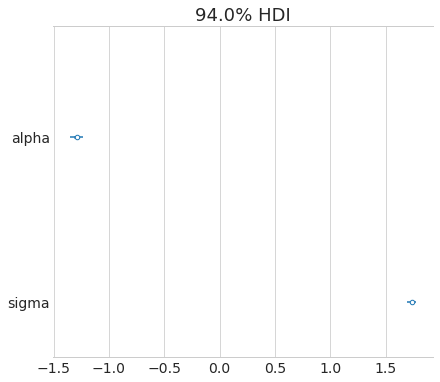

# DEMETER2 in Stan


```python
import pystan
import numpy as np
import pandas as pd
from matplotlib import pyplot as plt
import arviz as az
from pathlib import Path
import seaborn as sns
from timeit import default_timer as timer
import warnings
import re

plt.style.use('seaborn-whitegrid')
plt.rcParams['figure.figsize'] = (10.0, 7.0)
plt.rcParams['axes.titlesize'] = 18
plt.rcParams['axes.labelsize'] = 15

modeling_data_dir = Path('../modeling_data')

warnings.filterwarnings(action='ignore', 
                        message='Argument backend_kwargs has not effect in matplotlib.plot_distSupplied value won\'t be used')
```

## Data preparation


```python
modeling_data = pd.read_csv(modeling_data_dir / 'subset_modeling_data.csv')
modeling_data.head()
```


<div>
<style scoped>
    .dataframe tbody tr th:only-of-type {
        vertical-align: middle;
    }

    .dataframe tbody tr th {
        vertical-align: top;
    }

    .dataframe thead th {
        text-align: right;
    }
</style>
<table border="1" class="dataframe">
  <thead>
    <tr style="text-align: right;">
      <th></th>
      <th>barcode_sequence</th>
      <th>cell_line</th>
      <th>lfc</th>
      <th>batch</th>
      <th>gene_symbol</th>
    </tr>
  </thead>
  <tbody>
    <tr>
      <th>0</th>
      <td>ACAGAAGAAATTCTGGCAGAT</td>
      <td>ln215_central_nervous_system</td>
      <td>1.966515</td>
      <td>1</td>
      <td>EIF6</td>
    </tr>
    <tr>
      <th>1</th>
      <td>ACAGAAGAAATTCTGGCAGAT</td>
      <td>ln382_central_nervous_system</td>
      <td>1.289606</td>
      <td>1</td>
      <td>EIF6</td>
    </tr>
    <tr>
      <th>2</th>
      <td>ACAGAAGAAATTCTGGCAGAT</td>
      <td>efo21_ovary</td>
      <td>0.625725</td>
      <td>1</td>
      <td>EIF6</td>
    </tr>
    <tr>
      <th>3</th>
      <td>ACAGAAGAAATTCTGGCAGAT</td>
      <td>jhesoad1_oesophagus</td>
      <td>1.392272</td>
      <td>1</td>
      <td>EIF6</td>
    </tr>
    <tr>
      <th>4</th>
      <td>ACAGAAGAAATTCTGGCAGAT</td>
      <td>km12_large_intestine</td>
      <td>0.820838</td>
      <td>1</td>
      <td>EIF6</td>
    </tr>
  </tbody>
</table>
</div>


## Exploratory data analysis


```python
genes = set(modeling_data.gene_symbol.to_list())
fig, axes = plt.subplots(5, 3, figsize=(9, 9))
for ax, gene in zip(axes.flat, genes):
    lfc = modeling_data[modeling_data.gene_symbol == gene].lfc
    sns.distplot(lfc, kde=True, hist=False, ax=ax, kde_kws={'shade': True}, color='b')
    
    y_data = ax.lines[0].get_ydata()
    ax.vlines(x=0, ymin=0, ymax=np.max(y_data) * 1.05, linestyles='dashed')
    
    ax.set_title(gene, fontsize=12)
    ax.set_xlabel(None)


axes[4, 2].axis('off')
axes[4, 1].axis('off')
fig.tight_layout(pad=1.0)
plt.show()
```


```python
cell_lines = set(modeling_data.cell_line.to_list())
for cell_line in cell_lines:
    lfc = modeling_data[modeling_data.cell_line == cell_line].lfc
    sns.distplot(lfc, kde=True, hist=False, label=None, kde_kws={'alpha': 0.2})

plt.title('LFC distributions')
plt.xlabel('LFC')
plt.show()
```


```python
sns.distplot(modeling_data.lfc)
plt.show()
```


```python
modeling_data[['barcode_sequence', 'gene_symbol']].drop_duplicates().groupby('gene_symbol').count()
```


<div>
<style scoped>
    .dataframe tbody tr th:only-of-type {
        vertical-align: middle;
    }

    .dataframe tbody tr th {
        vertical-align: top;
    }

    .dataframe thead th {
        text-align: right;
    }
</style>
<table border="1" class="dataframe">
  <thead>
    <tr style="text-align: right;">
      <th></th>
      <th>barcode_sequence</th>
    </tr>
    <tr>
      <th>gene_symbol</th>
      <th></th>
    </tr>
  </thead>
  <tbody>
    <tr>
      <th>BRAF</th>
      <td>8</td>
    </tr>
    <tr>
      <th>COG3</th>
      <td>5</td>
    </tr>
    <tr>
      <th>COL8A1</th>
      <td>5</td>
    </tr>
    <tr>
      <th>EGFR</th>
      <td>19</td>
    </tr>
    <tr>
      <th>EIF6</th>
      <td>5</td>
    </tr>
    <tr>
      <th>ESPL1</th>
      <td>5</td>
    </tr>
    <tr>
      <th>GRK5</th>
      <td>5</td>
    </tr>
    <tr>
      <th>KRAS</th>
      <td>11</td>
    </tr>
    <tr>
      <th>PTK2</th>
      <td>23</td>
    </tr>
    <tr>
      <th>RC3H2</th>
      <td>4</td>
    </tr>
    <tr>
      <th>RHBDL2</th>
      <td>5</td>
    </tr>
    <tr>
      <th>SDHB</th>
      <td>5</td>
    </tr>
    <tr>
      <th>TRIM39</th>
      <td>9</td>
    </tr>
  </tbody>
</table>
</div>


```python
lfc_corr = modeling_data \
    .pivot(index='cell_line', columns='barcode_sequence', values='lfc') \
    .corr()

mask = np.triu(np.ones_like(lfc_corr, dtype=np.bool), k=0)
f, ax = plt.subplots(figsize=(15, 13))
cmap = sns.diverging_palette(220, 10, as_cmap=True)
sns.heatmap(lfc_corr, mask=mask, 
            cmap=cmap, center=0, 
            square=True, linewidths=0.5, cbar_kws={'shrink': 0.5})
plt.xlabel('barcode')
plt.ylabel('barcode')
plt.title('Correlation of LFC of barcodes')
plt.show()
```


## Modeling


```python
models_dir = Path('..', 'models')
```


```python
modeling_data.head()
```


<div>
<style scoped>
    .dataframe tbody tr th:only-of-type {
        vertical-align: middle;
    }

    .dataframe tbody tr th {
        vertical-align: top;
    }

    .dataframe thead th {
        text-align: right;
    }
</style>
<table border="1" class="dataframe">
  <thead>
    <tr style="text-align: right;">
      <th></th>
      <th>barcode_sequence</th>
      <th>cell_line</th>
      <th>lfc</th>
      <th>batch</th>
      <th>gene_symbol</th>
    </tr>
  </thead>
  <tbody>
    <tr>
      <th>0</th>
      <td>ACAGAAGAAATTCTGGCAGAT</td>
      <td>ln215_central_nervous_system</td>
      <td>1.966515</td>
      <td>1</td>
      <td>EIF6</td>
    </tr>
    <tr>
      <th>1</th>
      <td>ACAGAAGAAATTCTGGCAGAT</td>
      <td>ln382_central_nervous_system</td>
      <td>1.289606</td>
      <td>1</td>
      <td>EIF6</td>
    </tr>
    <tr>
      <th>2</th>
      <td>ACAGAAGAAATTCTGGCAGAT</td>
      <td>efo21_ovary</td>
      <td>0.625725</td>
      <td>1</td>
      <td>EIF6</td>
    </tr>
    <tr>
      <th>3</th>
      <td>ACAGAAGAAATTCTGGCAGAT</td>
      <td>jhesoad1_oesophagus</td>
      <td>1.392272</td>
      <td>1</td>
      <td>EIF6</td>
    </tr>
    <tr>
      <th>4</th>
      <td>ACAGAAGAAATTCTGGCAGAT</td>
      <td>km12_large_intestine</td>
      <td>0.820838</td>
      <td>1</td>
      <td>EIF6</td>
    </tr>
  </tbody>
</table>
</div>


Select only a few cell lines while model building.


```python
len(np.unique(modeling_data.cell_line))
```


    501


```python
np.random.seed(123)
cell_lines = np.random.choice(np.unique(modeling_data.cell_line), 40)
modeling_data = modeling_data[modeling_data.cell_line.isin(cell_lines)]
modeling_data.shape
```


    (3334, 5)


```python
np.unique(modeling_data.gene_symbol)
```


    array(['BRAF', 'COG3', 'COL8A1', 'EGFR', 'EIF6', 'ESPL1', 'GRK5', 'KRAS',
           'PTK2', 'RC3H2', 'RHBDL2', 'SDHB', 'TRIM39'], dtype=object)


```python
model_testing_genes = ['COG3', 'KRAS', 'COL8A1', 'EIF6']
modeling_data = modeling_data[modeling_data.gene_symbol.isin(model_testing_genes)]
```


```python
genes = set(modeling_data.gene_symbol.to_list())
fig, axes = plt.subplots(1, 4, figsize=(10, 3))
for ax, gene in zip(axes.flat, genes):
    lfc = modeling_data[modeling_data.gene_symbol == gene].lfc
    sns.distplot(lfc, kde=True, hist=True, ax=ax, color='b')
    
    y_data = ax.lines[0].get_ydata()
    ax.vlines(x=0, ymin=0, ymax=np.max(y_data) * 1.05, linestyles='dashed')
    
    ax.set_title(gene, fontsize=12)
    ax.set_xlabel(None)

fig.tight_layout(pad=1.0)
plt.show()
```


```python
def add_categorical_idx(df, col):
    df[f'{col}_idx'] = df[col].astype('category').cat.codes + 1
    return df

for col in ['barcode_sequence', 'cell_line', 'gene_symbol']:
    modeling_data = add_categorical_idx(modeling_data, col)

modeling_data = modeling_data.reset_index(drop=True)
modeling_data.head()
```


<div>
<style scoped>
    .dataframe tbody tr th:only-of-type {
        vertical-align: middle;
    }

    .dataframe tbody tr th {
        vertical-align: top;
    }

    .dataframe thead th {
        text-align: right;
    }
</style>
<table border="1" class="dataframe">
  <thead>
    <tr style="text-align: right;">
      <th></th>
      <th>barcode_sequence</th>
      <th>cell_line</th>
      <th>lfc</th>
      <th>batch</th>
      <th>gene_symbol</th>
      <th>barcode_sequence_idx</th>
      <th>cell_line_idx</th>
      <th>gene_symbol_idx</th>
    </tr>
  </thead>
  <tbody>
    <tr>
      <th>0</th>
      <td>ACAGAAGAAATTCTGGCAGAT</td>
      <td>efo21_ovary</td>
      <td>0.625725</td>
      <td>1</td>
      <td>EIF6</td>
      <td>1</td>
      <td>11</td>
      <td>3</td>
    </tr>
    <tr>
      <th>1</th>
      <td>ACAGAAGAAATTCTGGCAGAT</td>
      <td>dbtrg05mg_central_nervous_system</td>
      <td>2.145082</td>
      <td>2</td>
      <td>EIF6</td>
      <td>1</td>
      <td>9</td>
      <td>3</td>
    </tr>
    <tr>
      <th>2</th>
      <td>ACAGAAGAAATTCTGGCAGAT</td>
      <td>bt20_breast</td>
      <td>0.932751</td>
      <td>2</td>
      <td>EIF6</td>
      <td>1</td>
      <td>3</td>
      <td>3</td>
    </tr>
    <tr>
      <th>3</th>
      <td>ACAGAAGAAATTCTGGCAGAT</td>
      <td>sw1783_central_nervous_system</td>
      <td>1.372030</td>
      <td>2</td>
      <td>EIF6</td>
      <td>1</td>
      <td>36</td>
      <td>3</td>
    </tr>
    <tr>
      <th>4</th>
      <td>ACAGAAGAAATTCTGGCAGAT</td>
      <td>kns60_central_nervous_system</td>
      <td>0.803835</td>
      <td>2</td>
      <td>EIF6</td>
      <td>1</td>
      <td>18</td>
      <td>3</td>
    </tr>
  </tbody>
</table>
</div>


Binary matrix of $[shRNA \times gene]$.


```python
shrna_gene_matrix = modeling_data[['barcode_sequence_idx', 'gene_symbol_idx']] \
    .drop_duplicates() \
    .reset_index(drop=True) \
    .assign(value = lambda df: np.ones(df.shape[0], dtype=int)) \
    .pivot(index='barcode_sequence_idx', columns='gene_symbol_idx', values='value') \
    .fillna(0) \
    .to_numpy() \
    .astype(int)

shrna_gene_matrix
```


    array([[0, 0, 1, 0],
           [0, 0, 1, 0],
           [0, 1, 0, 0],
           [0, 0, 0, 1],
           [0, 0, 0, 1],
           [1, 0, 0, 0],
           [1, 0, 0, 0],
           [0, 0, 0, 1],
           [0, 0, 0, 1],
           [0, 0, 0, 1],
           [1, 0, 0, 0],
           [0, 0, 0, 1],
           [0, 0, 0, 1],
           [0, 0, 1, 0],
           [0, 0, 0, 1],
           [0, 0, 0, 1],
           [0, 0, 0, 1],
           [0, 0, 0, 1],
           [1, 0, 0, 0],
           [0, 1, 0, 0],
           [0, 1, 0, 0],
           [1, 0, 0, 0],
           [0, 1, 0, 0],
           [0, 1, 0, 0],
           [0, 0, 1, 0],
           [0, 0, 1, 0]])


```python
shrna_gene_matrix.shape
```


    (26, 4)


## Model 1. Just an intercept

$$
D \sim N(\mu, \sigma) \\
\mu = \alpha \\
\alpha \sim N(0, 5) \\
\sigma \sim \text{HalfCauchy}(0, 5)
$$

**Model data.**


```python
d2_m1_data = {
    'N': int(modeling_data.shape[0]),
    'y': modeling_data.lfc
}
```

**Compile model.**


```python
start = timer()
d2_m1_file = models_dir / 'd2_m1.cpp'
d2_m1 = pystan.StanModel(file=d2_m1_file.as_posix())
end = timer()
print(f'{(end - start) / 60:.2f} minutes to compile model')
```

    INFO:pystan:COMPILING THE C++ CODE FOR MODEL anon_model_2a3da92f7ba3e62805394cf29daed746 NOW.


    0.81 minutes to compile model


```python
d2_m1_fit = d2_m1.sampling(data=d2_m1_data, iter=2000, chains=2)
```


```python
pystan.check_hmc_diagnostics(d2_m1_fit)
```


    {'n_eff': True,
     'Rhat': True,
     'divergence': True,
     'treedepth': True,
     'energy': True}


```python
az_d2_m1 = az.from_pystan(posterior=d2_m1_fit,
                          posterior_predictive='y_pred',
                          observed_data=['y'],
                          posterior_model=d2_m1)
az.summary(az_d2_m1)
```


<div>
<style scoped>
    .dataframe tbody tr th:only-of-type {
        vertical-align: middle;
    }

    .dataframe tbody tr th {
        vertical-align: top;
    }

    .dataframe thead th {
        text-align: right;
    }
</style>
<table border="1" class="dataframe">
  <thead>
    <tr style="text-align: right;">
      <th></th>
      <th>mean</th>
      <th>sd</th>
      <th>hpd_3%</th>
      <th>hpd_97%</th>
      <th>mcse_mean</th>
      <th>mcse_sd</th>
      <th>ess_mean</th>
      <th>ess_sd</th>
      <th>ess_bulk</th>
      <th>ess_tail</th>
      <th>r_hat</th>
    </tr>
  </thead>
  <tbody>
    <tr>
      <th>alpha</th>
      <td>-1.857</td>
      <td>0.055</td>
      <td>-1.954</td>
      <td>-1.748</td>
      <td>0.001</td>
      <td>0.001</td>
      <td>1552.0</td>
      <td>1542.0</td>
      <td>1559.0</td>
      <td>1251.0</td>
      <td>1.0</td>
    </tr>
    <tr>
      <th>sigma</th>
      <td>1.712</td>
      <td>0.039</td>
      <td>1.644</td>
      <td>1.790</td>
      <td>0.001</td>
      <td>0.001</td>
      <td>1593.0</td>
      <td>1593.0</td>
      <td>1599.0</td>
      <td>1284.0</td>
      <td>1.0</td>
    </tr>
  </tbody>
</table>
</div>


```python
az.plot_trace(az_d2_m1)
plt.show()
```


```python
az.plot_forest(az_d2_m1, combined=True)
plt.show()
```


```python
az.plot_ppc(az_d2_m1, data_pairs={'y':'y_pred'}, num_pp_samples=50)
plt.show()
```





## Model 2. Varying intercept by shRNA

$$
D_{i|s} \sim N(\mu_{i|s}, \sigma) \\
\mu = \alpha_{i|s} \\
\alpha \sim N(\mu_{\alpha}, \sigma_{\alpha}) \\
\mu_{\alpha} \sim N(0, 2) \\
\sigma_{\alpha} \sim \text{HalfCauchy}(0, 2) \\
\sigma \sim \text{HalfCauchy}(0, 5)
$$

### Generative model for a prior predictive check


```python
N = 1000
S = 100
shrna_barcodes = list(range(1, S+1))
shrna_barcodes_idx = np.repeat(shrna_barcodes, N/S)
```


```python
d2_m2_gen_data = {
    'N': N,
    'S': S,
    'shrna': shrna_barcodes_idx
}
```


```python
start = timer()
d2_m2_gen_file = models_dir / 'd2_m2_generative.cpp'
d2_m2_gen = pystan.StanModel(file=d2_m2_gen_file.as_posix())
end = timer()
print(f'{(end - start) / 60:.2f} minutes to compile model')
```

    INFO:pystan:COMPILING THE C++ CODE FOR MODEL anon_model_112516ecd402d13dafa0de6e631a9e45 NOW.


    0.86 minutes to compile model


```python
d2_m2_gen_fit = d2_m2_gen.sampling(data=d2_m2_gen_data, iter=10, chains=1, algorithm='Fixed_param')
```

    WARNING:pystan:`warmup=0` forced with `algorithm="Fixed_param"`.


```python
az_d2_m2_gen = az.from_pystan(d2_m2_gen_fit)
```


```python
df = d2_m2_gen_fit.to_dataframe() \
    .drop(['chain', 'draw', 'warmup'], axis=1) \
    .melt(var_name='parameter', value_name='value')
df = df[df.parameter.str.contains('alpha\[')]
sns.distplot(df.value)
plt.show()
```


```python
df = d2_m2_gen_fit.to_dataframe() \
    .drop(['chain', 'draw', 'warmup'], axis=1) \
    .melt(var_name='parameter', value_name='value')
df = df[df.parameter.str.contains('y_pred')]
sns.distplot(df.value)
plt.show()
```


```python
sns.distplot(modeling_data.lfc)
plt.show()
```


**Model data**


```python
d2_m2_data = {
    'N': int(modeling_data.shape[0]),
    'S': np.max(modeling_data.barcode_sequence_idx),
    
    'shrna': modeling_data.barcode_sequence_idx,
    
    'y': modeling_data.lfc,
}
```


```python
d2_m2_data['S']
```


    26


**Compile model.**

The current problem is that the various values for `alpha` of different shRNA are the same because `sigma_alpha` is so small.
Maybe try with just two shRNA, but I need to figure out why the value for `sigma_alpha` is shrinking so fast.


```python
start = timer()
d2_m2_file = models_dir / 'd2_m2.cpp'
d2_m2 = pystan.StanModel(file=d2_m2_file.as_posix())
end = timer()
print(f'{(end - start) / 60:.2f} minutes to compile model')
```

    INFO:pystan:COMPILING THE C++ CODE FOR MODEL anon_model_27c69fe8813455b868fbd0406f6b51bd NOW.


    0.74 minutes to compile model


```python
d2_m2_fit = d2_m2.sampling(data=d2_m2_data, iter=1000, chains=2)
```


```python
pystan.check_hmc_diagnostics(d2_m2_fit)
```


    {'n_eff': True,
     'Rhat': True,
     'divergence': True,
     'treedepth': True,
     'energy': True}


```python
az_d2_m2 = az.from_pystan(posterior=d2_m2_fit,
                          posterior_predictive='y_pred',
                          observed_data=['y'],
                          posterior_model=d2_m2)
az.summary(az_d2_m2).head()
```


<div>
<style scoped>
    .dataframe tbody tr th:only-of-type {
        vertical-align: middle;
    }

    .dataframe tbody tr th {
        vertical-align: top;
    }

    .dataframe thead th {
        text-align: right;
    }
</style>
<table border="1" class="dataframe">
  <thead>
    <tr style="text-align: right;">
      <th></th>
      <th>mean</th>
      <th>sd</th>
      <th>hpd_3%</th>
      <th>hpd_97%</th>
      <th>mcse_mean</th>
      <th>mcse_sd</th>
      <th>ess_mean</th>
      <th>ess_sd</th>
      <th>ess_bulk</th>
      <th>ess_tail</th>
      <th>r_hat</th>
    </tr>
  </thead>
  <tbody>
    <tr>
      <th>mu_alpha</th>
      <td>-1.815</td>
      <td>0.263</td>
      <td>-2.280</td>
      <td>-1.302</td>
      <td>0.008</td>
      <td>0.005</td>
      <td>1199.0</td>
      <td>1180.0</td>
      <td>1204.0</td>
      <td>578.0</td>
      <td>1.00</td>
    </tr>
    <tr>
      <th>sigma_alpha</th>
      <td>1.254</td>
      <td>0.189</td>
      <td>0.943</td>
      <td>1.612</td>
      <td>0.005</td>
      <td>0.004</td>
      <td>1382.0</td>
      <td>1264.0</td>
      <td>1544.0</td>
      <td>816.0</td>
      <td>1.00</td>
    </tr>
    <tr>
      <th>alpha[0]</th>
      <td>0.698</td>
      <td>0.200</td>
      <td>0.297</td>
      <td>1.058</td>
      <td>0.005</td>
      <td>0.004</td>
      <td>1877.0</td>
      <td>1563.0</td>
      <td>1886.0</td>
      <td>703.0</td>
      <td>1.01</td>
    </tr>
    <tr>
      <th>alpha[1]</th>
      <td>-0.793</td>
      <td>0.212</td>
      <td>-1.126</td>
      <td>-0.364</td>
      <td>0.005</td>
      <td>0.003</td>
      <td>1896.0</td>
      <td>1868.0</td>
      <td>1897.0</td>
      <td>848.0</td>
      <td>1.00</td>
    </tr>
    <tr>
      <th>alpha[2]</th>
      <td>-2.265</td>
      <td>0.203</td>
      <td>-2.651</td>
      <td>-1.907</td>
      <td>0.005</td>
      <td>0.003</td>
      <td>2034.0</td>
      <td>1875.0</td>
      <td>2044.0</td>
      <td>648.0</td>
      <td>1.00</td>
    </tr>
  </tbody>
</table>
</div>


```python
az.plot_trace(az_d2_m2, var_names=['alpha'])
plt.show()
```


```python
az.plot_forest(az_d2_m2, kind='ridgeplot', combined=True, var_names=['alpha'])
plt.show()
```


```python
az.plot_ppc(az_d2_m2, data_pairs={'y':'y_pred'}, num_pp_samples=50)
plt.show()
```


```python
d2_m2_fit.to_dataframe().head()
```


<div>
<style scoped>
    .dataframe tbody tr th:only-of-type {
        vertical-align: middle;
    }

    .dataframe tbody tr th {
        vertical-align: top;
    }

    .dataframe thead th {
        text-align: right;
    }
</style>
<table border="1" class="dataframe">
  <thead>
    <tr style="text-align: right;">
      <th></th>
      <th>chain</th>
      <th>draw</th>
      <th>warmup</th>
      <th>mu_alpha</th>
      <th>sigma_alpha</th>
      <th>alpha[1]</th>
      <th>alpha[2]</th>
      <th>alpha[3]</th>
      <th>alpha[4]</th>
      <th>alpha[5]</th>
      <th>...</th>
      <th>y_pred[960]</th>
      <th>y_pred[961]</th>
      <th>y_pred[962]</th>
      <th>lp__</th>
      <th>accept_stat__</th>
      <th>stepsize__</th>
      <th>treedepth__</th>
      <th>n_leapfrog__</th>
      <th>divergent__</th>
      <th>energy__</th>
    </tr>
  </thead>
  <tbody>
    <tr>
      <th>0</th>
      <td>0</td>
      <td>0</td>
      <td>0</td>
      <td>-2.457118</td>
      <td>1.326445</td>
      <td>0.892962</td>
      <td>-0.746398</td>
      <td>-2.178321</td>
      <td>-1.535540</td>
      <td>-2.077625</td>
      <td>...</td>
      <td>-2.956824</td>
      <td>-3.065314</td>
      <td>-5.018948</td>
      <td>-728.683719</td>
      <td>0.771255</td>
      <td>0.534713</td>
      <td>3</td>
      <td>7</td>
      <td>0</td>
      <td>745.100115</td>
    </tr>
    <tr>
      <th>1</th>
      <td>0</td>
      <td>1</td>
      <td>0</td>
      <td>-1.341726</td>
      <td>1.083854</td>
      <td>0.416304</td>
      <td>-0.888440</td>
      <td>-2.373778</td>
      <td>-1.696952</td>
      <td>-2.632622</td>
      <td>...</td>
      <td>-4.492233</td>
      <td>-6.700063</td>
      <td>-5.749304</td>
      <td>-729.176425</td>
      <td>0.983083</td>
      <td>0.534713</td>
      <td>3</td>
      <td>7</td>
      <td>0</td>
      <td>741.113816</td>
    </tr>
    <tr>
      <th>2</th>
      <td>0</td>
      <td>2</td>
      <td>0</td>
      <td>-1.452934</td>
      <td>1.570810</td>
      <td>0.348248</td>
      <td>-0.777222</td>
      <td>-2.328061</td>
      <td>-1.564425</td>
      <td>-2.671122</td>
      <td>...</td>
      <td>-4.344147</td>
      <td>-5.856167</td>
      <td>-6.215676</td>
      <td>-731.555727</td>
      <td>0.956461</td>
      <td>0.534713</td>
      <td>3</td>
      <td>7</td>
      <td>0</td>
      <td>750.006068</td>
    </tr>
    <tr>
      <th>3</th>
      <td>0</td>
      <td>3</td>
      <td>0</td>
      <td>-1.955864</td>
      <td>0.975822</td>
      <td>0.712350</td>
      <td>-0.973998</td>
      <td>-2.354045</td>
      <td>-1.662263</td>
      <td>-2.269254</td>
      <td>...</td>
      <td>-4.604906</td>
      <td>-5.421145</td>
      <td>-4.265527</td>
      <td>-732.990468</td>
      <td>0.948801</td>
      <td>0.534713</td>
      <td>3</td>
      <td>7</td>
      <td>0</td>
      <td>749.221425</td>
    </tr>
    <tr>
      <th>4</th>
      <td>0</td>
      <td>4</td>
      <td>0</td>
      <td>-1.799420</td>
      <td>1.422785</td>
      <td>0.427787</td>
      <td>-0.921388</td>
      <td>-2.057306</td>
      <td>-1.613114</td>
      <td>-2.417118</td>
      <td>...</td>
      <td>-2.374970</td>
      <td>-4.401133</td>
      <td>-3.869677</td>
      <td>-722.190455</td>
      <td>1.000000</td>
      <td>0.534713</td>
      <td>3</td>
      <td>7</td>
      <td>0</td>
      <td>742.034621</td>
    </tr>
  </tbody>
</table>
<p>5 rows × 1001 columns</p>
</div>


## Model 3. Another varying intercept for target gene

$$
D_{i|s} \sim N(\mu_{i|s}, \sigma) \\
\mu = \alpha_{i|s} + g_{i|l}\\
\alpha_s \sim N(\mu_{\alpha}, \sigma_{\alpha}) \\
g_l \sim N(\mu_g, \sigma_g) \\
\mu_{\alpha} \sim N(0, 2) \quad \sigma_{\alpha} \sim \text{HalfCauchy}(0, 10) \\
\mu_{g} \sim N(0, 2) \quad \sigma_{g} \sim \text{HalfCauchy}(0, 10) \\
\sigma \sim \text{HalfCauchy}(0, 10)
$$


```python
d2_m3_data = {
    'N': int(modeling_data.shape[0]),
    'S': np.max(modeling_data.barcode_sequence_idx),
    'L': np.max(modeling_data.gene_symbol_idx),
    
    'shrna': modeling_data.barcode_sequence_idx,
    'gene': modeling_data.gene_symbol_idx,
    
    'y': modeling_data.lfc,
}
```

**Compile model.**


```python
start = timer()
d2_m3_file = models_dir / 'd2_m3.cpp'
d2_m3 = pystan.StanModel(file=d2_m3_file.as_posix())
end = timer()
print(f'{(end - start) / 60:.2f} minutes to compile model')
```

    INFO:pystan:COMPILING THE C++ CODE FOR MODEL anon_model_fdb12fa958279899a501dc9f27a621f0 NOW.


    0.75 minutes to compile model


```python
d2_m3_control = {'adapt_delta': 0.999, 
                 'max_treedepth': 20}
d2_m3_fit = d2_m3.sampling(data=d2_m3_data, 
                           iter=3000, warmup=1000, chains=4, 
                           control=d2_m3_control)
```

    WARNING:pystan:16 of 8000 iterations ended with a divergence (0.2 %).
    WARNING:pystan:Try running with adapt_delta larger than 0.999 to remove the divergences.


```python
pystan.check_hmc_diagnostics(d2_m3_fit)
```

    WARNING:pystan:16 of 8000 iterations ended with a divergence (0.2 %).
    WARNING:pystan:Try running with adapt_delta larger than 0.999 to remove the divergences.


    {'n_eff': True,
     'Rhat': True,
     'divergence': False,
     'treedepth': True,
     'energy': True}


```python
az_d2_m3 = az.from_pystan(posterior=d2_m3_fit,
                          posterior_predictive='y_pred',
                          observed_data=['y'],
                          posterior_model=d2_m3)
az.summary(az_d2_m3).head()
```


<div>
<style scoped>
    .dataframe tbody tr th:only-of-type {
        vertical-align: middle;
    }

    .dataframe tbody tr th {
        vertical-align: top;
    }

    .dataframe thead th {
        text-align: right;
    }
</style>
<table border="1" class="dataframe">
  <thead>
    <tr style="text-align: right;">
      <th></th>
      <th>mean</th>
      <th>sd</th>
      <th>hpd_3%</th>
      <th>hpd_97%</th>
      <th>mcse_mean</th>
      <th>mcse_sd</th>
      <th>ess_mean</th>
      <th>ess_sd</th>
      <th>ess_bulk</th>
      <th>ess_tail</th>
      <th>r_hat</th>
    </tr>
  </thead>
  <tbody>
    <tr>
      <th>mu_alpha</th>
      <td>-0.838</td>
      <td>1.406</td>
      <td>-3.269</td>
      <td>1.990</td>
      <td>0.084</td>
      <td>0.059</td>
      <td>280.0</td>
      <td>280.0</td>
      <td>279.0</td>
      <td>333.0</td>
      <td>1.02</td>
    </tr>
    <tr>
      <th>sigma_alpha</th>
      <td>1.204</td>
      <td>0.198</td>
      <td>0.871</td>
      <td>1.584</td>
      <td>0.004</td>
      <td>0.003</td>
      <td>2011.0</td>
      <td>1969.0</td>
      <td>2109.0</td>
      <td>2515.0</td>
      <td>1.00</td>
    </tr>
    <tr>
      <th>mu_g</th>
      <td>-0.923</td>
      <td>1.417</td>
      <td>-3.789</td>
      <td>1.595</td>
      <td>0.080</td>
      <td>0.056</td>
      <td>315.0</td>
      <td>315.0</td>
      <td>316.0</td>
      <td>390.0</td>
      <td>1.02</td>
    </tr>
    <tr>
      <th>sigma_g</th>
      <td>0.857</td>
      <td>0.924</td>
      <td>0.011</td>
      <td>2.238</td>
      <td>0.029</td>
      <td>0.020</td>
      <td>1036.0</td>
      <td>1036.0</td>
      <td>626.0</td>
      <td>637.0</td>
      <td>1.01</td>
    </tr>
    <tr>
      <th>alpha[0]</th>
      <td>1.768</td>
      <td>1.457</td>
      <td>-0.719</td>
      <td>4.763</td>
      <td>0.084</td>
      <td>0.060</td>
      <td>297.0</td>
      <td>297.0</td>
      <td>297.0</td>
      <td>373.0</td>
      <td>1.02</td>
    </tr>
  </tbody>
</table>
</div>


```python
az.plot_trace(az_d2_m3, var_names=['g'])
plt.show()
```


```python
az.plot_ppc(az_d2_m3, data_pairs={'y':'y_pred'}, num_pp_samples=50)
plt.show()
```


```python
fit3_summary = az.summary(az_d2_m3)
```


```python
fit3_alpha_summary = fit3_summary[fit3_summary.index.str.contains('alpha\[')]
shrna_idx = [re.search(r"\[([A-Za-z0-9_]+)\]", a).group(1) for a in fit3_alpha_summary.index]
shrna_idx = [int(a) + 1 for a in shrna_idx]
fit3_alpha_summary = fit3_alpha_summary \
    .assign(barcode_sequence_idx = shrna_idx) \
    .set_index('barcode_sequence_idx') \
    .join(modeling_data[['barcode_sequence_idx', 'gene_symbol']] \
          .drop_duplicates() \
          .set_index('barcode_sequence_idx'))
fit3_alpha_summary.head(10)
```


<div>
<style scoped>
    .dataframe tbody tr th:only-of-type {
        vertical-align: middle;
    }

    .dataframe tbody tr th {
        vertical-align: top;
    }

    .dataframe thead th {
        text-align: right;
    }
</style>
<table border="1" class="dataframe">
  <thead>
    <tr style="text-align: right;">
      <th></th>
      <th>mean</th>
      <th>sd</th>
      <th>hpd_3%</th>
      <th>hpd_97%</th>
      <th>mcse_mean</th>
      <th>mcse_sd</th>
      <th>ess_mean</th>
      <th>ess_sd</th>
      <th>ess_bulk</th>
      <th>ess_tail</th>
      <th>r_hat</th>
      <th>gene_symbol</th>
    </tr>
    <tr>
      <th>barcode_sequence_idx</th>
      <th></th>
      <th></th>
      <th></th>
      <th></th>
      <th></th>
      <th></th>
      <th></th>
      <th></th>
      <th></th>
      <th></th>
      <th></th>
      <th></th>
    </tr>
  </thead>
  <tbody>
    <tr>
      <th>1</th>
      <td>1.768</td>
      <td>1.457</td>
      <td>-0.719</td>
      <td>4.763</td>
      <td>0.084</td>
      <td>0.060</td>
      <td>297.0</td>
      <td>297.0</td>
      <td>297.0</td>
      <td>373.0</td>
      <td>1.02</td>
      <td>EIF6</td>
    </tr>
    <tr>
      <th>2</th>
      <td>0.272</td>
      <td>1.461</td>
      <td>-2.255</td>
      <td>3.253</td>
      <td>0.085</td>
      <td>0.060</td>
      <td>293.0</td>
      <td>293.0</td>
      <td>293.0</td>
      <td>393.0</td>
      <td>1.02</td>
      <td>EIF6</td>
    </tr>
    <tr>
      <th>3</th>
      <td>-0.916</td>
      <td>1.486</td>
      <td>-3.585</td>
      <td>1.920</td>
      <td>0.089</td>
      <td>0.063</td>
      <td>278.0</td>
      <td>278.0</td>
      <td>277.0</td>
      <td>386.0</td>
      <td>1.02</td>
      <td>COL8A1</td>
    </tr>
    <tr>
      <th>4</th>
      <td>-0.488</td>
      <td>1.451</td>
      <td>-3.092</td>
      <td>2.300</td>
      <td>0.086</td>
      <td>0.061</td>
      <td>282.0</td>
      <td>282.0</td>
      <td>282.0</td>
      <td>346.0</td>
      <td>1.02</td>
      <td>KRAS</td>
    </tr>
    <tr>
      <th>5</th>
      <td>-1.336</td>
      <td>1.454</td>
      <td>-3.930</td>
      <td>1.479</td>
      <td>0.086</td>
      <td>0.061</td>
      <td>284.0</td>
      <td>284.0</td>
      <td>284.0</td>
      <td>373.0</td>
      <td>1.02</td>
      <td>KRAS</td>
    </tr>
    <tr>
      <th>6</th>
      <td>0.619</td>
      <td>1.458</td>
      <td>-2.258</td>
      <td>3.276</td>
      <td>0.083</td>
      <td>0.058</td>
      <td>312.0</td>
      <td>312.0</td>
      <td>311.0</td>
      <td>383.0</td>
      <td>1.01</td>
      <td>COG3</td>
    </tr>
    <tr>
      <th>7</th>
      <td>-0.617</td>
      <td>1.459</td>
      <td>-3.377</td>
      <td>2.152</td>
      <td>0.082</td>
      <td>0.058</td>
      <td>314.0</td>
      <td>314.0</td>
      <td>314.0</td>
      <td>376.0</td>
      <td>1.01</td>
      <td>COG3</td>
    </tr>
    <tr>
      <th>8</th>
      <td>-1.601</td>
      <td>1.452</td>
      <td>-4.194</td>
      <td>1.201</td>
      <td>0.086</td>
      <td>0.061</td>
      <td>284.0</td>
      <td>284.0</td>
      <td>284.0</td>
      <td>361.0</td>
      <td>1.02</td>
      <td>KRAS</td>
    </tr>
    <tr>
      <th>9</th>
      <td>0.806</td>
      <td>1.453</td>
      <td>-1.714</td>
      <td>3.661</td>
      <td>0.086</td>
      <td>0.061</td>
      <td>284.0</td>
      <td>284.0</td>
      <td>284.0</td>
      <td>360.0</td>
      <td>1.02</td>
      <td>KRAS</td>
    </tr>
    <tr>
      <th>10</th>
      <td>-0.170</td>
      <td>1.452</td>
      <td>-2.825</td>
      <td>2.575</td>
      <td>0.086</td>
      <td>0.061</td>
      <td>283.0</td>
      <td>283.0</td>
      <td>283.0</td>
      <td>366.0</td>
      <td>1.02</td>
      <td>KRAS</td>
    </tr>
  </tbody>
</table>
</div>


```python
fit3_gene_summary = fit3_summary[fit3_summary.index.str.contains('g\[')]
gene_idx = [re.search(r"\[([A-Za-z0-9_]+)\]", a).group(1) for a in fit3_gene_summary.index]
gene_idx = [int(a) + 1 for a in gene_idx]
fit3_gene_summary = fit3_gene_summary \
    .assign(gene_symbol_idx = gene_idx) \
    .set_index('gene_symbol_idx') \
    .join(modeling_data[['gene_symbol_idx', 'gene_symbol']] \
          .drop_duplicates() \
          .set_index('gene_symbol_idx')) \
    .reset_index(drop=False)
fit3_gene_summary.head(10)
```


<div>
<style scoped>
    .dataframe tbody tr th:only-of-type {
        vertical-align: middle;
    }

    .dataframe tbody tr th {
        vertical-align: top;
    }

    .dataframe thead th {
        text-align: right;
    }
</style>
<table border="1" class="dataframe">
  <thead>
    <tr style="text-align: right;">
      <th></th>
      <th>gene_symbol_idx</th>
      <th>mean</th>
      <th>sd</th>
      <th>hpd_3%</th>
      <th>hpd_97%</th>
      <th>mcse_mean</th>
      <th>mcse_sd</th>
      <th>ess_mean</th>
      <th>ess_sd</th>
      <th>ess_bulk</th>
      <th>ess_tail</th>
      <th>r_hat</th>
      <th>gene_symbol</th>
    </tr>
  </thead>
  <tbody>
    <tr>
      <th>0</th>
      <td>1</td>
      <td>-0.530</td>
      <td>1.450</td>
      <td>-3.195</td>
      <td>2.340</td>
      <td>0.082</td>
      <td>0.058</td>
      <td>310.0</td>
      <td>310.0</td>
      <td>309.0</td>
      <td>392.0</td>
      <td>1.01</td>
      <td>COG3</td>
    </tr>
    <tr>
      <th>1</th>
      <td>2</td>
      <td>-1.351</td>
      <td>1.474</td>
      <td>-4.134</td>
      <td>1.324</td>
      <td>0.089</td>
      <td>0.063</td>
      <td>274.0</td>
      <td>274.0</td>
      <td>273.0</td>
      <td>393.0</td>
      <td>1.02</td>
      <td>COL8A1</td>
    </tr>
    <tr>
      <th>2</th>
      <td>3</td>
      <td>-1.076</td>
      <td>1.449</td>
      <td>-4.012</td>
      <td>1.476</td>
      <td>0.085</td>
      <td>0.060</td>
      <td>289.0</td>
      <td>289.0</td>
      <td>289.0</td>
      <td>363.0</td>
      <td>1.02</td>
      <td>EIF6</td>
    </tr>
    <tr>
      <th>3</th>
      <td>4</td>
      <td>-1.027</td>
      <td>1.440</td>
      <td>-3.837</td>
      <td>1.511</td>
      <td>0.086</td>
      <td>0.061</td>
      <td>278.0</td>
      <td>278.0</td>
      <td>278.0</td>
      <td>341.0</td>
      <td>1.02</td>
      <td>KRAS</td>
    </tr>
  </tbody>
</table>
</div>


```python
for i in range(fit3_gene_summary.shape[0]):
    plt.plot(np.repeat(fit3_gene_summary.loc[i, 'gene_symbol'], 2), 
             [fit3_gene_summary.loc[i, 'hpd_3%'], fit3_gene_summary.loc[i, 'hpd_97%']],
             color='red', alpha=0.5)


plt.scatter(fit3_gene_summary['gene_symbol'], 
            fit3_gene_summary['mean'],
            s=100, c='r', label='gene')
plt.scatter(fit3_alpha_summary['gene_symbol'], 
            fit3_alpha_summary['mean'], 
            alpha=0.3, s=75, c='b', label='shRNA')

plt.title('shRNA and gene mean values')
plt.xlabel('target gene')
plt.ylabel('estimated effect on LFC')
plt.legend()
plt.show()
```


## Model 4. Parameters for difference between average gene effect and cell line-specific effect

$$
D_{i|s} \sim N(\mu_{i|s}, \sigma) \\
\mu = c_{i|s} + \bar g_{i|l} - g_{i|jl} \\
c_s \sim N(0, \sigma_c) \\
\bar g_l \sim N(\mu_{\bar g}, \sigma_{\bar g}) \\
g_{jl} \sim N(0, \sigma_g) \\
\sigma_c \sim \text{HalfCauchy}(0, 3) \\
\mu_{\bar g} \sim N(0, 2) \quad \sigma_{\bar g} \sim \text{HalfCauchy}(0, 10) \\
\sigma_g \sim \text{HalfCauchy}(0, 5) \\
\sigma \sim \text{HalfCauchy}(0, 10)
$$


```python

```
